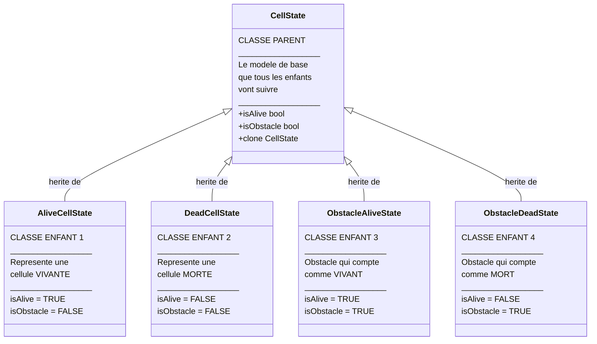
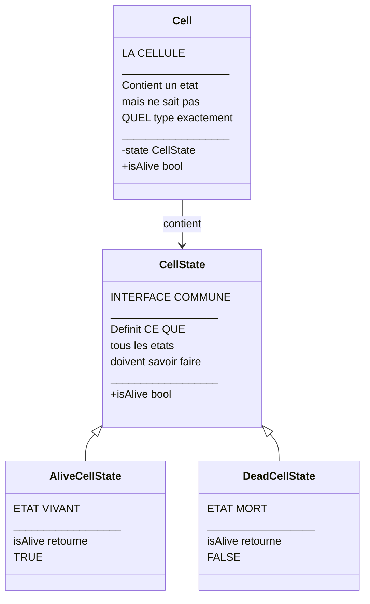
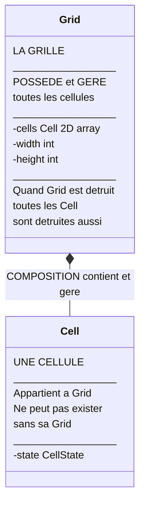
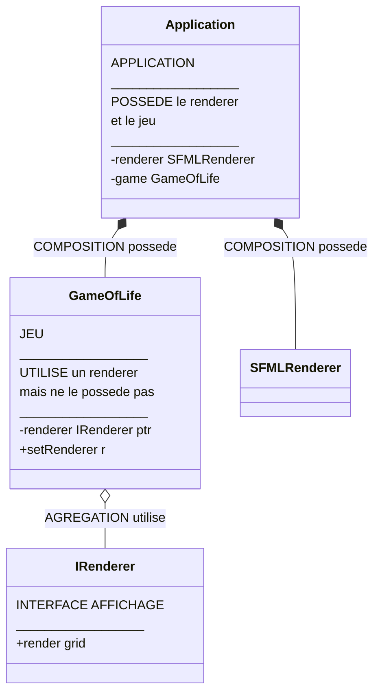
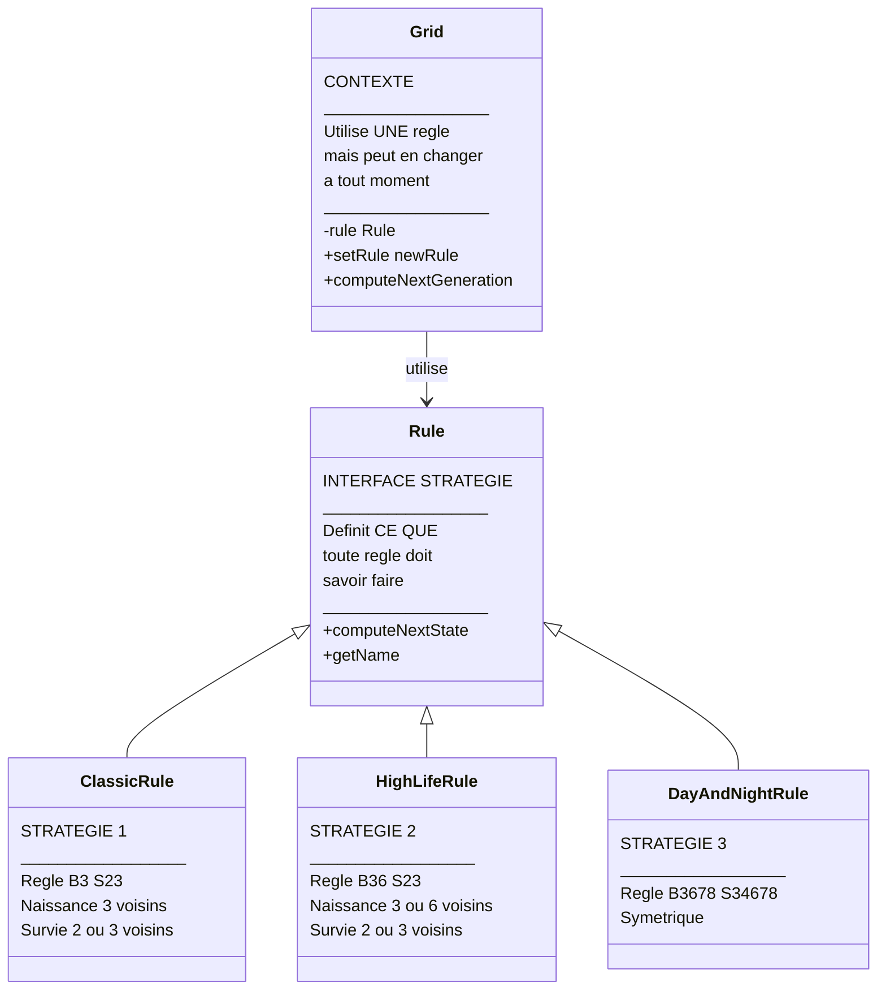
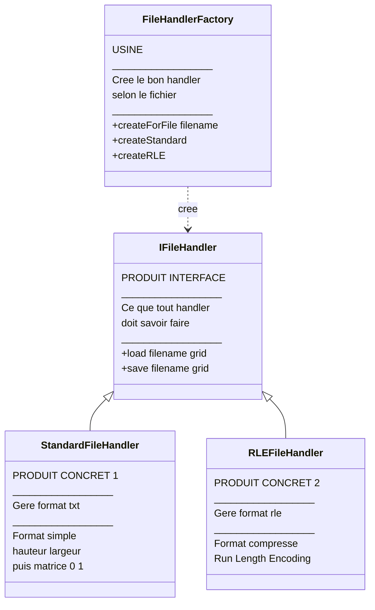
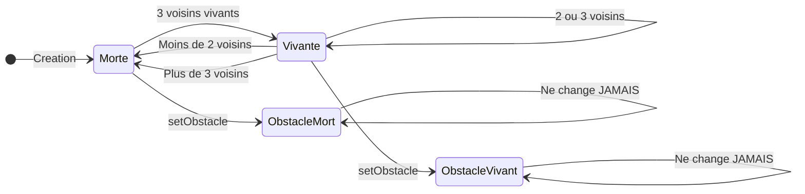
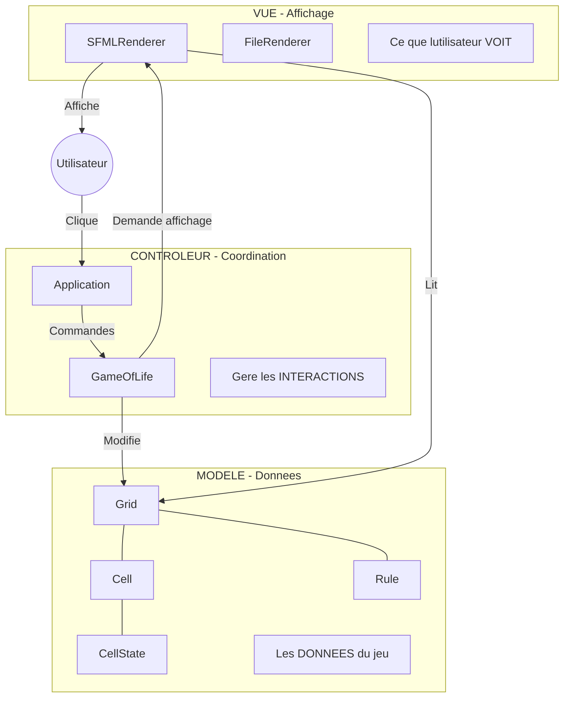

# Explications Detaillees des Concepts POO
## Guide Pedagogique pour Presentation Orale

Ce document explique chaque concept de maniere tres detaillee, comme si on l'expliquait a l'oral a quelqu'un qui ne connait rien a la programmation.

---

# PARTIE 1 : L'HERITAGE

## Qu'est-ce que l'heritage ?

### Analogie de la vie reelle

Imaginez une famille. Les enfants heritent des caracteristiques de leurs parents : la couleur des yeux, la taille, certains comportements. En programmation, c'est exactement pareil !

**L'heritage** permet a une classe (l'enfant) de recuperer automatiquement toutes les caracteristiques d'une autre classe (le parent).

### Pourquoi c'est utile ?

Sans heritage, si on veut creer 4 types de cellules differentes, on devrait ecrire 4 fois le meme code. Avec l'heritage, on ecrit le code commun UNE SEULE FOIS dans le parent, et les enfants en heritent automatiquement.

### Exemple concret dans notre projet

Dans le Jeu de la Vie, une cellule peut etre dans differents etats :
- Vivante
- Morte  
- Obstacle vivant
- Obstacle mort

Tous ces etats ont des choses en commun : ils doivent pouvoir dire s'ils sont vivants et s'ils sont des obstacles. Plutot que de reecrire ce code 4 fois, on cree une classe parent `CellState` dont heritent les 4 classes enfants.



### Comment lire ce diagramme ?

1. **La boite en haut** (CellState) est la classe PARENT - c'est le modele
2. **Les boites en bas** sont les classes ENFANTS - elles heritent du parent
3. **Les fleches** pointent vers le parent et signifient "herite de"
4. Le symbole `<|--` represente l'heritage en UML

### En code, ca donne quoi ?

```cpp
// ETAPE 1 : On cree la classe parent
// C'est comme creer un formulaire vide que les enfants devront remplir
class CellState {
public:
    // Ces methodes sont "virtuelles pures" (= 0)
    // Ca veut dire : "les enfants DOIVENT les implementer"
    virtual bool isAlive() const = 0;
    virtual bool isObstacle() const = 0;
};

// ETAPE 2 : On cree une classe enfant
// Elle "herite" de CellState avec le mot-cle : public CellState
class AliveCellState : public CellState {
public:
    // On DOIT implementer les methodes du parent
    bool isAlive() const override { 
        return true;  // Une cellule vivante retourne VRAI
    }
    
    bool isObstacle() const override { 
        return false;  // Ce n'est pas un obstacle
    }
};
```

### Les mots-cles importants

| Mot-cle | Signification | Analogie |
|---------|---------------|----------|
| `class Parent` | Declare la classe parent | Le formulaire modele |
| `: public Parent` | Declare l'heritage | "Je suis un enfant de Parent" |
| `virtual` | Methode redefinissable | "Les enfants peuvent changer ca" |
| `= 0` | Methode abstraite | "Les enfants DOIVENT definir ca" |
| `override` | Redefinition | "Je remplace la version du parent" |

---

# PARTIE 2 : LE POLYMORPHISME

## Qu'est-ce que le polymorphisme ?

### Analogie de la vie reelle

Imaginez que vous avez une telecommande universelle. Quand vous appuyez sur "Power", elle allume la tele. Mais si vous la pointez vers la chaine hi-fi et appuyez sur le meme bouton "Power", elle allume la chaine hi-fi.

**Meme bouton, meme action, mais resultat different selon l'appareil.**

C'est exactement ca le polymorphisme : un meme appel de methode produit des resultats differents selon l'objet qui recoit l'appel.

### Pourquoi c'est utile ?

Sans polymorphisme, on devrait ecrire :
```cpp
if (etat == "vivant") {
    return true;
} else if (etat == "mort") {
    return false;
} else if (etat == "obstacle_vivant") {
    return true;
}
// etc... tres long et repetitif !
```

Avec polymorphisme, on ecrit simplement :
```cpp
return state->isAlive();  // Ca marche pour TOUS les types !
```

### Exemple concret dans notre projet



### Comment ca fonctionne etape par etape ?

```
SCENARIO 1 : La cellule contient un AliveCellState
================================================

    Cell                    AliveCellState
    +----+                  +-------------+
    |    | -- state -->     | isAlive()   |
    |    |                  | return TRUE |
    +----+                  +-------------+
    
    Quand on appelle cell.isAlive()
    --> Ca appelle state->isAlive()
    --> AliveCellState repond TRUE


SCENARIO 2 : La cellule contient un DeadCellState
================================================

    Cell                    DeadCellState
    +----+                  +-------------+
    |    | -- state -->     | isAlive()   |
    |    |                  | return FALSE|
    +----+                  +-------------+
    
    Quand on appelle cell.isAlive()
    --> Ca appelle state->isAlive()
    --> DeadCellState repond FALSE


MEME CODE, RESULTATS DIFFERENTS = POLYMORPHISME
```

### En code, ca donne quoi ?

```cpp
class Cell {
private:
    // state peut pointer vers N'IMPORTE QUEL type d'etat
    // (AliveCellState, DeadCellState, ObstacleAliveState, etc.)
    CellState* state;
    
public:
    bool isAlive() const {
        // POLYMORPHISME ICI !
        // On appelle isAlive() sur state
        // Le resultat depend du TYPE REEL de state
        return state->isAlive();
    }
};

// UTILISATION :
Cell cellule1;  // contient AliveCellState
Cell cellule2;  // contient DeadCellState

cellule1.isAlive();  // --> true  (car AliveCellState)
cellule2.isAlive();  // --> false (car DeadCellState)

// MEME METHODE, RESULTATS DIFFERENTS !
```

### Pourquoi c'est magique ?

Le code de `Cell::isAlive()` ne change JAMAIS, mais il peut gerer :
- Des cellules vivantes
- Des cellules mortes
- Des obstacles vivants
- Des obstacles morts
- Et n'importe quel nouvel etat qu'on ajouterait dans le futur !

---

# PARTIE 3 : LA COMPOSITION

## Qu'est-ce que la composition ?

### Analogie de la vie reelle

Pensez a une voiture. Une voiture est COMPOSEE de :
- Un moteur
- Des roues
- Un volant
- Des sieges

Si vous detruisez la voiture, le moteur, les roues, le volant et les sieges sont detruits aussi. Ils n'existent pas independamment de la voiture.

**La composition = "est compose de" avec dependance forte**

### Dans notre projet

Une Grille est COMPOSEE de Cellules. Si on detruit la Grille, toutes ses Cellules sont detruites aussi.



### Comment lire ce diagramme ?

Le symbole `*--` avec le **losange PLEIN** (◆) signifie COMPOSITION :
- Le losange est du cote du "proprietaire" (Grid)
- La ligne pointe vers l'objet "possede" (Cell)
- Grid POSSEDE Cell
- Grid GERE le cycle de vie de Cell

### Cycle de vie en composition

```
CREATION :
==========
1. On cree Grid         --> Grid existe
2. Grid cree ses Cell   --> Cell existent

    +-------+
    | Grid  |----*----+-------+-------+-------+
    +-------+         | Cell  | Cell  | Cell  |
                      +-------+-------+-------+

DESTRUCTION :
=============
1. On detruit Grid      --> Grid va etre supprime
2. Grid detruit ses Cell --> Toutes les Cell supprimees
3. Grid supprime        --> Tout est nettoye

    +-------+
    |  X    |----X----+---X---+---X---+---X---+
    +-------+         |   X   |   X   |   X   |
                      +-------+-------+-------+
```

### En code, ca donne quoi ?

```cpp
class Grid {
private:
    // vector est un tableau dynamique
    // vector<vector<Cell>> = tableau 2D de Cell
    // Grid POSSEDE ces cellules directement (pas des pointeurs)
    std::vector<std::vector<Cell>> cells;
    
public:
    Grid(int width, int height) {
        // A la creation de Grid, on cree toutes les Cell
        cells.resize(height);
        for (int y = 0; y < height; y++) {
            cells[y].resize(width);
            // Chaque Cell est creee automatiquement
        }
    }
    
    // Quand Grid est detruit (sort de la memoire)
    // Le destructeur est appele AUTOMATIQUEMENT
    ~Grid() {
        // cells est detruit automatiquement
        // Et donc toutes les Cell sont detruites
        // On n'a RIEN a ecrire, C++ le fait pour nous !
    }
};
```

### Pourquoi utiliser la composition ?

| Avantage | Explication |
|----------|-------------|
| Gestion memoire automatique | Pas besoin de delete manuellement |
| Logique claire | Grid possede ses Cell, c'est evident |
| Pas de fuite memoire | Impossible d'oublier de supprimer |
| Encapsulation | Les Cell sont cachees dans Grid |

---

# PARTIE 4 : L'AGREGATION

## Qu'est-ce que l'agregation ?

### Analogie de la vie reelle

Pensez a une universite et ses etudiants :
- L'universite "utilise" des etudiants
- Mais si l'universite ferme, les etudiants continuent d'exister !
- Les etudiants peuvent meme aller dans une autre universite

**L'agregation = "utilise" avec dependance faible**

### Dans notre projet

GameOfLife UTILISE un IRenderer pour afficher, mais :
- Le renderer peut exister sans GameOfLife
- GameOfLife ne detruit pas le renderer
- On peut changer de renderer a tout moment



### Comment lire ce diagramme ?

Le symbole `o--` avec le **losange VIDE** (◇) signifie AGREGATION :
- GameOfLife UTILISE IRenderer
- Mais ne le POSSEDE PAS
- Ne gere PAS son cycle de vie

### Difference avec la composition

```
COMPOSITION (losange plein) :
=============================
    Grid ◆──── Cell
    
    Grid POSSEDE Cell
    Grid DETRUIT Cell quand Grid est detruit
    Cell ne peut pas exister sans Grid


AGREGATION (losange vide) :
===========================
    GameOfLife ◇──── IRenderer
    
    GameOfLife UTILISE IRenderer
    GameOfLife NE DETRUIT PAS IRenderer
    IRenderer peut exister sans GameOfLife
```

### En code, ca donne quoi ?

```cpp
class GameOfLife {
private:
    // POINTEUR simple = agregation
    // GameOfLife ne possede pas le renderer
    IRenderer* renderer;  // Juste une reference
    
public:
    // On RECOIT le renderer de l'exterieur
    void setRenderer(IRenderer* r) {
        renderer = r;  // On garde juste la reference
        // On NE CREE PAS le renderer
    }
    
    void render() {
        if (renderer) {
            renderer->render(grid);
        }
    }
    
    // Destructeur : on ne detruit PAS renderer !
    ~GameOfLife() {
        // Ne fait RIEN avec renderer
        // Car on ne le possede pas
    }
};

// UTILISATION :
class Application {
private:
    SFMLRenderer renderer;  // Application POSSEDE (composition)
    GameOfLife game;        // Application POSSEDE (composition)
    
public:
    void init() {
        // On PASSE le renderer au jeu (agregation)
        game.setRenderer(&renderer);
    }
};
```

### Tableau comparatif

| Aspect | Composition ◆ | Agregation ◇ |
|--------|---------------|--------------|
| Force | FORTE | FAIBLE |
| Possession | OUI | NON |
| Gestion memoire | OUI | NON |
| Destruction | Detruit les objets | Ne detruit pas |
| Exemple | Grid possede Cell | GameOfLife utilise Renderer |

---

# PARTIE 5 : LE PATTERN STRATEGY

## Qu'est-ce que le pattern Strategy ?

### Analogie de la vie reelle

Imaginez un GPS. Vous pouvez choisir differentes strategies de navigation :
- Route la plus rapide
- Route la plus courte
- Eviter les peages
- Eviter les autoroutes

Le GPS reste le meme, mais son comportement change selon la strategie choisie.

**Strategy = famille d'algorithmes interchangeables**

### Dans notre projet

Le Jeu de la Vie peut utiliser differentes REGLES :
- Regle Classique (B3/S23)
- Regle HighLife (B36/S23)
- Regle Day and Night (B3678/S34678)
- etc.

On peut changer de regle EN COURS de partie !



### Comment ca fonctionne ?

```
ETAPE 1 : Le jeu demarre avec ClassicRule
=========================================

    Grid                    ClassicRule
    +--------+              +-----------+
    | rule --|------------->| B3/S23    |
    +--------+              +-----------+
    
    Cellule morte + 3 voisins = NAIT
    Cellule vivante + 2 voisins = SURVIT


ETAPE 2 : L'utilisateur change de regle
=======================================

    Grid                    HighLifeRule
    +--------+              +-----------+
    | rule --|------------->| B36/S23   |
    +--------+              +-----------+
    
    Cellule morte + 3 voisins = NAIT
    Cellule morte + 6 voisins = NAIT aussi !
    
    
LE CODE DE GRID NE CHANGE PAS !
Seule la regle change, et le comportement change automatiquement.
```

### En code, ca donne quoi ?

```cpp
// L'INTERFACE STRATEGIE
class Rule {
public:
    // Toute regle doit pouvoir calculer le prochain etat
    virtual CellState* computeNextState(
        const CellState& current, 
        int neighbors
    ) = 0;
    
    virtual std::string getName() = 0;
};

// UNE STRATEGIE CONCRETE
class ClassicRule : public Rule {
public:
    CellState* computeNextState(const CellState& current, int neighbors) override {
        if (current.isAlive()) {
            // Survie : 2 ou 3 voisins
            if (neighbors == 2 || neighbors == 3) {
                return new AliveCellState();
            }
            return new DeadCellState();
        } else {
            // Naissance : exactement 3 voisins
            if (neighbors == 3) {
                return new AliveCellState();
            }
            return new DeadCellState();
        }
    }
    
    std::string getName() override { return "Classique"; }
};

// LE CONTEXTE QUI UTILISE LA STRATEGIE
class Grid {
private:
    Rule* rule;  // La strategie actuelle
    
public:
    // On peut CHANGER de strategie a tout moment !
    void setRule(Rule* newRule) {
        rule = newRule;
    }
    
    void computeNextGeneration() {
        for (chaque cellule) {
            int voisins = countNeighbors(x, y);
            
            // On DELEGUE a la strategie
            // Le resultat depend de QUELLE regle est active
            CellState* next = rule->computeNextState(
                cells[y][x].getState(), 
                voisins
            );
            
            cells[y][x].setNextState(next);
        }
    }
};
```

### Avantages du pattern Strategy

| Avantage | Explication |
|----------|-------------|
| Flexibilite | Changer d'algorithme sans modifier le code principal |
| Open/Closed | Ajouter de nouvelles regles sans toucher a Grid |
| Testabilite | Tester chaque regle independamment |
| Clarte | Chaque regle dans sa propre classe |

---

# PARTIE 6 : LE PATTERN FACTORY

## Qu'est-ce que le pattern Factory ?

### Analogie de la vie reelle

Imaginez une usine de voitures. Vous dites juste "Je veux une voiture rouge" et l'usine se charge de :
- Choisir le bon modele
- Assembler les pieces
- Vous livrer le produit fini

Vous n'avez pas besoin de savoir COMMENT la voiture est fabriquee.

**Factory = usine qui cree des objets pour vous**

### Dans notre projet

On a differents formats de fichiers :
- `.txt` → utilise StandardFileHandler
- `.rle` → utilise RLEFileHandler
- `.gol` → utilise ExtendedFileHandler

La Factory choisit automatiquement le bon handler selon l'extension !



### Comment ca fonctionne ?

```
SCENARIO : L'utilisateur veut charger "game.txt"
================================================

1. On demande a la Factory :
   FileHandlerFactory::createForFile("game.txt")

2. La Factory analyse l'extension :
   "game.txt" --> extension = ".txt"

3. La Factory DECIDE quel handler creer :
   ".txt" --> return new StandardFileHandler()

4. On recoit le bon handler, pret a l'emploi !


SCENARIO : L'utilisateur veut charger "pattern.rle"
===================================================

1. On demande a la Factory :
   FileHandlerFactory::createForFile("pattern.rle")

2. La Factory analyse l'extension :
   "pattern.rle" --> extension = ".rle"

3. La Factory DECIDE quel handler creer :
   ".rle" --> return new RLEFileHandler()

4. On recoit le bon handler, pret a l'emploi !


LE CODE CLIENT NE CHANGE JAMAIS !
Il demande juste "cree-moi un handler pour ce fichier"
```

### En code, ca donne quoi ?

```cpp
class FileHandlerFactory {
public:
    // LA METHODE FACTORY
    // Cree le bon handler selon l'extension du fichier
    static IFileHandler* createForFile(const std::string& filename) {
        
        // 1. Trouver l'extension
        std::string ext = getExtension(filename);
        
        // 2. Decider quel handler creer
        if (ext == ".txt" || ext == ".cells") {
            return new StandardFileHandler();
        }
        else if (ext == ".rle") {
            return new RLEFileHandler();
        }
        else if (ext == ".gol") {
            return new ExtendedFileHandler();
        }
        else {
            // Par defaut
            return new StandardFileHandler();
        }
    }
};

// UTILISATION - Super simple !
void Grid::loadFromFile(const std::string& filename) {
    // On demande a la factory de creer le bon handler
    auto handler = FileHandlerFactory::createForFile(filename);
    
    // On utilise le handler (sans savoir quel type c'est)
    handler->load(filename, *this);
    
    // C'est tout ! La factory a gere toute la complexite
}
```

### Avantages du pattern Factory

| Avantage | Explication |
|----------|-------------|
| Centralisation | Toute la logique de creation au meme endroit |
| Simplicite | Le code client ne sait pas comment creer |
| Flexibilite | Facile d'ajouter de nouveaux types |
| Maintenance | Un seul endroit a modifier |

---

# PARTIE 7 : LE PATTERN STATE

## Qu'est-ce que le pattern State ?

### Analogie de la vie reelle

Pensez a un feu de circulation :
- Etat ROUGE → les voitures s'arretent
- Etat ORANGE → les voitures ralentissent
- Etat VERT → les voitures passent

Le feu est toujours le meme objet, mais son COMPORTEMENT change selon son ETAT.

**State = l'objet change de comportement selon son etat interne**

### Dans notre projet

Une cellule peut etre dans differents etats, et chaque etat a un comportement different :



### Comment lire ce diagramme d'etats ?

1. **[*]** = point de depart
2. **Rectangles** = les differents etats possibles
3. **Fleches** = transitions possibles
4. **Texte sur fleches** = condition pour la transition

### En code, ca donne quoi ?

```cpp
// L'objet qui change d'etat
class Cell {
private:
    CellState* state;  // L'etat actuel
    
public:
    Cell() {
        state = new DeadCellState();  // Commence morte
    }
    
    // Le comportement depend de l'etat
    bool isAlive() const {
        return state->isAlive();  // Delegue a l'etat
    }
    
    // Changer d'etat
    void setAlive(bool alive) {
        delete state;
        if (alive) {
            state = new AliveCellState();
        } else {
            state = new DeadCellState();
        }
    }
    
    // Transition automatique selon les regles du jeu
    void update() {
        // L'etat suivant a ete calcule
        delete state;
        state = nextState;
        nextState = nullptr;
    }
};
```

---

# PARTIE 8 : ARCHITECTURE MVC

## Qu'est-ce que MVC ?

### Analogie de la vie reelle

Pensez a un restaurant :
- **Le Chef (Model)** : prepare la nourriture, connait les recettes
- **Le Serveur (Controller)** : prend les commandes, coordonne
- **L'Assiette (View)** : presente la nourriture au client

Chacun a son role, ils ne se melangent pas.

**MVC = separer les responsabilites en 3 parties**

### Dans notre projet



### Les 3 composants expliques

#### 1. Le MODELE (Model)

```
QU'EST-CE QUE C'EST ?
====================
- Les DONNEES de l'application
- La LOGIQUE METIER (les regles du jeu)
- Ne sait RIEN de l'affichage

DANS NOTRE PROJET :
==================
- Grid : la grille de cellules
- Cell : une cellule individuelle
- CellState : l'etat d'une cellule
- Rule : les regles d'evolution

EXEMPLE :
========
Grid sait comment :
- Stocker les cellules
- Calculer les voisins
- Appliquer les regles
- Mais ne sait PAS comment s'afficher !
```

#### 2. La VUE (View)

```
QU'EST-CE QUE C'EST ?
====================
- L'AFFICHAGE de l'application
- Ce que l'utilisateur VOIT
- Ne contient PAS de logique metier

DANS NOTRE PROJET :
==================
- SFMLRenderer : affichage graphique
- FileRenderer : sauvegarde en fichiers
- NullRenderer : pas d'affichage (tests)

EXEMPLE :
========
SFMLRenderer sait comment :
- Dessiner des rectangles
- Afficher du texte
- Gerer les couleurs
- Mais ne sait PAS les regles du jeu !
```

#### 3. Le CONTROLEUR (Controller)

```
QU'EST-CE QUE C'EST ?
====================
- Le CHEF D'ORCHESTRE
- Recoit les commandes de l'utilisateur
- Coordonne Model et View

DANS NOTRE PROJET :
==================
- GameOfLife : gere la simulation
- Application : gere l'interface

EXEMPLE :
========
GameOfLife :
- Recoit "avancer d'un pas"
- Dit a Grid de calculer
- Dit au Renderer d'afficher
```

### Pourquoi separer comme ca ?

| Avantage | Explication |
|----------|-------------|
| Maintenance | Modifier l'affichage sans toucher a la logique |
| Tests | Tester le modele sans interface graphique |
| Reutilisation | Meme modele, differentes vues |
| Travail en equipe | Un dev sur le modele, un sur la vue |

---

# PARTIE 9 : PRINCIPES SOLID

## Les 5 principes de bonne conception

### S - Single Responsibility (Responsabilite Unique)

```
PRINCIPE :
=========
Une classe = UNE seule responsabilite
Une classe ne doit avoir qu'UNE seule raison de changer

MAUVAIS EXEMPLE :
================
class GodClass {
    void calculerEtat();      // Logique jeu
    void dessinerEcran();     // Affichage
    void sauvegarderFichier(); // Persistance
    void jouerSon();          // Audio
}
// Cette classe fait TOUT = MAUVAIS

BON EXEMPLE (notre projet) :
===========================
class Cell {
    // Responsabilite unique : gerer l'etat d'UNE cellule
}

class Grid {
    // Responsabilite unique : gerer la COLLECTION de cellules
}

class Rule {
    // Responsabilite unique : calculer les TRANSITIONS
}

class IRenderer {
    // Responsabilite unique : AFFICHER
}
```

### O - Open/Closed (Ouvert/Ferme)

```
PRINCIPE :
=========
- OUVERT a l'extension (on peut ajouter)
- FERME a la modification (on ne change pas l'existant)

DANS NOTRE PROJET :
==================
Pour ajouter une nouvelle regle (ex: "BriansBrain") :

1. On CREE une nouvelle classe :
   class BriansBrainRule : public Rule { ... }

2. On NE MODIFIE PAS :
   - La classe Rule
   - La classe Grid
   - Aucun code existant !

Le systeme est OUVERT (on peut ajouter BriansBrainRule)
mais FERME (on ne touche pas au code existant)
```

### L - Liskov Substitution (Substitution de Liskov)

```
PRINCIPE :
=========
Un objet enfant doit pouvoir remplacer son parent
sans casser le programme

DANS NOTRE PROJET :
==================
Partout ou on utilise IRenderer, on peut mettre :
- SFMLRenderer
- FileRenderer
- NullRenderer

Le code continue de fonctionner !

game.setRenderer(new SFMLRenderer());  // OK
game.setRenderer(new FileRenderer());  // OK aussi !
game.setRenderer(new NullRenderer());  // OK encore !
```

### I - Interface Segregation (Segregation des Interfaces)

```
PRINCIPE :
=========
Plein de petites interfaces specifiques
vaut mieux qu'une grosse interface generale

MAUVAIS EXEMPLE :
================
class IEverything {
    void render();
    void load();
    void save();
    void playSound();
    void sendNetwork();
    // Trop de choses !
}

BON EXEMPLE (notre projet) :
===========================
class IRenderer {
    void render();  // Juste l'affichage
}

class IFileHandler {
    void load();
    void save();  // Juste les fichiers
}

// Interfaces petites et focalisees
```

### D - Dependency Inversion (Inversion des Dependances)

```
PRINCIPE :
=========
- Les modules de haut niveau ne dependent pas des modules de bas niveau
- Les deux dependent d'ABSTRACTIONS

MAUVAIS EXEMPLE :
================
class GameOfLife {
    SFMLRenderer renderer;  // Depend du CONCRET
    // Si on veut changer de renderer, on doit modifier GameOfLife
}

BON EXEMPLE (notre projet) :
===========================
class GameOfLife {
    IRenderer* renderer;  // Depend de l'ABSTRACTION
    // On peut injecter n'importe quel renderer !
}

GameOfLife depend de IRenderer (abstraction)
SFMLRenderer implemente IRenderer
--> GameOfLife ne connait PAS SFMLRenderer directement
```

---

# RESUME FINAL

## Les concepts cles a retenir

| Concept | Definition simple | Exemple du projet |
|---------|-------------------|-------------------|
| Heritage | Enfant herite du parent | AliveCellState herite de CellState |
| Polymorphisme | Meme appel, resultats differents | cell.isAlive() selon le type d'etat |
| Composition | Possede et gere | Grid possede ses Cell |
| Agregation | Utilise sans posseder | GameOfLife utilise IRenderer |
| Encapsulation | Cache les details | Attributs prives, methodes publiques |
| Abstraction | Interface sans implementation | IRenderer, Rule |
| Pattern State | Comportement selon etat | CellState |
| Pattern Strategy | Algorithmes interchangeables | Rule |
| Pattern Factory | Usine a objets | FileHandlerFactory |
| MVC | Separer Model/View/Controller | Grid / Renderer / GameOfLife |

