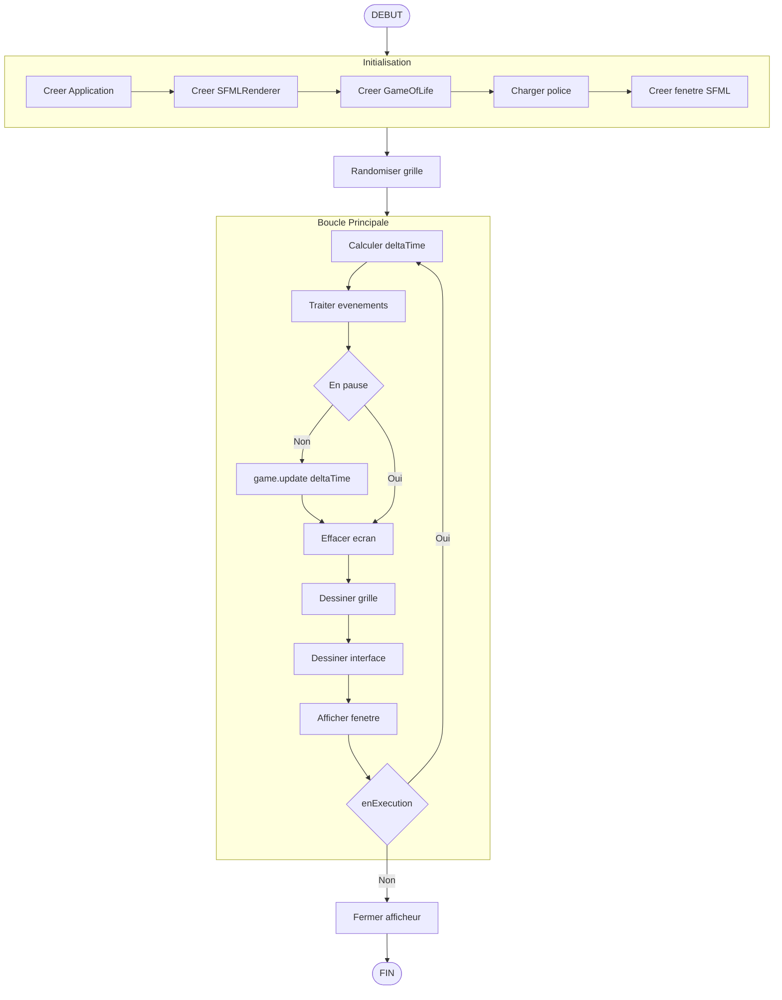
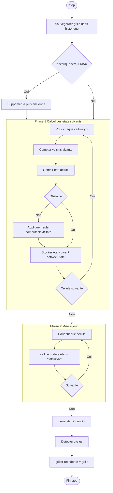
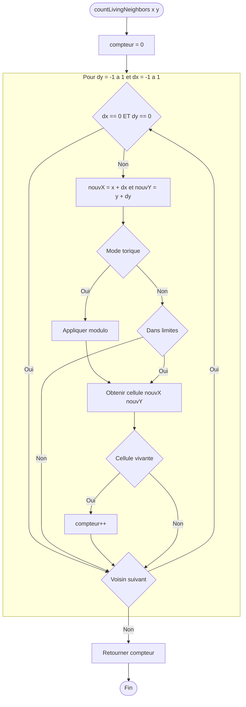
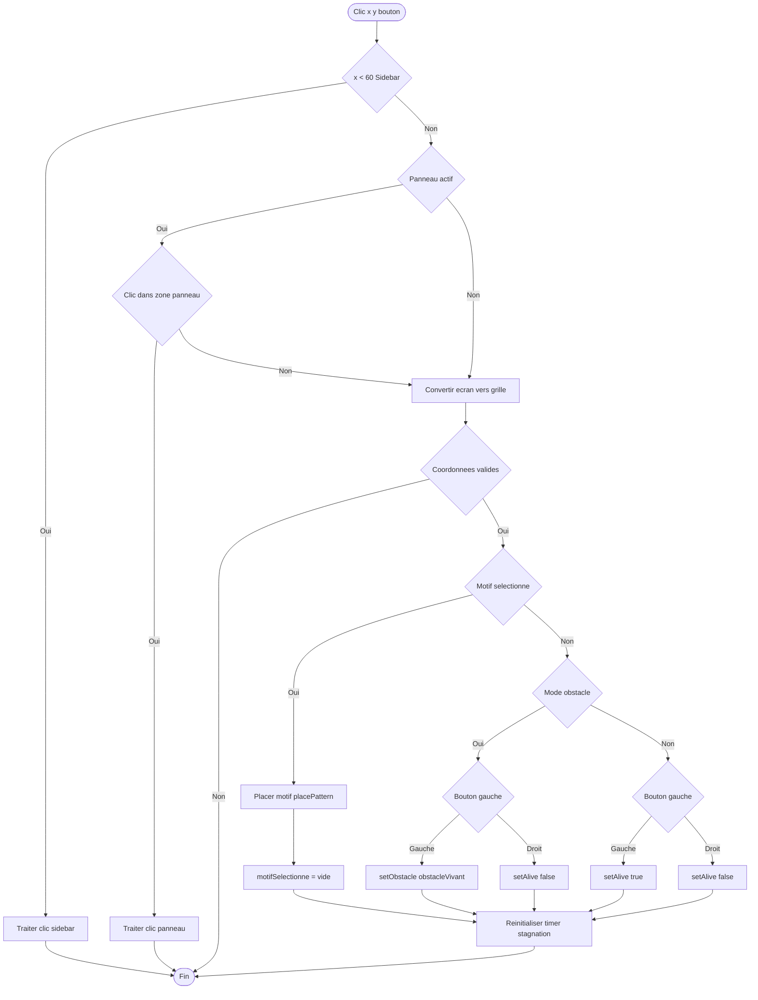
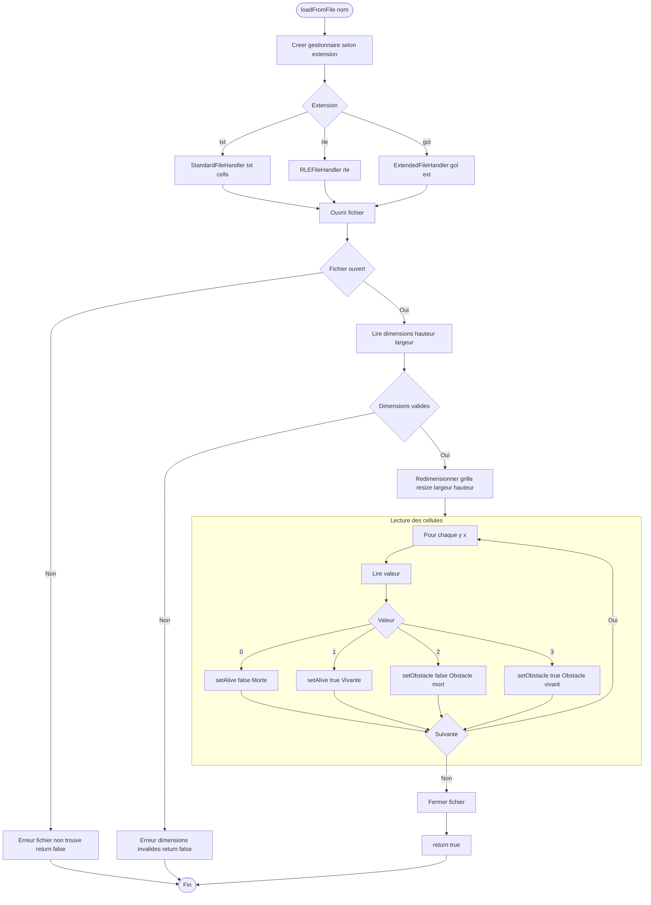
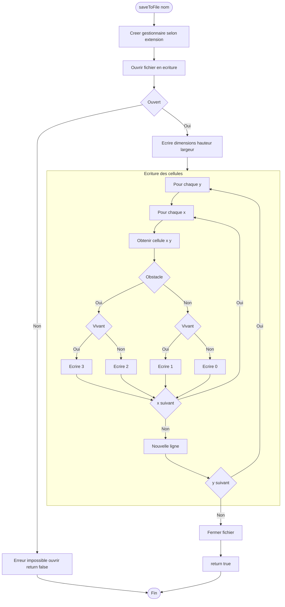
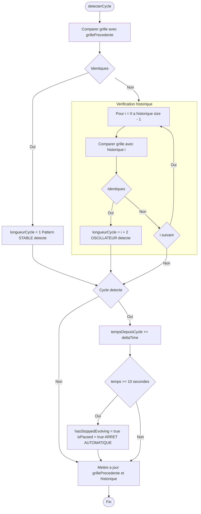
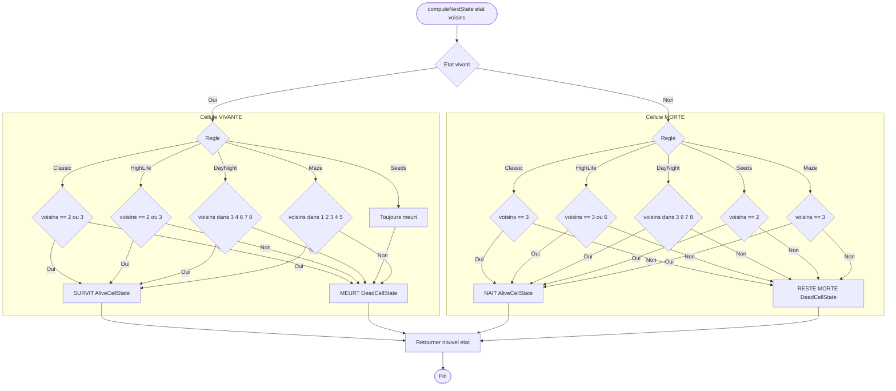
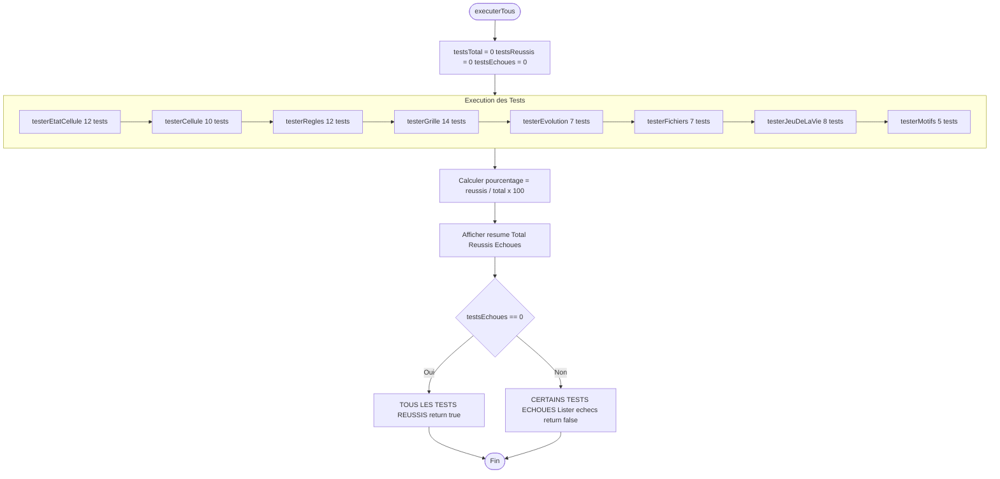

# Diagrammes Activite - Mermaid

## 1. Boucle Principale Application

---

## 2. Calcul Generation

---

## 3. Comptage des Voisins

---

## 4. Gestion Clic Souris

---

## 5. Chargement Fichier

---

## 6. Sauvegarde Fichier

---

## 7. Detection de Cycle

---

## 8. Gestion Evenements Clavier

```mermaid
flowchart TD
    START([Touche pressee])
    
    KEY{Quelle touche}
    
    SPACE[Basculer pause togglePause]
    
    N[Avancer un pas step]
    
    R[Randomiser grille randomize]
    
    C[Effacer grille clear]
    
    O[Basculer mode obstacle]
    
    V[Basculer type obstacle]
    
    T[Basculer mode torique]
    
    P[Basculer mode parallele]
    
    H[Ouvrir Fermer panneau Aide]
    
    F[Ouvrir Fermer panneau Fichier]
    
    M[Ouvrir Fermer panneau Modes]
    
    G[Ouvrir Fermer panneau Motifs]
    
    ESC[Fermer panneau actif]
    
    NUMS[Selectionner regle 1-5]
    
    PLUS[Augmenter vitesse]
    
    MINUS[Diminuer vitesse]
    
    LEFT[Reculer historique stepBack]
    
    RIGHT[Avancer historique stepForward]
    
    S_KEY[Sauvegarder etat initial]
    
    L_KEY[Restaurer etat initial]
    
    W[Sauvegarde rapide quickSave]
    
    STATUS[Afficher message statut]
    
    FIN([Fin])
    
    START --> KEY
    KEY -->|ESPACE| SPACE --> STATUS
    KEY -->|N| N --> STATUS
    KEY -->|R| R --> STATUS
    KEY -->|C| C --> STATUS
    KEY -->|O| O --> STATUS
    KEY -->|V| V --> STATUS
    KEY -->|T| T --> STATUS
    KEY -->|P| P --> STATUS
    KEY -->|H| H --> FIN
    KEY -->|F| F --> FIN
    KEY -->|M| M --> FIN
    KEY -->|G| G --> FIN
    KEY -->|ECHAP| ESC --> FIN
    KEY -->|1-5| NUMS --> STATUS
    KEY -->|PLUS| PLUS --> STATUS
    KEY -->|MOINS| MINUS --> STATUS
    KEY -->|GAUCHE| LEFT --> STATUS
    KEY -->|DROITE| RIGHT --> STATUS
    KEY -->|S| S_KEY --> STATUS
    KEY -->|L| L_KEY --> STATUS
    KEY -->|W| W --> STATUS
    STATUS --> FIN
```

---

## 9. Application de la Regle

---

## 10. Tests Unitaires

