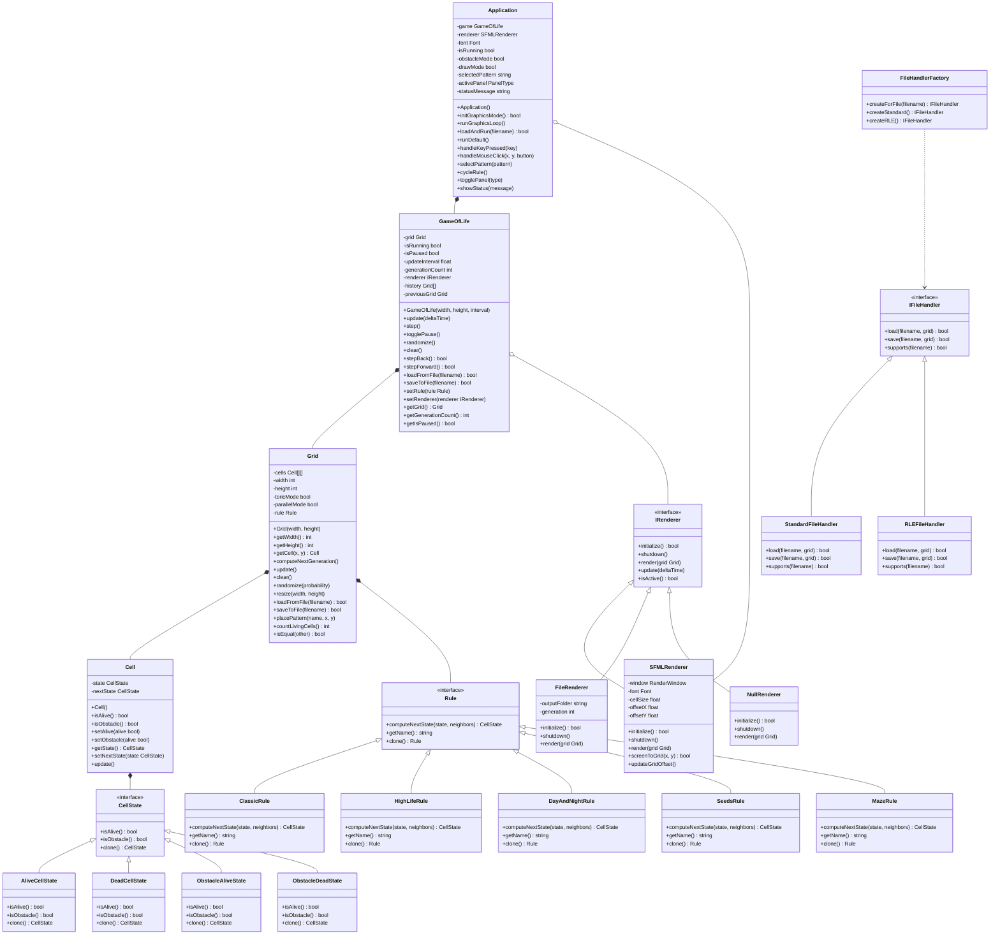
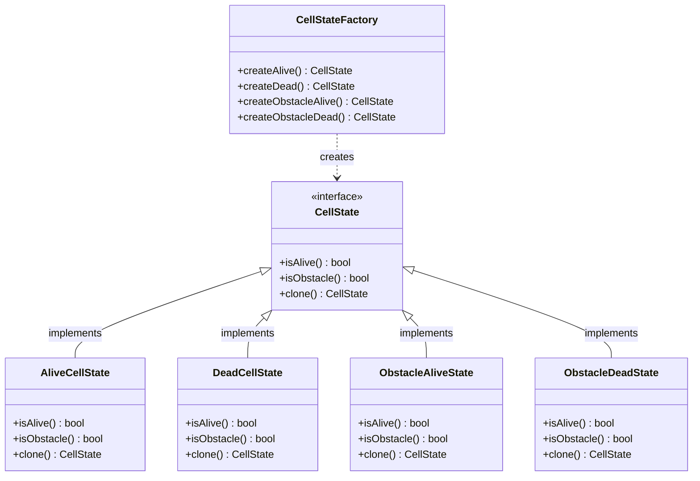
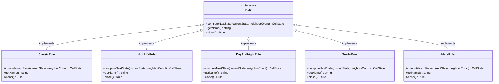
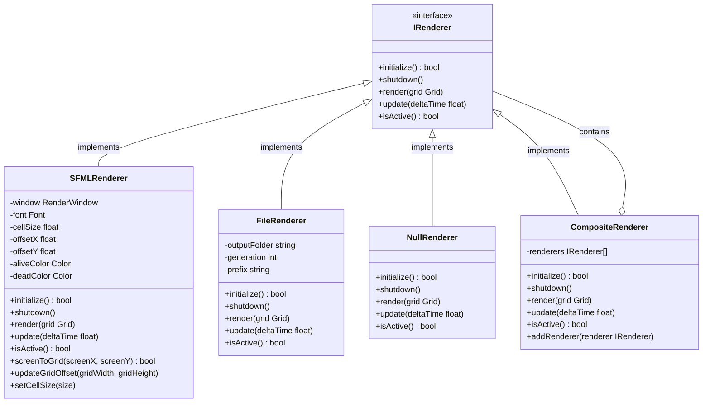
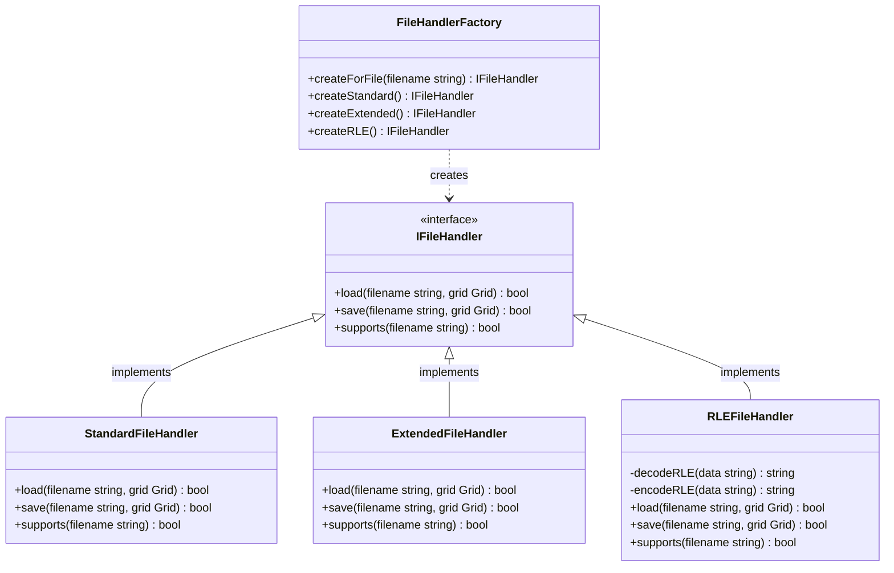
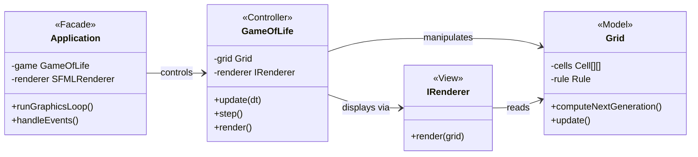
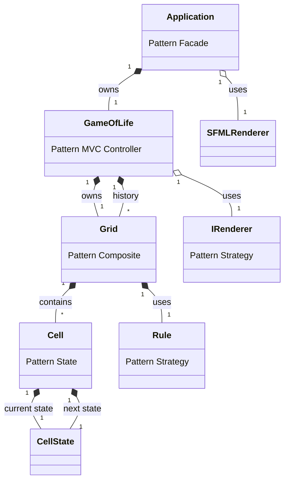

# Diagrammes de Classes - Mermaid

## 1. Diagramme Complet du Systeme

---

## 2. Bloc Etats - State Pattern

---

## 3. Bloc Regles - Strategy Pattern

---

## 4. Bloc Afficheurs - Strategy Pattern

---

## 5. Bloc Gestionnaires Fichiers - Factory Pattern

---

## 6. Architecture MVC Globale

---

## 7. Relations et Cardinalites

