# Concepts POO - Diagrammes pour Presentation

Ce fichier contient des diagrammes separes pour expliquer chaque concept de Programmation Orientee Objet avec des exemples concrets du projet Jeu de la Vie.

---

## 1. HERITAGE - Hierarchie de Classes

### Explication
L'heritage permet a une classe enfant d'heriter des attributs et methodes d'une classe parent.
- La classe enfant **est un** type de la classe parent
- Symbole UML : fleche vide pointant vers le parent

### Exemple : Hierarchie des Etats

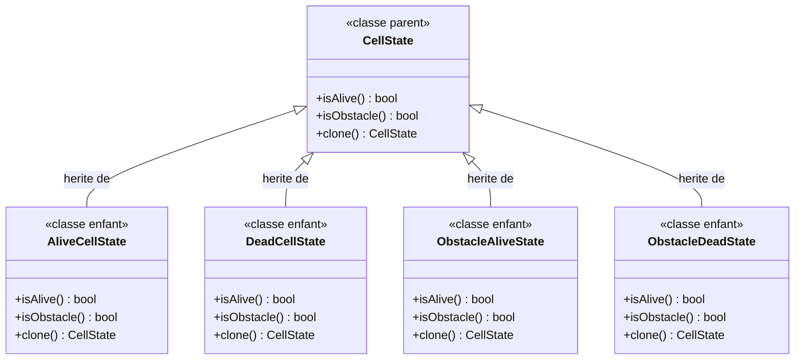

### Code C++ correspondant

```cpp
// Classe parent (abstraite)
class CellState {
public:
    virtual bool isAlive() const = 0;
    virtual bool isObstacle() const = 0;
    virtual std::unique_ptr<CellState> clone() const = 0;
};

// Classe enfant
class AliveCellState : public CellState {
public:
    bool isAlive() const override { return true; }
    bool isObstacle() const override { return false; }
    std::unique_ptr<CellState> clone() const override {
        return std::make_unique<AliveCellState>();
    }
};
```

---

## 2. HERITAGE - Hierarchie des Regles

### Exemple : Differentes regles du jeu

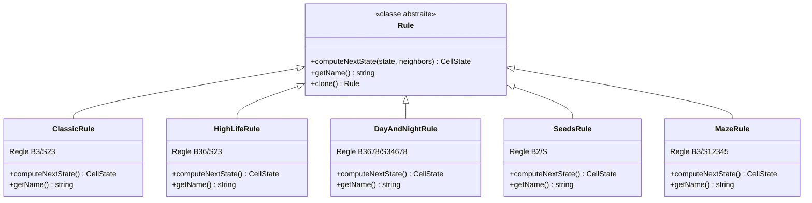

---

## 3. POLYMORPHISME

### Explication
Le polymorphisme permet d'utiliser des objets de classes differentes de maniere uniforme via une interface commune.
- Un meme appel de methode produit des comportements differents selon l'objet
- Permet de traiter des objets de types differents de la meme facon

### Exemple : Polymorphisme des Etats

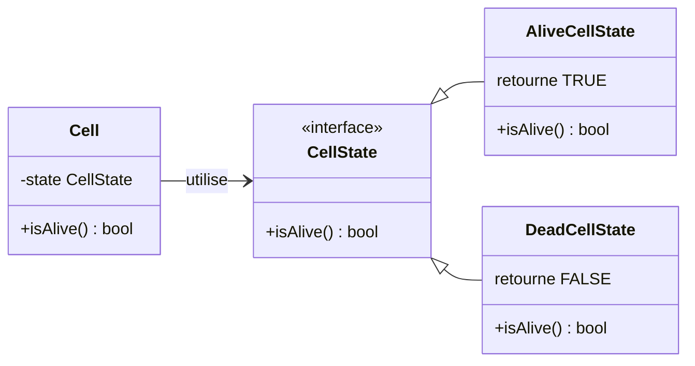

### Code C++ correspondant

```cpp
// Dans Cell.cpp
bool Cell::isAlive() const {
    return state->isAlive();  // Appel polymorphe
}

// Si state pointe vers AliveCellState -> retourne true
// Si state pointe vers DeadCellState  -> retourne false
// MEME CODE, COMPORTEMENT DIFFERENT
```

### Exemple : Polymorphisme des Renderers

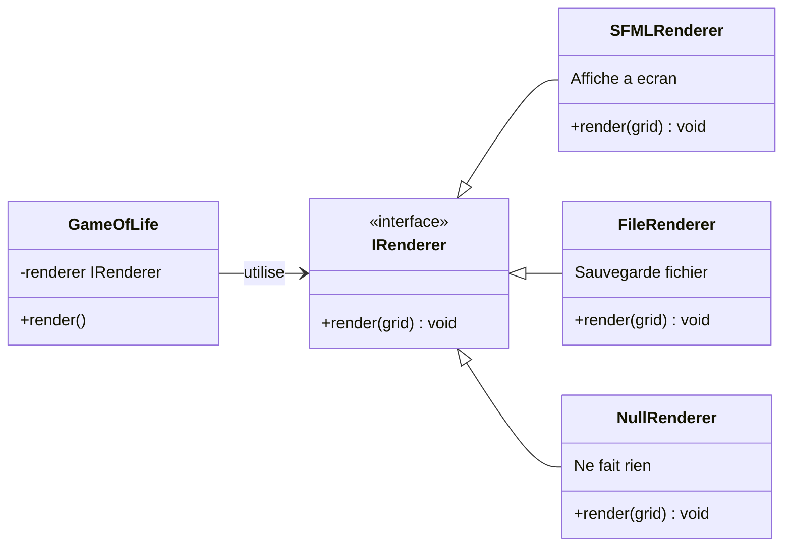

---

## 4. RELATIONS - Composition

### Explication
La composition est une relation FORTE ou un objet possede et gere le cycle de vie d'autres objets.
- Si le conteneur est detruit, les objets contenus le sont aussi
- Symbole UML : losange PLEIN

### Exemple : Grid compose de Cells

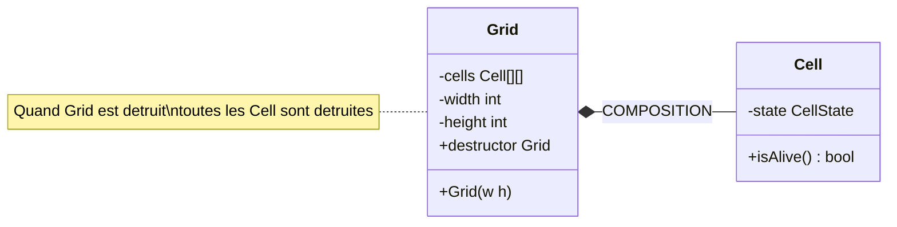

### Exemple : Cell compose de CellState

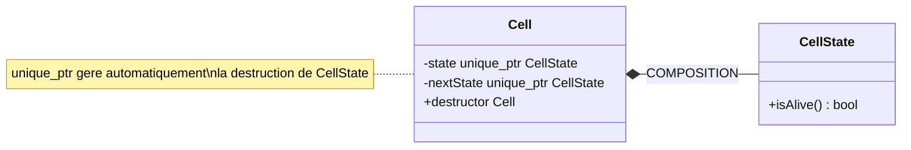

### Code C++ correspondant

```cpp
class Grid {
private:
    std::vector<std::vector<Cell>> cells;  // Grid POSSEDE les cells
    // Quand Grid est detruit, cells sont detruites automatiquement
};

class Cell {
private:
    std::unique_ptr<CellState> state;  // Cell POSSEDE son etat
    // unique_ptr detruit automatiquement CellState
};
```

---

## 5. RELATIONS - Agregation

### Explication
L'agregation est une relation FAIBLE ou un objet utilise un autre objet sans en gerer le cycle de vie.
- L'objet utilise peut exister independamment
- Symbole UML : losange VIDE

### Exemple : GameOfLife utilise IRenderer

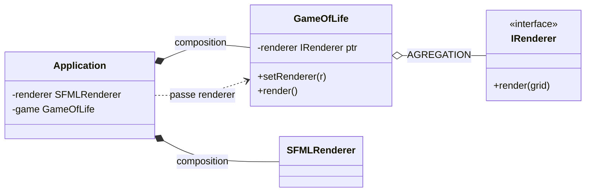

### Code C++ correspondant

```cpp
class GameOfLife {
private:
    IRenderer* renderer;  // Pointeur simple = agregation
    // GameOfLife NE detruit PAS renderer
    
public:
    void setRenderer(IRenderer* r) {
        renderer = r;  // Utilise mais ne possede pas
    }
};

class Application {
private:
    SFMLRenderer renderer;  // Application possede
    GameOfLife game;
    
    void init() {
        game.setRenderer(&renderer);  // Passe reference
    }
};
```

---

## 6. RELATIONS - Association

### Explication
L'association est une relation simple ou un objet connait un autre objet temporairement.
- Relation la plus faible
- Utilisation ponctuelle

### Exemple : Grid utilise FileHandler temporairement

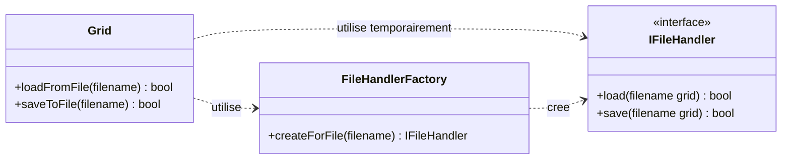

### Code C++ correspondant

```cpp
bool Grid::loadFromFile(const std::string& filename) {
    // Creation temporaire du handler
    auto handler = FileHandlerFactory::createForFile(filename);
    
    // Utilisation
    bool success = handler->load(filename, *this);
    
    // handler detruit automatiquement a la fin
    return success;
}
```

---

## 7. RELATIONS - Resume Comparatif

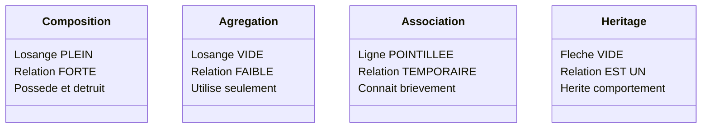

### Tableau Comparatif

| Relation | Symbole | Force | Cycle de vie | Exemple |
|----------|---------|-------|--------------|---------|
| Composition | ◆ | Forte | Gere | Grid possede Cell |
| Agregation | ◇ | Faible | Ne gere pas | GameOfLife utilise IRenderer |
| Association | --- | Temporaire | Independant | Grid utilise FileHandler |
| Heritage | ◁ | EST UN | - | AliveCellState herite CellState |

---

## 8. ENCAPSULATION

### Explication
L'encapsulation cache les details d'implementation et expose une interface publique.
- Attributs prives (-) : accessible uniquement dans la classe
- Methodes publiques (+) : interface pour l'exterieur
- Protection des donnees

### Exemple : Classe Cell

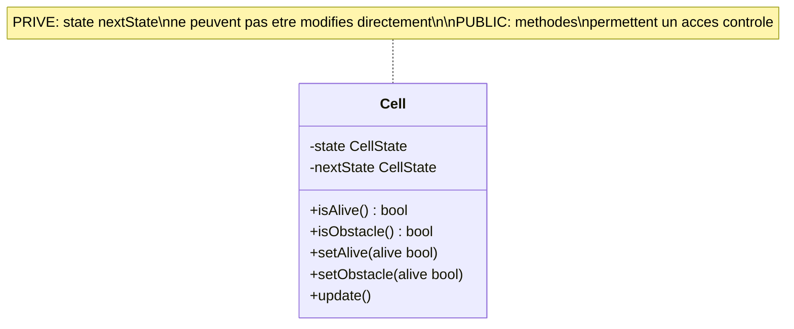

### Code C++ correspondant

```cpp
class Cell {
private:  // ENCAPSULE - cache
    std::unique_ptr<CellState> state;
    std::unique_ptr<CellState> nextState;
    
public:  // INTERFACE - expose
    bool isAlive() const {
        return state->isAlive();
    }
    
    void setAlive(bool alive) {
        // Validation possible ici
        if (alive) {
            state = std::make_unique<AliveCellState>();
        } else {
            state = std::make_unique<DeadCellState>();
        }
    }
};
```

---

## 9. ABSTRACTION

### Explication
L'abstraction definit un contrat sans implementation concrete.
- Classe abstraite : ne peut pas etre instanciee
- Methodes virtuelles pures : doivent etre implementees

### Exemple : Interface IRenderer

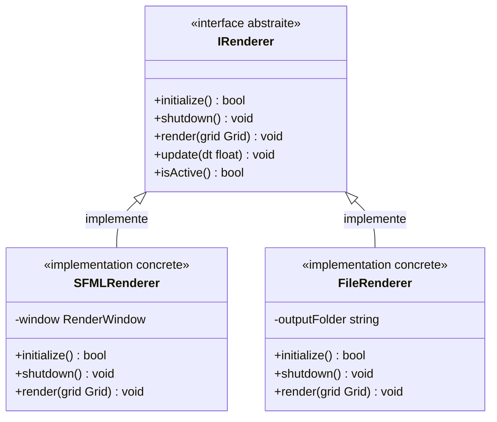

### Code C++ correspondant

```cpp
// ABSTRACTION - Interface pure
class IRenderer {
public:
    virtual bool initialize() = 0;  // = 0 signifie abstrait
    virtual void shutdown() = 0;
    virtual void render(const Grid& grid) = 0;
    virtual ~IRenderer() = default;
};

// IMPLEMENTATION CONCRETE
class SFMLRenderer : public IRenderer {
public:
    bool initialize() override {
        window = new sf::RenderWindow(...);
        return true;
    }
    
    void render(const Grid& grid) override {
        // Code specifique SFML
    }
};
```

---

## 10. DESIGN PATTERN - State

### Explication
Le pattern State permet a un objet de changer de comportement quand son etat interne change.

### Exemple : Etat des Cellules

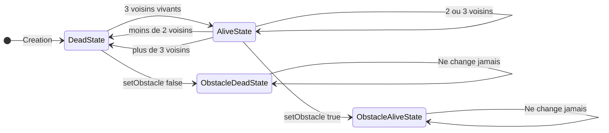

### Diagramme de Classes

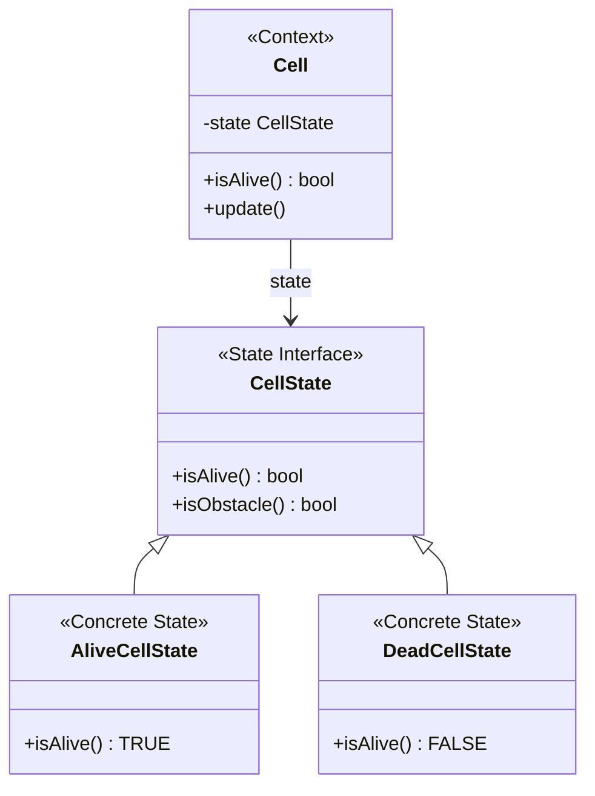

---

## 11. DESIGN PATTERN - Strategy

### Explication
Le pattern Strategy permet de definir une famille d'algorithmes interchangeables.

### Exemple : Regles du Jeu

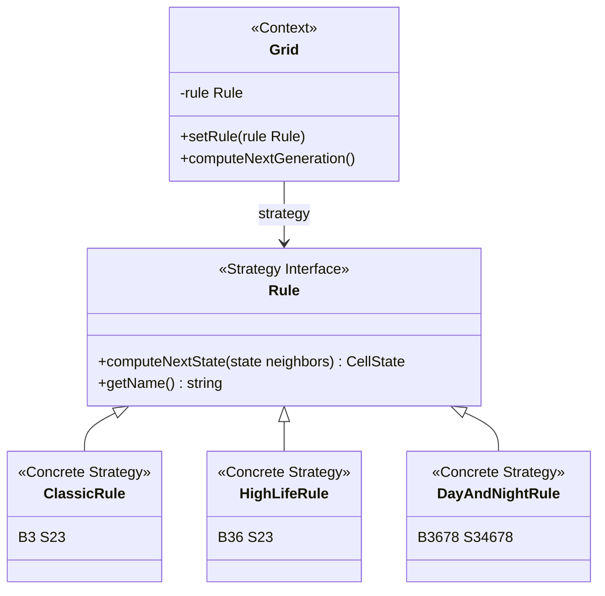

### Code C++ correspondant

```cpp
// Dans Grid
void Grid::computeNextGeneration() {
    for (int y = 0; y < height; y++) {
        for (int x = 0; x < width; x++) {
            int neighbors = countLivingNeighbors(x, y);
            
            // La STRATEGIE decide du prochain etat
            auto nextState = rule->computeNextState(
                cells[y][x].getState(), 
                neighbors
            );
            
            cells[y][x].setNextState(std::move(nextState));
        }
    }
}

// Changer de strategie a runtime
void Grid::setRule(std::unique_ptr<Rule> newRule) {
    rule = std::move(newRule);
}
```

---

## 12. DESIGN PATTERN - Factory

### Explication
Le pattern Factory centralise la creation d'objets et cache la logique d'instanciation.

### Exemple : Factory des FileHandlers

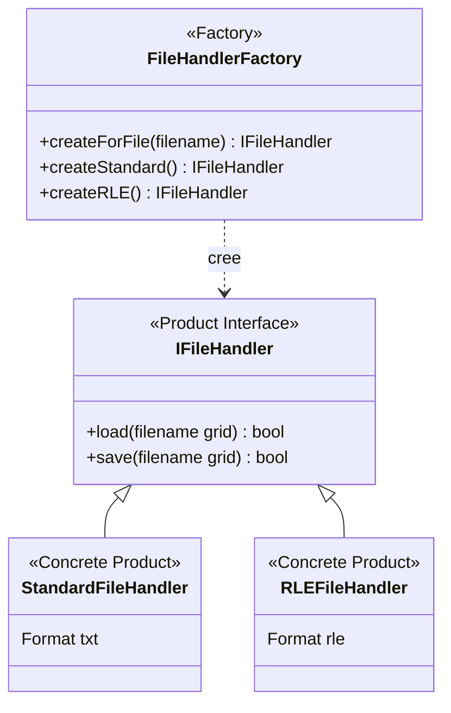

### Code C++ correspondant

```cpp
class FileHandlerFactory {
public:
    static std::unique_ptr<IFileHandler> createForFile(
        const std::string& filename
    ) {
        std::string ext = getExtension(filename);
        
        if (ext == ".txt" || ext == ".cells") {
            return std::make_unique<StandardFileHandler>();
        }
        else if (ext == ".rle") {
            return std::make_unique<RLEFileHandler>();
        }
        else {
            return std::make_unique<StandardFileHandler>();
        }
    }
};

// Utilisation
auto handler = FileHandlerFactory::createForFile("game.txt");
handler->load("game.txt", grid);
```

---

## 13. DESIGN PATTERN - Facade

### Explication
Le pattern Facade fournit une interface simplifiee pour un sous-systeme complexe.

### Exemple : Application comme Facade

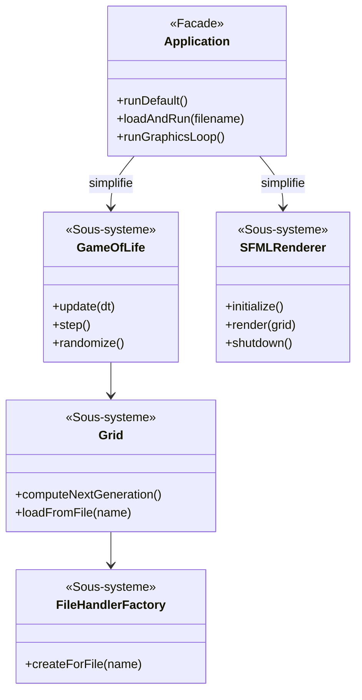

### Code C++ correspondant

```cpp
class Application {
private:
    GameOfLife* game;
    SFMLRenderer* renderer;
    
public:
    // FACADE - Interface simple
    void runDefault() {
        initGraphicsMode();
        game->randomize();
        runGraphicsLoop();
    }
    
    // Cache la complexite interne
    bool loadAndRun(const std::string& filename) {
        if (!initGraphicsMode()) return false;
        if (!game->loadFromFile(filename)) return false;
        renderer->updateGridOffset(
            game->getGrid().getWidth(),
            game->getGrid().getHeight()
        );
        runGraphicsLoop();
        return true;
    }
};
```

---

## 14. ARCHITECTURE MVC

### Explication
Model-View-Controller separe les responsabilites en 3 couches.

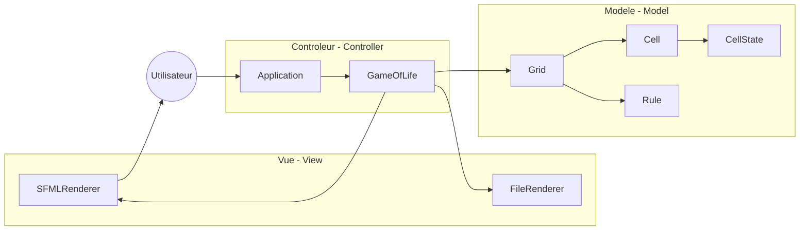

### Diagramme de Classes

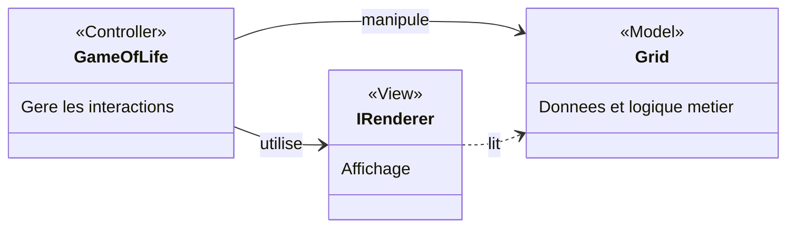

---

## 15. PRINCIPES SOLID

### S - Single Responsibility

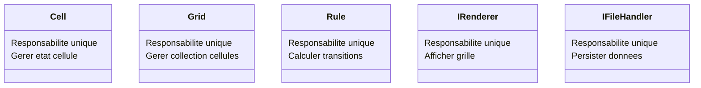

### O - Open/Closed

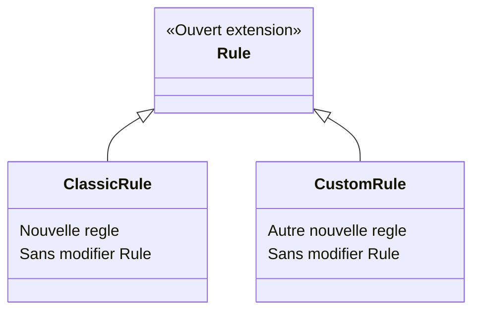

### L - Liskov Substitution

```mermaid
classDiagram
    class IRenderer {
        +render(grid)
    }
    
    class SFMLRenderer {
        +render(grid)
    }
    
    class FileRenderer {
        +render(grid)
    }
    
    class NullRenderer {
        +render(grid)
    }
    
    IRenderer <|-- SFMLRenderer
    IRenderer <|-- FileRenderer
    IRenderer <|-- NullRenderer
    
    note for IRenderer "Tous les enfants peuvent\nremplacer le parent\nsans casser le code"
```

### I - Interface Segregation

```mermaid
classDiagram
    class IRenderer {
        <<Interface specifique>>
        +render(grid)
        +initialize()
        +shutdown()
    }
    
    class IFileHandler {
        <<Interface specifique>>
        +load(name grid)
        +save(name grid)
    }
    
    note for IRenderer "Interfaces petites\net specifiques\npas une grosse interface"
```

### D - Dependency Inversion

```mermaid
classDiagram
    class GameOfLife {
        <<Haut niveau>>
        -renderer IRenderer
    }
    
    class IRenderer {
        <<Abstraction>>
    }
    
    class SFMLRenderer {
        <<Bas niveau>>
    }
    
    GameOfLife --> IRenderer : depend de abstraction
    IRenderer <|-- SFMLRenderer : implemente
    
    note for GameOfLife "Depend de IRenderer\nPAS de SFMLRenderer"
```

