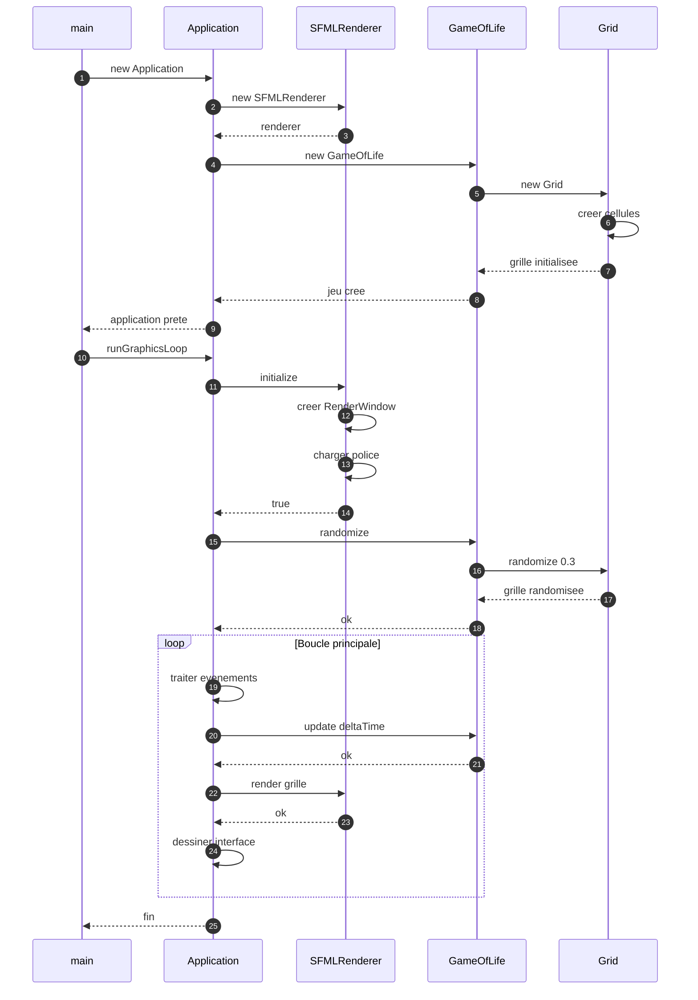
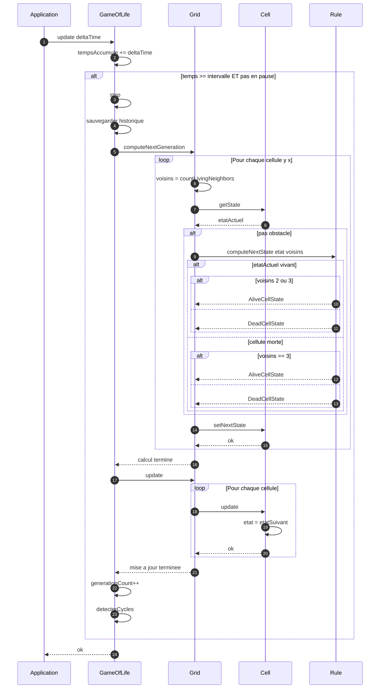
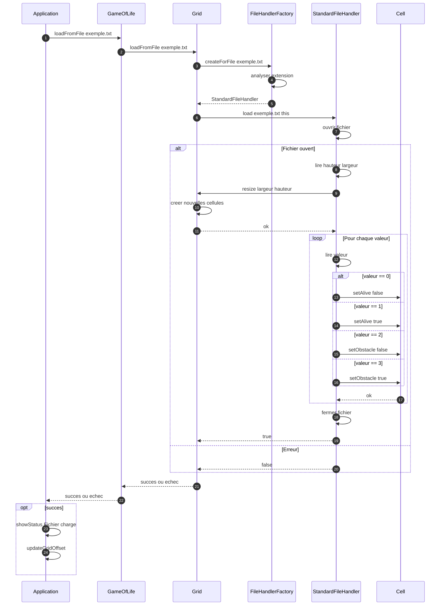
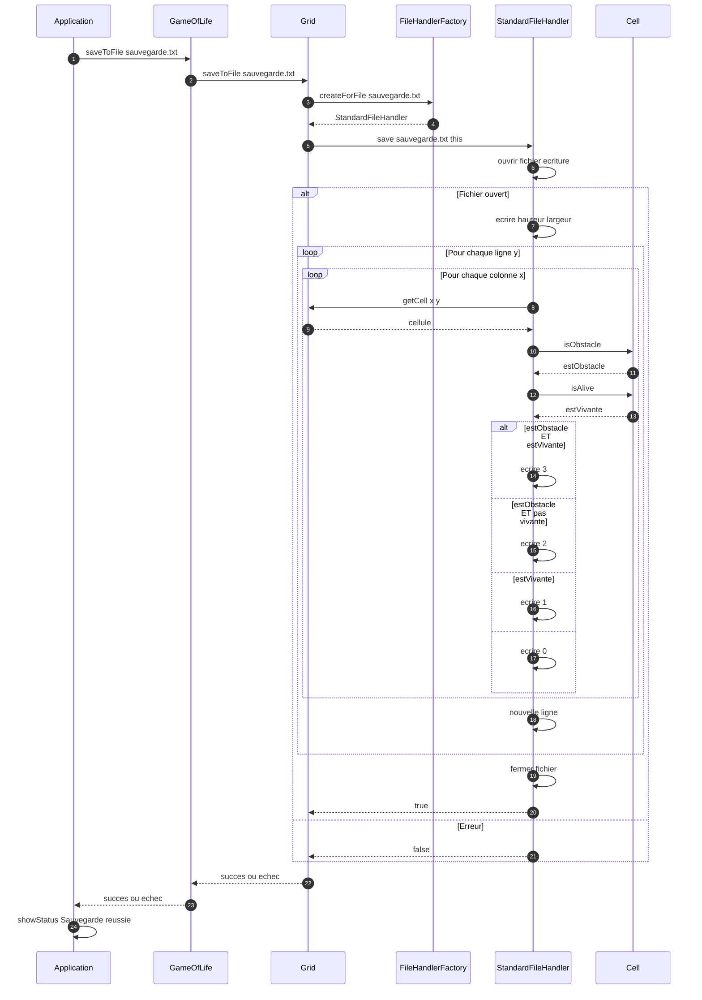
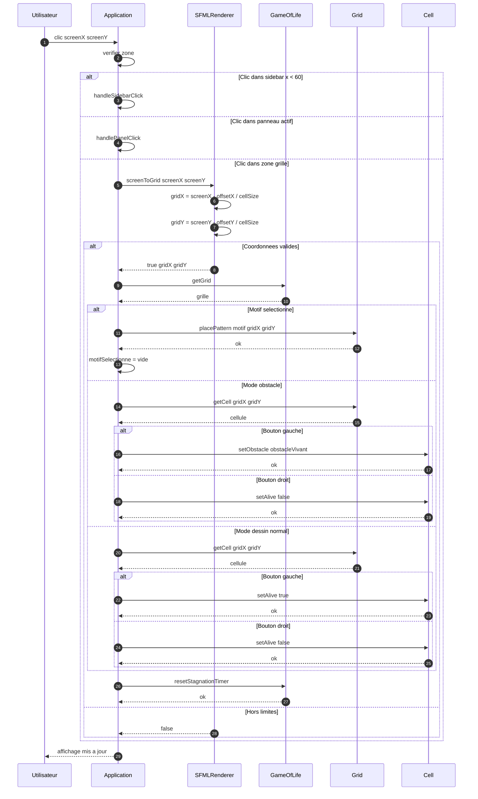
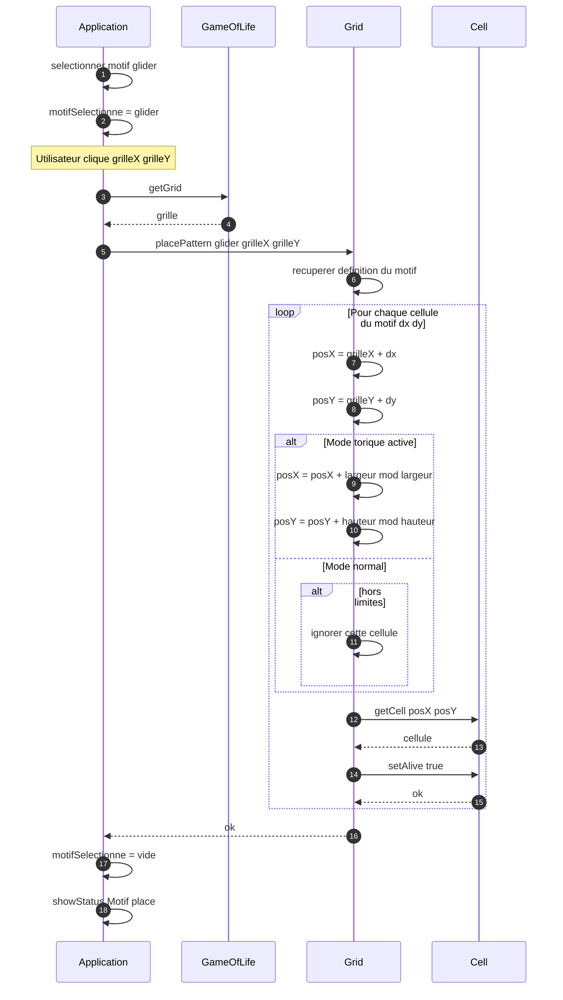
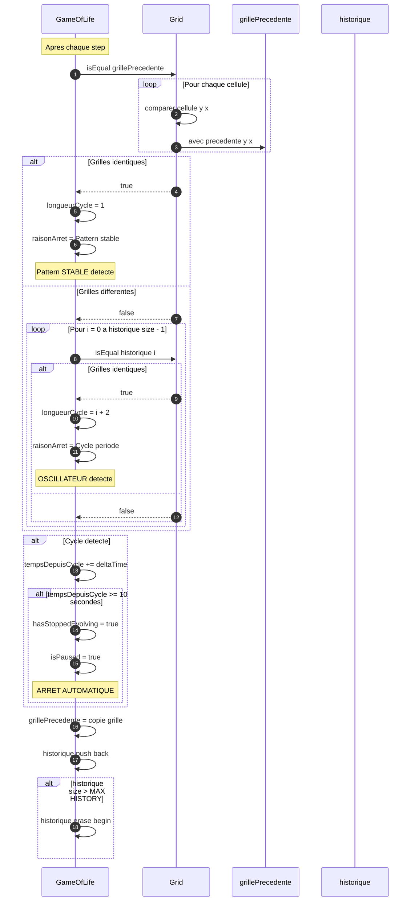
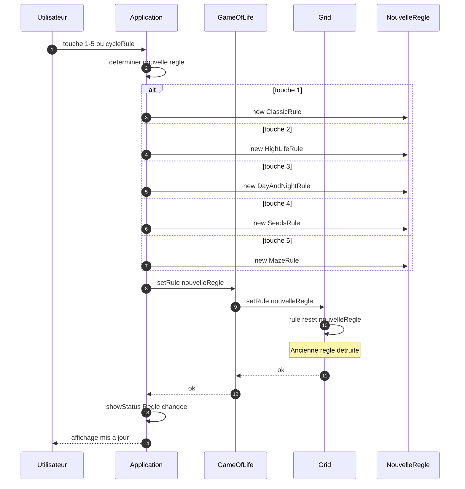
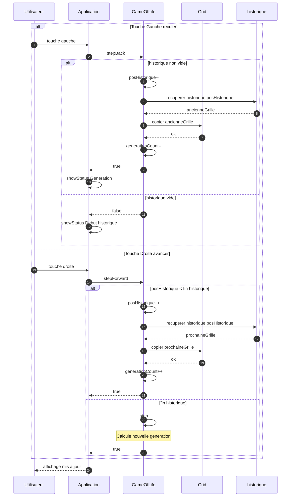
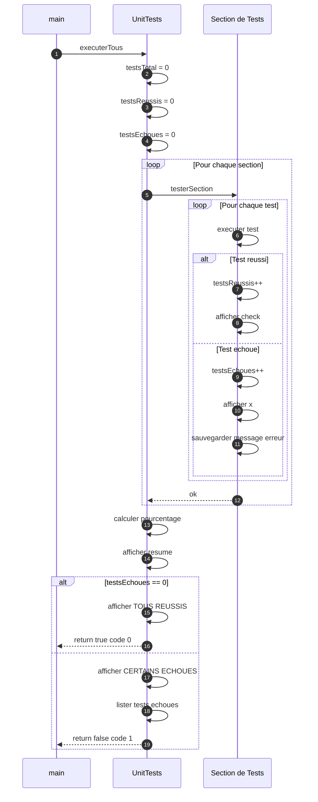

# Diagrammes de Sequence - Mermaid

## 1. Initialisation de Application

---

## 2. Calcul Generation

---

## 3. Chargement Fichier

---

## 4. Sauvegarde Fichier

---

## 5. Dessin Cellule - Clic Souris

---

## 6. Placement Motif

---

## 7. Detection de Cycle

---

## 8. Changement de Regle

---

## 9. Navigation Historique

---

## 10. Tests Unitaires

