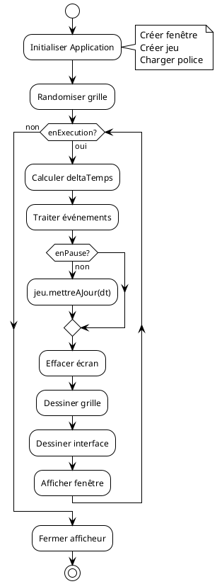
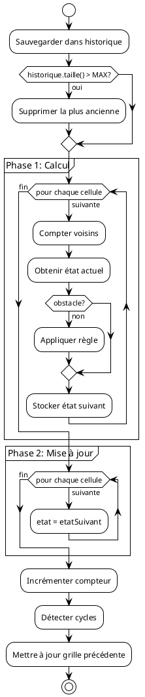
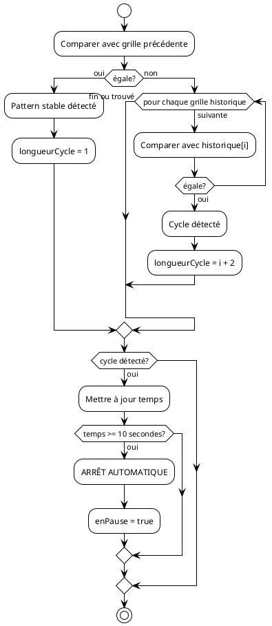

# 🔄 Diagrammes d'Activité - Jeu de la Vie

## Table des Matières
1. [Activité 1 : Boucle Principale](#activité-1--boucle-principale)
2. [Activité 2 : Calcul d'une Génération](#activité-2--calcul-dune-génération)
3. [Activité 3 : Comptage des Voisins](#activité-3--comptage-des-voisins)
4. [Activité 4 : Gestion d'un Clic Souris](#activité-4--gestion-dun-clic-souris)
5. [Activité 5 : Chargement de Fichier](#activité-5--chargement-de-fichier)
6. [Activité 6 : Sauvegarde de Fichier](#activité-6--sauvegarde-de-fichier)
7. [Activité 7 : Détection de Cycle](#activité-7--détection-de-cycle)
8. [Activité 8 : Gestion des Événements Clavier](#activité-8--gestion-des-événements-clavier)
9. [Relations entre Activités](#relations-entre-activités)
10. [Code PlantUML](#code-plantuml)

---

## Activité 1 : Boucle Principale

### Description
Cette activité montre le cycle de vie complet de l'application graphique.

### Diagramme

```
                              ┌─────────────┐
                              │   DÉBUT     │
                              └──────┬──────┘
                                     │
                                     ▼
                    ╔════════════════════════════════╗
                    ║    INITIALISATION              ║
                    ╠════════════════════════════════╣
                    ║ • Créer fenêtre SFML          ║
                    ║ • Créer JeuDeLaVie            ║
                    ║ • Charger police              ║
                    ║ • Initialiser variables       ║
                    ╚═══════════════╤════════════════╝
                                    │
                                    ▼
                    ╔════════════════════════════════╗
                    ║    RANDOMISER GRILLE           ║
                    ║    (30% de cellules vivantes)  ║
                    ╚═══════════════╤════════════════╝
                                    │
                                    ▼
      ┌─────────────────────────────────────────────────────────────┐
      │                                                             │
      │                  BOUCLE PRINCIPALE                          │
      │              (tant que enExecution)                         │
      │                                                             │
      │     ┌──────────────────────────────────────────────────┐   │
      │     │                                                   │   │
      │     ▼                                                   │   │
      │   ╔═══════════════════════════════════╗                │   │
      │   ║  CALCULER DELTA TEMPS             ║                │   │
      │   ║  dt = clock.restart()             ║                │   │
      │   ╚═══════════════╤═══════════════════╝                │   │
      │                   │                                     │   │
      │                   ▼                                     │   │
      │   ╔═══════════════════════════════════╗                │   │
      │   ║  TRAITER ÉVÉNEMENTS               ║                │   │
      │   ║  • Fermeture fenêtre              ║                │   │
      │   ║  • Touches clavier                ║                │   │
      │   ║  • Clics souris                   ║                │   │
      │   ║  • Saisie texte                   ║                │   │
      │   ╚═══════════════╤═══════════════════╝                │   │
      │                   │                                     │   │
      │                   ▼                                     │   │
      │              ◇ enPause?                                 │   │
      │             ╱         ╲                                 │   │
      │           OUI         NON                               │   │
      │            │           │                                │   │
      │            │           ▼                                │   │
      │            │   ╔═══════════════════════════════════╗   │   │
      │            │   ║  METTRE À JOUR LE JEU             ║   │   │
      │            │   ║  jeu.mettreAJour(dt)              ║   │   │
      │            │   ║                                    ║   │   │
      │            │   ║  [Calcule les générations si      ║   │   │
      │            │   ║   temps écoulé >= intervalle]     ║   │   │
      │            │   ╚═══════════════╤═══════════════════╝   │   │
      │            │                   │                        │   │
      │            └───────┬───────────┘                        │   │
      │                    │                                     │   │
      │                    ▼                                     │   │
      │   ╔═══════════════════════════════════╗                │   │
      │   ║  EFFACER L'ÉCRAN                  ║                │   │
      │   ║  window.clear(couleurFond)        ║                │   │
      │   ╚═══════════════╤═══════════════════╝                │   │
      │                   │                                     │   │
      │                   ▼                                     │   │
      │   ╔═══════════════════════════════════╗                │   │
      │   ║  DESSINER LA GRILLE               ║                │   │
      │   ║  afficheur.afficher(grille)       ║                │   │
      │   ╚═══════════════╤═══════════════════╝                │   │
      │                   │                                     │   │
      │                   ▼                                     │   │
      │   ╔═══════════════════════════════════╗                │   │
      │   ║  DESSINER L'INTERFACE             ║                │   │
      │   ║  • Barre latérale                 ║                │   │
      │   ║  • Barre supérieure               ║                │   │
      │   ║  • Barre inférieure               ║                │   │
      │   ║  • Panneau actif (si ouvert)      ║                │   │
      │   ╚═══════════════╤═══════════════════╝                │   │
      │                   │                                     │   │
      │                   ▼                                     │   │
      │   ╔═══════════════════════════════════╗                │   │
      │   ║  AFFICHER LA FENÊTRE              ║                │   │
      │   ║  window.display()                 ║                │   │
      │   ╚═══════════════╤═══════════════════╝                │   │
      │                   │                                     │   │
      │                   │                                     │   │
      │                   └─────────────────────────────────────┘   │
      │                                                             │
      └─────────────────────────────────────────────────────────────┘
                                    │
                                    │ (enExecution = false)
                                    ▼
                    ╔════════════════════════════════╗
                    ║  NETTOYAGE                     ║
                    ║  • Fermer afficheur            ║
                    ║  • Libérer mémoire             ║
                    ╚═══════════════╤════════════════╝
                                    │
                                    ▼
                              ┌─────────────┐
                              │     FIN     │
                              └─────────────┘
```

---

## Activité 2 : Calcul d'une Génération

### Description
Cette activité détaille l'algorithme de calcul d'une nouvelle génération.

### Diagramme

```
                              ┌─────────────┐
                              │   DÉBUT     │
                              │  avancer()  │
                              └──────┬──────┘
                                     │
                                     ▼
                    ╔════════════════════════════════╗
                    ║  SAUVEGARDER DANS HISTORIQUE   ║
                    ║  historique.push_back(grille)  ║
                    ╚═══════════════╤════════════════╝
                                    │
                                    ▼
                         ◇ historique.taille() > MAX?
                        ╱                            ╲
                      OUI                            NON
                       │                              │
                       ▼                              │
        ╔══════════════════════════════╗             │
        ║ SUPPRIMER LA PLUS ANCIENNE   ║             │
        ║ historique.erase(begin())    ║             │
        ╚══════════════╤═══════════════╝             │
                       │                              │
                       └──────────┬───────────────────┘
                                  │
                                  ▼
                    ╔════════════════════════════════╗
                    ║  PHASE 1: CALCUL DES ÉTATS     ║
                    ║  grille.calculerProchaine-     ║
                    ║  Generation()                  ║
                    ╚═══════════════╤════════════════╝
                                    │
                                    ▼
      ┌─────────────────────────────────────────────────────────────┐
      │                                                             │
      │     ╔═══════════════════════════════════════════════════╗  │
      │     ║  POUR y = 0 À hauteur - 1                         ║  │
      │     ║  POUR x = 0 À largeur - 1                         ║  │
      │     ╚═══════════════════════════════════════════════════╝  │
      │                         │                                   │
      │                         ▼                                   │
      │     ╔═══════════════════════════════════╗                  │
      │     ║  COMPTER VOISINS VIVANTS          ║                  │
      │     ║  voisins = compterVoisins(x, y)   ║                  │
      │     ╚═══════════════╤═══════════════════╝                  │
      │                     │                                       │
      │                     ▼                                       │
      │     ╔═══════════════════════════════════╗                  │
      │     ║  OBTENIR ÉTAT ACTUEL              ║                  │
      │     ║  etat = cellule.obtenirEtat()     ║                  │
      │     ╚═══════════════╤═══════════════════╝                  │
      │                     │                                       │
      │                     ▼                                       │
      │              ◇ estObstacle?                                 │
      │             ╱             ╲                                 │
      │           OUI             NON                               │
      │            │               │                                │
      │            │               ▼                                │
      │            │  ╔═══════════════════════════════════╗        │
      │            │  ║  APPLIQUER LA RÈGLE               ║        │
      │            │  ║  nouvelEtat = regle.calculer-     ║        │
      │            │  ║  ProchainEtat(etat, voisins)      ║        │
      │            │  ╚═══════════════╤═══════════════════╝        │
      │            │                  │                             │
      │            │                  │                             │
      │            │  ╔═══════════════════════════════════════════╗│
      │            │  ║  RÈGLE CLASSIQUE (B3/S23):                ║│
      │            │  ║                                            ║│
      │            │  ║  SI vivante:                               ║│
      │            │  ║    voisins == 2 OU 3 → reste vivante      ║│
      │            │  ║    sinon → meurt                          ║│
      │            │  ║                                            ║│
      │            │  ║  SI morte:                                 ║│
      │            │  ║    voisins == 3 → naît                    ║│
      │            │  ║    sinon → reste morte                    ║│
      │            │  ╚═══════════════════════════════════════════╝│
      │            │                  │                             │
      │            └───────┬──────────┘                             │
      │                    │                                        │
      │                    ▼                                        │
      │     ╔═══════════════════════════════════╗                  │
      │     ║  STOCKER ÉTAT SUIVANT             ║                  │
      │     ║  cellule.definirEtatSuivant(      ║                  │
      │     ║      nouvelEtat)                  ║                  │
      │     ╚═══════════════════════════════════╝                  │
      │                                                             │
      │     ╔═══════════════════════════════════════════════════╗  │
      │     ║  FIN BOUCLES                                      ║  │
      │     ╚═══════════════════════════════════════════════════╝  │
      │                                                             │
      └─────────────────────────────────────────────────────────────┘
                                    │
                                    ▼
                    ╔════════════════════════════════╗
                    ║  PHASE 2: MISE À JOUR          ║
                    ║  grille.mettreAJour()          ║
                    ╚═══════════════╤════════════════╝
                                    │
                                    ▼
      ┌─────────────────────────────────────────────────────────────┐
      │                                                             │
      │     ╔═══════════════════════════════════════════════════╗  │
      │     ║  POUR CHAQUE CELLULE                              ║  │
      │     ╚═══════════════════════════════════════════════════╝  │
      │                         │                                   │
      │                         ▼                                   │
      │     ╔═══════════════════════════════════╗                  │
      │     ║  APPLIQUER TRANSITION              ║                  │
      │     ║  cellule.mettreAJour()             ║                  │
      │     ║  (etat = etatSuivant)              ║                  │
      │     ╚═══════════════════════════════════╝                  │
      │                                                             │
      └─────────────────────────────────────────────────────────────┘
                                    │
                                    ▼
                    ╔════════════════════════════════╗
                    ║  INCRÉMENTER COMPTEUR          ║
                    ║  compteurGeneration++          ║
                    ╚═══════════════╤════════════════╝
                                    │
                                    ▼
                    ╔════════════════════════════════╗
                    ║  DÉTECTER CYCLES               ║
                    ║  (voir Activité 7)             ║
                    ╚═══════════════╤════════════════╝
                                    │
                                    ▼
                    ╔════════════════════════════════╗
                    ║  METTRE À JOUR GRILLE          ║
                    ║  PRÉCÉDENTE                    ║
                    ║  grillePrecedente = grille     ║
                    ╚═══════════════╤════════════════╝
                                    │
                                    ▼
                              ┌─────────────┐
                              │     FIN     │
                              └─────────────┘
```

---

## Activité 3 : Comptage des Voisins

### Description
Cette activité montre l'algorithme de comptage des 8 voisins d'une cellule.

### Diagramme

```
                              ┌─────────────┐
                              │   DÉBUT     │
                              │compterVoisins│
                              │   (x, y)    │
                              └──────┬──────┘
                                     │
                                     ▼
                    ╔════════════════════════════════╗
                    ║  INITIALISER COMPTEUR          ║
                    ║  compteur = 0                  ║
                    ╚═══════════════╤════════════════╝
                                    │
                                    ▼
      ┌─────────────────────────────────────────────────────────────┐
      │                                                             │
      │     ╔═══════════════════════════════════════════════════╗  │
      │     ║  POUR dy = -1 À 1                                 ║  │
      │     ║  POUR dx = -1 À 1                                 ║  │
      │     ╚═══════════════════════════════════════════════════╝  │
      │                         │                                   │
      │                         ▼                                   │
      │              ◇ dx == 0 ET dy == 0?                          │
      │             ╱                    ╲                          │
      │           OUI                    NON                        │
      │            │                      │                         │
      │            │ [Ignorer la cellule  │                         │
      │            │  elle-même]          │                         │
      │            │                      ▼                         │
      │            │     ╔═══════════════════════════════════╗     │
      │            │     ║  CALCULER COORDONNÉES VOISIN      ║     │
      │            │     ║  nouvX = x + dx                   ║     │
      │            │     ║  nouvY = y + dy                   ║     │
      │            │     ╚═══════════════╤═══════════════════╝     │
      │            │                     │                          │
      │            │                     ▼                          │
      │            │              ◇ modeTorique?                    │
      │            │             ╱              ╲                   │
      │            │           OUI              NON                 │
      │            │            │                │                  │
      │            │            ▼                ▼                  │
      │            │ ╔════════════════════╗ ╔════════════════════╗ │
      │            │ ║ APPLIQUER MODULO   ║ ║ VÉRIFIER LIMITES   ║ │
      │            │ ║                    ║ ║                    ║ │
      │            │ ║ nouvX = (nouvX +   ║ ║ SI nouvX < 0 OU    ║ │
      │            │ ║   largeur) % largeur║ ║   nouvX >= largeur ║ │
      │            │ ║                    ║ ║   OU nouvY < 0 OU  ║ │
      │            │ ║ nouvY = (nouvY +   ║ ║   nouvY >= hauteur ║ │
      │            │ ║   hauteur) % hauteur║ ║ ALORS continuer   ║ │
      │            │ ╚══════════╤═════════╝ ╚══════════╤═════════╝ │
      │            │            │                      │            │
      │            │            └──────────┬───────────┘            │
      │            │                       │                        │
      │            │                       ▼                        │
      │            │     ╔═══════════════════════════════════╗     │
      │            │     ║  VÉRIFIER SI VOISIN EST VIVANT    ║     │
      │            │     ║  cellule = grille[nouvY][nouvX]   ║     │
      │            │     ╚═══════════════╤═══════════════════╝     │
      │            │                     │                          │
      │            │                     ▼                          │
      │            │              ◇ cellule.estVivante()?           │
      │            │             ╱                      ╲           │
      │            │           OUI                      NON         │
      │            │            │                        │          │
      │            │            ▼                        │          │
      │            │ ╔════════════════════╗              │          │
      │            │ ║ INCRÉMENTER        ║              │          │
      │            │ ║ compteur++         ║              │          │
      │            │ ╚══════════╤═════════╝              │          │
      │            │            │                        │          │
      │            │            └────────────┬───────────┘          │
      │            │                         │                      │
      │            └─────────────┬───────────┘                      │
      │                          │                                  │
      │     ╔═══════════════════════════════════════════════════╗  │
      │     ║  FIN BOUCLES                                      ║  │
      │     ╚═══════════════════════════════════════════════════╝  │
      │                                                             │
      └─────────────────────────────────────────────────────────────┘
                                    │
                                    ▼
                    ╔════════════════════════════════╗
                    ║  RETOURNER compteur            ║
                    ╚═══════════════╤════════════════╝
                                    │
                                    ▼
                              ┌─────────────┐
                              │     FIN     │
                              │ return compteur│
                              └─────────────┘
```

### Illustration du Voisinage

```
╔═══════════════════════════════════════════════════════════════════════════╗
║                        VOISINAGE D'UNE CELLULE                             ║
╠═══════════════════════════════════════════════════════════════════════════╣
║                                                                            ║
║     Position des 8 voisins autour de (x, y):                              ║
║                                                                            ║
║                        (dx, dy)                                           ║
║                                                                            ║
║         ┌─────────┬─────────┬─────────┐                                   ║
║         │ (-1,-1) │ (0,-1)  │ (+1,-1) │                                   ║
║         │    ↖    │    ↑    │    ↗    │                                   ║
║         ├─────────┼─────────┼─────────┤                                   ║
║         │ (-1, 0) │  CELL   │ (+1, 0) │                                   ║
║         │    ←    │  (x,y)  │    →    │                                   ║
║         ├─────────┼─────────┼─────────┤                                   ║
║         │ (-1,+1) │ (0,+1)  │ (+1,+1) │                                   ║
║         │    ↙    │    ↓    │    ↘    │                                   ║
║         └─────────┴─────────┴─────────┘                                   ║
║                                                                            ║
║     MODE TORIQUE (bords connectés):                                       ║
║                                                                            ║
║         ┌───┬───┬───┬───┬───┐      Si cellule en (0,0), son voisin       ║
║         │ 5 │ 1 │ 2 │ 3 │ 5 │      en haut-gauche est en                  ║
║         ├───┼───┼───┼───┼───┤      (largeur-1, hauteur-1)                 ║
║         │ 4 │ A │ B │ C │ 4 │                                             ║
║         ├───┼───┼───┼───┼───┤                                             ║
║         │ 5 │ 1 │ 2 │ 3 │ 5 │      La grille "s'enroule" sur elle-même   ║
║         └───┴───┴───┴───┴───┘                                             ║
║                                                                            ║
╚═══════════════════════════════════════════════════════════════════════════╝
```

---

## Activité 4 : Gestion d'un Clic Souris

### Description
Cette activité montre le traitement complet d'un clic souris.

### Diagramme

```
                              ┌─────────────┐
                              │   DÉBUT     │
                              │gererClicSouris│
                              │ (x, y, bouton)│
                              └──────┬──────┘
                                     │
                                     ▼
                              ◇ x < LARGEUR_SIDEBAR?
                             ╱                      ╲
                           OUI                      NON
                            │                        │
                            ▼                        │
           ╔═══════════════════════════════╗        │
           ║  TRAITER CLIC SIDEBAR         ║        │
           ║  - Bouton Aide (H)            ║        │
           ║  - Bouton Fichier (F)         ║        │
           ║  - Bouton Modes (M)           ║        │
           ║  - Bouton Motifs (G)          ║        │
           ║  - Bouton Pause/Play          ║        │
           ║  - Bouton Randomiser          ║        │
           ║  - Bouton Effacer             ║        │
           ╚═══════════════╤═══════════════╝        │
                           │                         │
                           ▼                         │
                     ┌─────────┐                     │
                     │   FIN   │                     │
                     └─────────┘                     │
                                                     │
                                                     ▼
                              ◇ panneauActif != AUCUN
                              ◇ ET clic dans zone panneau?
                             ╱                            ╲
                           OUI                            NON
                            │                              │
                            ▼                              │
           ╔═══════════════════════════════╗              │
           ║  TRAITER CLIC PANNEAU         ║              │
           ║  (voir détail ci-dessous)     ║              │
           ╚═══════════════╤═══════════════╝              │
                           │                               │
                           ▼                               │
                     ┌─────────┐                           │
                     │   FIN   │                           │
                     └─────────┘                           │
                                                           │
                                                           ▼
           ╔═══════════════════════════════════════════════════╗
           ║  CONVERTIR COORDONNÉES ÉCRAN → GRILLE             ║
           ║                                                    ║
           ║  grilleX = (x - decalageX) / tailleCellule        ║
           ║  grilleY = (y - decalageY) / tailleCellule        ║
           ╚═══════════════════════╤═══════════════════════════╝
                                   │
                                   ▼
                              ◇ Coordonnées valides?
                              ◇ 0 <= grilleX < largeur
                              ◇ 0 <= grilleY < hauteur
                             ╱                        ╲
                           NON                        OUI
                            │                          │
                            ▼                          │
                     ┌─────────┐                       │
                     │   FIN   │                       │
                     └─────────┘                       │
                                                       │
                                                       ▼
                              ◇ motifSelectionne != ""?
                             ╱                         ╲
                           OUI                         NON
                            │                           │
                            ▼                           │
           ╔═══════════════════════════════╗           │
           ║  PLACER LE MOTIF              ║           │
           ║  placerMotif(motif, x, y)     ║           │
           ║  motifSelectionne = ""        ║           │
           ╚═══════════════╤═══════════════╝           │
                           │                            │
                           ▼                            │
           ╔═══════════════════════════════╗           │
           ║  AFFICHER STATUT              ║           │
           ║  "Motif placé"                ║           │
           ╚═══════════════╤═══════════════╝           │
                           │                            │
                           ▼                            │
                     ┌─────────┐                        │
                     │   FIN   │                        │
                     └─────────┘                        │
                                                        │
                                                        ▼
                              ◇ bouton == GAUCHE?
                             ╱                   ╲
                           OUI                   NON
                            │                     │
                            │                     ▼
                            │              ◇ bouton == DROIT?
                            │             ╱                 ╲
                            │           OUI                 NON
                            │            │                   │
                            │            ▼                   ▼
                            │  ╔════════════════════╗  ┌─────────┐
                            │  ║ CLIC DROIT:        ║  │   FIN   │
                            │  ║ modeDessin = false ║  └─────────┘
                            │  ║ ou                 ║
                            │  ║ supprimer obstacle ║
                            │  ╚══════════╤═════════╝
                            │             │
                            └──────┬──────┘
                                   │
                                   ▼
                              ◇ modeObstacle?
                             ╱              ╲
                           OUI              NON
                            │                │
                            ▼                ▼
           ╔════════════════════╗ ╔════════════════════╗
           ║ PLACER OBSTACLE    ║ ║ DESSINER CELLULE   ║
           ║                    ║ ║                    ║
           ║ cellule.definir-   ║ ║ cellule.definir-   ║
           ║ Obstacle(          ║ ║ Vivante(           ║
           ║   obstacleVivant)  ║ ║   modeDessin)      ║
           ╚══════════╤═════════╝ ╚══════════╤═════════╝
                      │                       │
                      └───────────┬───────────┘
                                  │
                                  ▼
           ╔═══════════════════════════════════════════════════╗
           ║  RÉINITIALISER MINUTERIE STAGNATION               ║
           ║  jeu.reinitialiserMinuterieStagnation()           ║
           ╚═══════════════════════╤═══════════════════════════╝
                                   │
                                   ▼
                             ┌─────────┐
                             │   FIN   │
                             └─────────┘
```

---

## Activité 5 : Chargement de Fichier

### Description
Cette activité montre le processus complet de chargement d'un fichier.

### Diagramme

```
                              ┌─────────────┐
                              │   DÉBUT     │
                              │chargerFichier│
                              │   (nom)     │
                              └──────┬──────┘
                                     │
                                     ▼
           ╔═══════════════════════════════════════════════════╗
           ║  CRÉER GESTIONNAIRE DE FICHIER                    ║
           ║                                                    ║
           ║  extension = extraireExtension(nom)               ║
           ╚═══════════════════════╤═══════════════════════════╝
                                   │
                                   ▼
                              ◇ extension?
                             ╱     │     ╲
                         .txt     .rle    autre
                          │        │        │
                          ▼        ▼        ▼
           ╔═══════════╗ ╔═══════════╗ ╔═══════════╗
           ║Gestionnaire║ ║Gestionnaire║ ║Gestionnaire║
           ║ Standard   ║ ║   RLE     ║ ║  Etendu   ║
           ╚═════╤═════╝ ╚═════╤═════╝ ╚═════╤═════╝
                 │             │             │
                 └──────┬──────┴─────────────┘
                        │
                        ▼
           ╔═══════════════════════════════════════════════════╗
           ║  OUVRIR LE FICHIER                                 ║
           ║  fichier.open(nom, ios::in)                       ║
           ╚═══════════════════════╤═══════════════════════════╝
                                   │
                                   ▼
                              ◇ Fichier ouvert?
                             ╱              ╲
                           NON              OUI
                            │                │
                            ▼                │
           ╔═══════════════════════════════╗│
           ║  ERREUR: Fichier non trouvé   ║│
           ║  return false                 ║│
           ╚═══════════════╤═══════════════╝│
                           │                 │
                           ▼                 │
                     ┌─────────┐             │
                     │   FIN   │             │
                     │ (false) │             │
                     └─────────┘             │
                                             │
                                             ▼
           ╔═══════════════════════════════════════════════════╗
           ║  LIRE DIMENSIONS                                   ║
           ║  fichier >> hauteur >> largeur                    ║
           ╚═══════════════════════╤═══════════════════════════╝
                                   │
                                   ▼
                              ◇ Dimensions valides?
                              ◇ hauteur > 0 ET largeur > 0
                             ╱                           ╲
                           NON                           OUI
                            │                             │
                            ▼                             │
           ╔═══════════════════════════════╗              │
           ║  ERREUR: Dimensions invalides ║              │
           ║  return false                 ║              │
           ╚═══════════════╤═══════════════╝              │
                           │                               │
                           ▼                               │
                     ┌─────────┐                           │
                     │   FIN   │                           │
                     │ (false) │                           │
                     └─────────┘                           │
                                                           │
                                                           ▼
           ╔═══════════════════════════════════════════════════╗
           ║  REDIMENSIONNER LA GRILLE                          ║
           ║  grille.redimensionner(largeur, hauteur)          ║
           ╚═══════════════════════╤═══════════════════════════╝
                                   │
                                   ▼
      ┌─────────────────────────────────────────────────────────────┐
      │                                                             │
      │     ╔═══════════════════════════════════════════════════╗  │
      │     ║  POUR y = 0 À hauteur - 1                         ║  │
      │     ║  POUR x = 0 À largeur - 1                         ║  │
      │     ╚═══════════════════════════════════════════════════╝  │
      │                         │                                   │
      │                         ▼                                   │
      │     ╔═══════════════════════════════════╗                  │
      │     ║  LIRE VALEUR                       ║                  │
      │     ║  fichier >> valeur                 ║                  │
      │     ╚═══════════════╤═══════════════════╝                  │
      │                     │                                       │
      │                     ▼                                       │
      │              ◇ valeur?                                      │
      │             ╱    │    ╲    ╲                                │
      │            0     1     2     3                              │
      │            │     │     │     │                              │
      │            ▼     ▼     ▼     ▼                              │
      │         MORTE VIVANTE OBST.  OBST.                         │
      │                       MORT   VIVANT                        │
      │            │     │     │     │                              │
      │            └──┬──┴──┬──┴──┬──┘                              │
      │               │     │     │                                 │
      │               ▼     │     │                                 │
      │     ╔═══════════════════════════════════╗                  │
      │     ║  DÉFINIR ÉTAT CELLULE              ║                  │
      │     ║  cellule.definirEtat(valeur)       ║                  │
      │     ╚═══════════════════════════════════╝                  │
      │                                                             │
      │     ╔═══════════════════════════════════════════════════╗  │
      │     ║  FIN BOUCLES                                      ║  │
      │     ╚═══════════════════════════════════════════════════╝  │
      │                                                             │
      └─────────────────────────────────────────────────────────────┘
                                   │
                                   ▼
           ╔═══════════════════════════════════════════════════╗
           ║  FERMER LE FICHIER                                 ║
           ║  fichier.close()                                  ║
           ╚═══════════════════════╤═══════════════════════════╝
                                   │
                                   ▼
           ╔═══════════════════════════════════════════════════╗
           ║  SUCCÈS                                            ║
           ║  return true                                      ║
           ╚═══════════════════════╤═══════════════════════════╝
                                   │
                                   ▼
                             ┌─────────┐
                             │   FIN   │
                             │ (true)  │
                             └─────────┘
```

---

## Activité 6 : Sauvegarde de Fichier

### Description
Cette activité montre le processus de sauvegarde de la grille.

### Diagramme

```
                              ┌─────────────┐
                              │   DÉBUT     │
                              │sauvegarder  │
                              │   (nom)     │
                              └──────┬──────┘
                                     │
                                     ▼
           ╔═══════════════════════════════════════════════════╗
           ║  OUVRIR LE FICHIER EN ÉCRITURE                    ║
           ║  fichier.open(nom, ios::out)                      ║
           ╚═══════════════════════╤═══════════════════════════╝
                                   │
                                   ▼
                              ◇ Fichier ouvert?
                             ╱              ╲
                           NON              OUI
                            │                │
                            ▼                │
           ╔═══════════════════════════════╗│
           ║  ERREUR: Impossible d'ouvrir  ║│
           ║  return false                 ║│
           ╚═══════════════╤═══════════════╝│
                           │                 │
                           ▼                 │
                     ┌─────────┐             │
                     │   FIN   │             │
                     │ (false) │             │
                     └─────────┘             │
                                             │
                                             ▼
           ╔═══════════════════════════════════════════════════╗
           ║  ÉCRIRE DIMENSIONS                                 ║
           ║  fichier << hauteur << " " << largeur << endl     ║
           ╚═══════════════════════╤═══════════════════════════╝
                                   │
                                   ▼
      ┌─────────────────────────────────────────────────────────────┐
      │                                                             │
      │     ╔═══════════════════════════════════════════════════╗  │
      │     ║  POUR y = 0 À hauteur - 1                         ║  │
      │     ╚═══════════════════════════════════════════════════╝  │
      │                         │                                   │
      │                         ▼                                   │
      │  ┌──────────────────────────────────────────────────────┐  │
      │  │                                                       │  │
      │  │  ╔═══════════════════════════════════════════════╗   │  │
      │  │  ║  POUR x = 0 À largeur - 1                     ║   │  │
      │  │  ╚═══════════════════════════════════════════════╝   │  │
      │  │                      │                                │  │
      │  │                      ▼                                │  │
      │  │  ╔═══════════════════════════════════╗               │  │
      │  │  ║  OBTENIR CELLULE                   ║               │  │
      │  │  ║  cellule = grille[y][x]            ║               │  │
      │  │  ╚═══════════════╤═══════════════════╝               │  │
      │  │                  │                                    │  │
      │  │                  ▼                                    │  │
      │  │           ◇ cellule.estObstacle()?                   │  │
      │  │          ╱                        ╲                   │  │
      │  │        OUI                        NON                 │  │
      │  │         │                          │                  │  │
      │  │         ▼                          ▼                  │  │
      │  │  ◇ cellule.estVivante()?    ◇ cellule.estVivante()?  │  │
      │  │ ╱                    ╲     ╱                    ╲     │  │
      │  │OUI                  NON   OUI                  NON    │  │
      │  │ │                    │     │                    │     │  │
      │  │ ▼                    ▼     ▼                    ▼     │  │
      │  │ 3                    2     1                    0     │  │
      │  │ │                    │     │                    │     │  │
      │  │ └──────┬─────────────┴─────┴────────────────────┘     │  │
      │  │        │                                              │  │
      │  │        ▼                                              │  │
      │  │  ╔═══════════════════════════════════╗               │  │
      │  │  ║  ÉCRIRE VALEUR                     ║               │  │
      │  │  ║  fichier << valeur << " "          ║               │  │
      │  │  ╚═══════════════════════════════════╝               │  │
      │  │                                                       │  │
      │  └───────────────────────────────────────────────────────┘  │
      │                         │                                   │
      │                         ▼                                   │
      │     ╔═══════════════════════════════════╗                  │
      │     ║  NOUVELLE LIGNE                    ║                  │
      │     ║  fichier << endl                   ║                  │
      │     ╚═══════════════════════════════════╝                  │
      │                                                             │
      └─────────────────────────────────────────────────────────────┘
                                   │
                                   ▼
           ╔═══════════════════════════════════════════════════╗
           ║  FERMER LE FICHIER                                 ║
           ║  fichier.close()                                  ║
           ╚═══════════════════════╤═══════════════════════════╝
                                   │
                                   ▼
           ╔═══════════════════════════════════════════════════╗
           ║  SUCCÈS                                            ║
           ║  return true                                      ║
           ╚═══════════════════════╤═══════════════════════════╝
                                   │
                                   ▼
                             ┌─────────┐
                             │   FIN   │
                             │ (true)  │
                             └─────────┘
```

---

## Activité 7 : Détection de Cycle

### Description
Cette activité montre l'algorithme de détection des patterns stables et oscillants.

### Diagramme

```
                              ┌─────────────┐
                              │   DÉBUT     │
                              │detecterCycle │
                              └──────┬──────┘
                                     │
                                     ▼
           ╔═══════════════════════════════════════════════════╗
           ║  ÉTAPE 1: COMPARER AVEC GRILLE PRÉCÉDENTE         ║
           ╚═══════════════════════╤═══════════════════════════╝
                                   │
                                   ▼
           ╔═══════════════════════════════════════════════════╗
           ║  resultat = grille.estEgale(grillePrecedente)     ║
           ╚═══════════════════════╤═══════════════════════════╝
                                   │
                                   ▼
                              ◇ resultat == true?
                             ╱                  ╲
                           OUI                  NON
                            │                    │
                            ▼                    │
           ╔════════════════════════════════════╗│
           ║  PATTERN STABLE DÉTECTÉ            ║│
           ║                                     ║│
           ║  longueurCycleDetecte = 1          ║│
           ║  raisonArret = "Pattern stable"    ║│
           ╚══════════════════╤═════════════════╝│
                              │                   │
                              │                   │
                              │                   ▼
                              │  ╔════════════════════════════════════╗
                              │  ║  ÉTAPE 2: COMPARER AVEC HISTORIQUE ║
                              │  ╚══════════════════╤═════════════════╝
                              │                     │
                              │                     ▼
                              │  ┌──────────────────────────────────────┐
                              │  │                                      │
                              │  │  ╔══════════════════════════════╗   │
                              │  │  ║  POUR i = 0 À historique.    ║   │
                              │  │  ║      taille() - 1            ║   │
                              │  │  ╚══════════════════════════════╝   │
                              │  │                  │                   │
                              │  │                  ▼                   │
                              │  │  ╔═══════════════════════════════╗  │
                              │  │  ║  resultat = grille.estEgale(  ║  │
                              │  │  ║      historique[i])           ║  │
                              │  │  ╚═══════════════╤═══════════════╝  │
                              │  │                  │                   │
                              │  │                  ▼                   │
                              │  │           ◇ resultat == true?       │
                              │  │          ╱                  ╲       │
                              │  │        OUI                  NON     │
                              │  │         │                    │      │
                              │  │         ▼                    │      │
                              │  │  ╔════════════════════════╗ │      │
                              │  │  ║  CYCLE DÉTECTÉ         ║ │      │
                              │  │  ║                        ║ │      │
                              │  │  ║  longueurCycle = i + 2 ║ │      │
                              │  │  ║  raisonArret =         ║ │      │
                              │  │  ║  "Cycle période X"     ║ │      │
                              │  │  ║  BREAK                 ║ │      │
                              │  │  ╚══════════╤═════════════╝ │      │
                              │  │             │                │      │
                              │  │             └────────────────┘      │
                              │  │                                      │
                              │  └──────────────────────────────────────┘
                              │                     │
                              └──────────┬──────────┘
                                         │
                                         ▼
                              ◇ longueurCycleDetecte > 0?
                             ╱                          ╲
                           NON                          OUI
                            │                            │
                            ▼                            ▼
                     ┌─────────┐       ╔═══════════════════════════════╗
                     │   FIN   │       ║  METTRE À JOUR TEMPS          ║
                     │ (aucun  │       ║  tempsDepuisCycle += dt       ║
                     │  cycle) │       ╚═══════════════╤═══════════════╝
                     └─────────┘                       │
                                                       ▼
                                        ◇ tempsDepuisCycle >= 10.0?
                                       ╱                           ╲
                                     NON                           OUI
                                      │                             │
                                      ▼                             ▼
                               ┌─────────┐        ╔═══════════════════════════════╗
                               │   FIN   │        ║  ARRÊT AUTOMATIQUE            ║
                               │ (cycle  │        ║                               ║
                               │ détecté,│        ║  aArreteEvoluer = true        ║
                               │ continue│        ║  enPause = true               ║
                               │ 10s)    │        ╚═══════════════╤═══════════════╝
                               └─────────┘                        │
                                                                  ▼
                                                           ┌─────────┐
                                                           │   FIN   │
                                                           │(arrêt   │
                                                           │ auto)   │
                                                           └─────────┘
```

---

## Activité 8 : Gestion des Événements Clavier

### Description
Cette activité montre le traitement des raccourcis clavier.

### Diagramme

```
                              ┌─────────────┐
                              │   DÉBUT     │
                              │gererTouche  │
                              │  (touche)   │
                              └──────┬──────┘
                                     │
                                     ▼
                              ◇ touche?
                             ╱│╲│╲│╲│╲│╲│╲│╲│╲
                            ╱ │ ╲│ ╲│ ╲│ ╲│ ╲│╲
     ┌─────────────────────┘  │  └┐ └┐ └┐ └┐ └┐└────────────────────┐
     │                        │   │  │  │  │  │                     │
     ▼                        ▼   ▼  ▼  ▼  ▼  ▼                     ▼
   ESPACE                    N    R  C  O  T  H/F/M/G            1-5/+/-
     │                       │    │  │  │  │     │                  │
     ▼                       ▼    ▼  ▼  ▼  ▼     ▼                  ▼
╔══════════╗           ╔══════════╗│  │  │  │ ╔══════════╗    ╔══════════╗
║ PAUSE/   ║           ║AVANCER   ║│  │  │  │ ║BASCULER  ║    ║CHANGER   ║
║ PLAY     ║           ║UN PAS    ║│  │  │  │ ║PANNEAU   ║    ║RÈGLE ou  ║
║          ║           ║          ║│  │  │  │ ║          ║    ║VITESSE   ║
║enPause = ║           ║avancer() ║│  │  │  │ ║basculer- ║    ║          ║
║!enPause  ║           ║          ║│  │  │  │ ║Panneau() ║    ║cycler-   ║
╚════╤═════╝           ╚════╤═════╝│  │  │  │ ╚════╤═════╝    ║Regle()   ║
     │                      │      │  │  │  │      │          ║ou        ║
     │                      │      │  │  │  │      │          ║modifier- ║
     │                      │      │  │  │  │      │          ║Intervalle║
     │                      │      │  │  │  │      │          ╚════╤═════╝
     │                      │      │  │  │  │      │               │
     │                      │      │  │  │  │      │               │
     │                      │      │  │  │  │      │               │
     │                      │      ▼  ▼  ▼  ▼      │               │
     │                      │   ╔══════════════╗   │               │
     │                      │   ║  R: randomiser║   │               │
     │                      │   ║  C: effacer  ║   │               │
     │                      │   ║  O: mode obst║   │               │
     │                      │   ║  T: torique  ║   │               │
     │                      │   ╚══════╤═══════╝   │               │
     │                      │          │           │               │
     └──────────────────────┴──────────┴───────────┴───────────────┘
                                       │
                                       ▼
                    ╔════════════════════════════════════════════╗
                    ║  AFFICHER MESSAGE DE STATUT                 ║
                    ║  (si applicable)                           ║
                    ╚════════════════════════╤═══════════════════╝
                                             │
                                             ▼
                                       ┌─────────┐
                                       │   FIN   │
                                       └─────────┘
```

### Tableau des Raccourcis

```
╔═══════════════════════════════════════════════════════════════════════════╗
║                        RACCOURCIS CLAVIER                                  ║
╠═══════════════╤═══════════════════════════════════════════════════════════╣
║    Touche     │                    Action                                  ║
╠═══════════════╪═══════════════════════════════════════════════════════════╣
║    ESPACE     │  Basculer Pause/Play                                      ║
║       N       │  Avancer d'une génération (pas à pas)                     ║
║       R       │  Randomiser la grille (30% vivantes)                      ║
║       C       │  Effacer la grille (tout mort)                            ║
╠═══════════════╪═══════════════════════════════════════════════════════════╣
║       O       │  Activer/Désactiver mode obstacle                         ║
║       V       │  Basculer type obstacle (vivant/mort)                     ║
║       T       │  Activer/Désactiver mode torique                          ║
║       P       │  Activer/Désactiver mode parallèle                        ║
╠═══════════════╪═══════════════════════════════════════════════════════════╣
║       H       │  Ouvrir/Fermer panneau Aide                               ║
║       F       │  Ouvrir/Fermer panneau Fichier                            ║
║       M       │  Ouvrir/Fermer panneau Modes                              ║
║       G       │  Ouvrir/Fermer panneau Motifs                             ║
║     ÉCHAP     │  Fermer le panneau actif                                  ║
╠═══════════════╪═══════════════════════════════════════════════════════════╣
║      1-5      │  Sélectionner règle (1=Classic, 2=HighLife, etc.)         ║
║       +       │  Augmenter la vitesse (réduire intervalle)                ║
║       -       │  Diminuer la vitesse (augmenter intervalle)               ║
╠═══════════════╪═══════════════════════════════════════════════════════════╣
║    GAUCHE     │  Reculer dans l'historique                                ║
║    DROITE     │  Avancer dans l'historique                                ║
║       S       │  Sauvegarder état initial                                 ║
║       L       │  Restaurer état initial                                   ║
║       W       │  Sauvegarde rapide                                        ║
╚═══════════════╧═══════════════════════════════════════════════════════════╝
```

---

## 9. Relations entre Activités

```
┌─────────────────────────────────────────────────────────────────────────────┐
│                      RELATIONS ENTRE ACTIVITÉS                               │
└─────────────────────────────────────────────────────────────────────────────┘

                           ┌────────────────────┐
                           │    Activité 1      │
                           │  Boucle Principale │
                           └─────────┬──────────┘
                                     │
           ┌─────────────────────────┼─────────────────────────┐
           │                         │                         │
           ▼                         ▼                         ▼
    ┌─────────────────┐     ┌─────────────────┐      ┌─────────────────┐
    │   Activité 8    │     │   Activité 2    │      │   Rendu SFML    │
    │    Clavier      │     │   Génération    │      │   (implicite)   │
    └────────┬────────┘     └────────┬────────┘      └─────────────────┘
             │                       │
             │                       │
    ┌────────┴────────┐              │
    │        │        │              │
    ▼        ▼        ▼              ▼
┌───────┐ ┌───────┐ ┌───────┐  ┌───────────┐
│Act. 4 │ │Act. 5 │ │Act. 6 │  │ Activité 3│
│ Souris│ │Charger│ │Sauver │  │  Voisins  │
└───┬───┘ └───────┘ └───────┘  └─────┬─────┘
    │                                │
    │                                │
    ▼                                ▼
┌─────────────────┐          ┌─────────────────┐
│   Placement     │          │   Activité 7    │
│   Motif         │          │ Détection Cycle │
└─────────────────┘          └─────────────────┘
```

### Légende des Relations

| De | Vers | Type | Description |
|----|------|------|-------------|
| Activité 1 | Activité 2 | Appel | La boucle appelle le calcul de génération |
| Activité 1 | Activité 8 | Appel | La boucle traite les événements clavier |
| Activité 2 | Activité 3 | Appel | Le calcul utilise le comptage de voisins |
| Activité 2 | Activité 7 | Appel | Après chaque génération, détection de cycle |
| Activité 8 | Activité 4 | Déclenche | Certaines touches déclenchent des actions souris |
| Activité 8 | Activité 5 | Déclenche | La touche peut déclencher un chargement |
| Activité 8 | Activité 6 | Déclenche | La touche peut déclencher une sauvegarde |
| Activité 4 | Placement | Déclenche | Un clic peut placer un motif |

---

## 10. Code PlantUML

### Activité Boucle Principale



### Activité Calcul Génération



### Activité Détection Cycle




