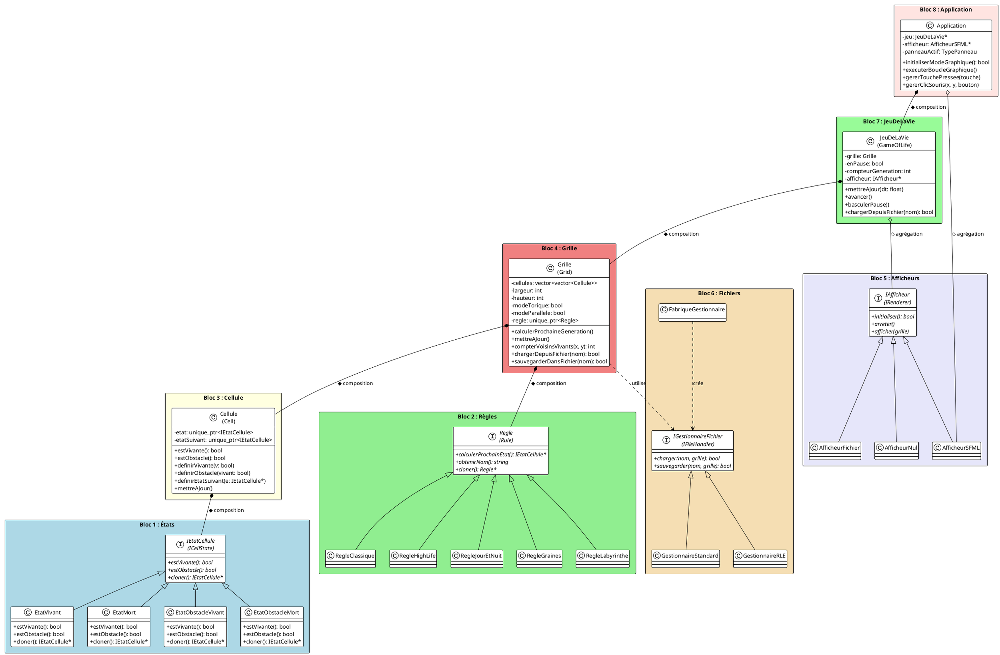

# 📐 Diagramme de Classes - Jeu de la Vie

## Table des Matières
1. [Vue d'ensemble](#1-vue-densemble)
2. [Bloc 1 : États des Cellules](#2-bloc-1--états-des-cellules)
3. [Bloc 2 : Règles du Jeu](#3-bloc-2--règles-du-jeu)
4. [Bloc 3 : Cellule](#4-bloc-3--cellule)
5. [Bloc 4 : Grille](#5-bloc-4--grille)
6. [Bloc 5 : Afficheurs (Renderers)](#6-bloc-5--afficheurs-renderers)
7. [Bloc 6 : Gestionnaires de Fichiers](#7-bloc-6--gestionnaires-de-fichiers)
8. [Bloc 7 : Jeu de la Vie (Contrôleur)](#8-bloc-7--jeu-de-la-vie-contrôleur)
9. [Bloc 8 : Application (Façade)](#9-bloc-8--application-façade)
10. [Relations entre les Blocs](#10-relations-entre-les-blocs)
11. [Code PlantUML](#11-code-plantuml)

---

## 1. Vue d'ensemble

```
┌─────────────────────────────────────────────────────────────────────────────┐
│                        ARCHITECTURE GLOBALE                                  │
│                                                                              │
│   ┌─────────────┐         ┌─────────────┐         ┌─────────────┐          │
│   │   BLOC 8    │────────>│   BLOC 7    │────────>│   BLOC 4    │          │
│   │ Application │         │ JeuDeLaVie  │         │   Grille    │          │
│   │  (Façade)   │         │ (Contrôleur)│         │  (Modèle)   │          │
│   └─────────────┘         └──────┬──────┘         └──────┬──────┘          │
│                                  │                       │                  │
│                                  │                       │                  │
│                                  ▼                       ▼                  │
│   ┌─────────────┐         ┌─────────────┐         ┌─────────────┐          │
│   │   BLOC 5    │         │   BLOC 6    │         │   BLOC 3    │          │
│   │ Afficheurs  │         │ Fichiers    │         │  Cellule    │          │
│   │   (Vue)     │         │ (Persistance)│        │             │          │
│   └─────────────┘         └─────────────┘         └──────┬──────┘          │
│                                                          │                  │
│                                                          │                  │
│                           ┌──────────────────────────────┼──────┐          │
│                           │                              │      │          │
│                           ▼                              ▼      │          │
│                    ┌─────────────┐               ┌─────────────┐│          │
│                    │   BLOC 2    │               │   BLOC 1    ││          │
│                    │   Règles    │               │   États     ││          │
│                    │ (Stratégie) │               │  (State)    ││          │
│                    └─────────────┘               └─────────────┘│          │
│                                                                  │          │
└─────────────────────────────────────────────────────────────────────────────┘
```

---

## 2. Bloc 1 : États des Cellules

### Pattern utilisé : **State (État)**

Ce bloc implémente le patron de conception État pour représenter les différents états possibles d'une cellule.

```
┌─────────────────────────────────────────────────────────────────────────────┐
│                          BLOC 1 : ÉTATS DES CELLULES                         │
│                                                                              │
│                        ┌─────────────────────────┐                          │
│                        │    <<interface>>        │                          │
│                        │    IEtatCellule         │                          │
│                        │    (ICellState)         │                          │
│                        ├─────────────────────────┤                          │
│                        │                         │                          │
│                        ├─────────────────────────┤                          │
│                        │ + estVivante(): bool    │  ← Méthode virtuelle pure│
│                        │ + estObstacle(): bool   │  ← Méthode virtuelle pure│
│                        │ + cloner(): IEtatCellule*│ ← Prototype             │
│                        └───────────┬─────────────┘                          │
│                                    │                                         │
│                                    │ Héritage (implements)                   │
│              ┌─────────────────────┼─────────────────────┐                  │
│              │                     │                     │                  │
│              ▼                     ▼                     ▼                  │
│   ┌─────────────────┐   ┌─────────────────┐   ┌─────────────────┐          │
│   │   EtatVivant    │   │    EtatMort     │   │ EtatObstacle... │          │
│   │  (AliveState)   │   │  (DeadState)    │   │                 │          │
│   ├─────────────────┤   ├─────────────────┤   ├─────────────────┤          │
│   │                 │   │                 │   │ - vivant: bool  │          │
│   ├─────────────────┤   ├─────────────────┤   ├─────────────────┤          │
│   │ + estVivante()  │   │ + estVivante()  │   │ + estVivante()  │          │
│   │   → return true │   │   → return false│   │   → return vivant│         │
│   │ + estObstacle() │   │ + estObstacle() │   │ + estObstacle() │          │
│   │   → return false│   │   → return false│   │   → return true │          │
│   │ + cloner()      │   │ + cloner()      │   │ + cloner()      │          │
│   └─────────────────┘   └─────────────────┘   └─────────────────┘          │
│                                                       │                     │
│                                    ┌──────────────────┴──────────────────┐  │
│                                    │                                     │  │
│                                    ▼                                     ▼  │
│                         ┌─────────────────┐                   ┌─────────────────┐
│                         │EtatObstacleVivant│                  │EtatObstacleMort │
│                         │(ObstacleAliveState)│                │(ObstacleDeadState)│
│                         ├─────────────────┤                   ├─────────────────┤
│                         │ vivant = true   │                   │ vivant = false  │
│                         └─────────────────┘                   └─────────────────┘
│                                                                              │
└─────────────────────────────────────────────────────────────────────────────┘
```

### Description des Classes

| Classe | Rôle | Attributs | Méthodes Clés |
|--------|------|-----------|---------------|
| **IEtatCellule** | Interface abstraite définissant le contrat | Aucun | `estVivante()`, `estObstacle()`, `cloner()` |
| **EtatVivant** | Représente une cellule vivante | Aucun | Retourne `true` pour `estVivante()` |
| **EtatMort** | Représente une cellule morte | Aucun | Retourne `false` pour `estVivante()` |
| **EtatObstacleVivant** | Obstacle qui compte comme vivant | vivant=true | Retourne `true` pour les deux |
| **EtatObstacleMort** | Obstacle qui compte comme mort | vivant=false | `estVivante()=false`, `estObstacle()=true` |

### Relations internes

```
IEtatCellule ◁─── EtatVivant          (Héritage/Implémentation)
IEtatCellule ◁─── EtatMort            (Héritage/Implémentation)
IEtatCellule ◁─── EtatObstacleVivant  (Héritage/Implémentation)
IEtatCellule ◁─── EtatObstacleMort    (Héritage/Implémentation)
```

### Pourquoi ce design ?

1. **Polymorphisme** : Permet de traiter tous les états de manière uniforme
2. **Extensibilité** : Facile d'ajouter de nouveaux types d'états
3. **Encapsulation** : Chaque état gère son propre comportement
4. **Principe Open/Closed** : Ouvert à l'extension, fermé à la modification

---

## 3. Bloc 2 : Règles du Jeu

### Pattern utilisé : **Strategy (Stratégie)**

Ce bloc permet de changer dynamiquement l'algorithme de calcul de l'état suivant.

```
┌─────────────────────────────────────────────────────────────────────────────┐
│                          BLOC 2 : RÈGLES DU JEU                              │
│                                                                              │
│                        ┌─────────────────────────┐                          │
│                        │    <<interface>>        │                          │
│                        │       Regle             │                          │
│                        │      (Rule)             │                          │
│                        ├─────────────────────────┤                          │
│                        │                         │                          │
│                        ├─────────────────────────┤                          │
│                        │ + calculerProchainEtat  │                          │
│                        │   (etat, voisins):      │                          │
│                        │   IEtatCellule*         │                          │
│                        │ + obtenirNom(): string  │                          │
│                        │ + cloner(): Regle*      │                          │
│                        └───────────┬─────────────┘                          │
│                                    │                                         │
│         ┌──────────────────────────┼──────────────────────────┐             │
│         │              │           │           │              │             │
│         ▼              ▼           ▼           ▼              ▼             │
│  ┌───────────┐  ┌───────────┐ ┌───────────┐ ┌───────────┐ ┌───────────┐    │
│  │  Regle    │  │  Regle    │ │  Regle    │ │  Regle    │ │  Regle    │    │
│  │ Classique │  │ HighLife  │ │ JourNuit  │ │  Graines  │ │Labyrinthe │    │
│  ├───────────┤  ├───────────┤ ├───────────┤ ├───────────┤ ├───────────┤    │
│  │           │  │           │ │           │ │           │ │           │    │
│  ├───────────┤  ├───────────┤ ├───────────┤ ├───────────┤ ├───────────┤    │
│  │ B3/S23    │  │ B36/S23   │ │B3678/S34678│ │ B2/S      │ │B3/S12345  │    │
│  │ Naissance:│  │ Naissance:│ │ Naissance:│ │ Naissance:│ │ Naissance:│    │
│  │ 3 voisins │  │ 3,6 vois. │ │3,6,7,8 v. │ │ 2 voisins │ │ 3 voisins │    │
│  │ Survie:   │  │ Survie:   │ │ Survie:   │ │ Survie:   │ │ Survie:   │    │
│  │ 2,3 vois. │  │ 2,3 vois. │ │3,4,6,7,8 v│ │ aucun     │ │1,2,3,4,5 v│    │
│  └───────────┘  └───────────┘ └───────────┘ └───────────┘ └───────────┘    │
│                                                                              │
└─────────────────────────────────────────────────────────────────────────────┘
```

### Description des Classes

| Classe | Règle (Notation B/S) | Comportement |
|--------|---------------------|--------------|
| **RegleClassique** | B3/S23 | Règles originales de Conway |
| **RegleHighLife** | B36/S23 | Ajoute naissance à 6 voisins (réplicateurs) |
| **RegleJourEtNuit** | B3678/S34678 | Symétrique vie/mort |
| **RegleGraines** | B2/S | Cellules "explosives", jamais de survie |
| **RegleLabyrinthe** | B3/S12345 | Crée des structures labyrinthiques |

### Algorithme commun

```cpp
IEtatCellule* calculerProchainEtat(IEtatCellule* etatActuel, int voisins) {
    if (etatActuel->estVivante()) {
        // Règle de SURVIE
        if (conditionSurvie(voisins)) {
            return new EtatVivant();
        } else {
            return new EtatMort();
        }
    } else {
        // Règle de NAISSANCE
        if (conditionNaissance(voisins)) {
            return new EtatVivant();
        } else {
            return new EtatMort();
        }
    }
}
```

### Relations internes

```
Regle ◁─── RegleClassique   (Héritage)
Regle ◁─── RegleHighLife    (Héritage)
Regle ◁─── RegleJourEtNuit  (Héritage)
Regle ◁─── RegleGraines     (Héritage)
Regle ◁─── RegleLabyrinthe  (Héritage)
```

---

## 4. Bloc 3 : Cellule

### Pattern utilisé : **State (Composition avec État)**

```
┌─────────────────────────────────────────────────────────────────────────────┐
│                              BLOC 3 : CELLULE                                │
│                                                                              │
│         ┌───────────────────────────────────────────────────────┐           │
│         │                        Cellule                         │           │
│         │                        (Cell)                          │           │
│         ├───────────────────────────────────────────────────────┤           │
│         │ - etat: unique_ptr<IEtatCellule>        ◆──────────────┼──> BLOC 1│
│         │ - etatSuivant: unique_ptr<IEtatCellule> ◆──────────────┼──> BLOC 1│
│         ├───────────────────────────────────────────────────────┤           │
│         │ + Cellule()                                            │           │
│         │ + Cellule(const Cellule& autre)   // Copie profonde   │           │
│         │ + operator=(const Cellule& autre) // Affectation      │           │
│         │                                                        │           │
│         │ + estVivante(): bool              // Délègue à etat   │           │
│         │ + estObstacle(): bool             // Délègue à etat   │           │
│         │                                                        │           │
│         │ + definirVivante(v: bool)         // Change l'état    │           │
│         │ + definirObstacle(vivant: bool)   // Définit obstacle │           │
│         │                                                        │           │
│         │ + obtenirEtat(): IEtatCellule&    // Accès à l'état   │           │
│         │ + definirEtatSuivant(e: IEtatCellule*) // Prépare MAJ │           │
│         │                                                        │           │
│         │ + mettreAJour()                   // etat = etatSuivant│           │
│         └───────────────────────────────────────────────────────┘           │
│                                                                              │
│  ╔═══════════════════════════════════════════════════════════════════════╗  │
│  ║  CYCLE DE VIE D'UNE CELLULE :                                         ║  │
│  ║                                                                        ║  │
│  ║  1. Création : etat = new EtatMort()                                  ║  │
│  ║  2. Calcul   : etatSuivant = regle.calculerProchainEtat(etat, voisins)║  │
│  ║  3. Mise à jour : etat = etatSuivant (via mettreAJour())              ║  │
│  ║  4. Répéter étapes 2-3 pour chaque génération                         ║  │
│  ╚═══════════════════════════════════════════════════════════════════════╝  │
│                                                                              │
└─────────────────────────────────────────────────────────────────────────────┘
```

### Responsabilités

| Méthode | Responsabilité |
|---------|----------------|
| `estVivante()` | Délègue la question à l'objet `etat` |
| `estObstacle()` | Délègue la question à l'objet `etat` |
| `definirVivante(bool)` | Crée un nouvel état (Vivant ou Mort) |
| `definirObstacle(bool)` | Crée un état obstacle (vivant ou mort) |
| `definirEtatSuivant()` | Stocke l'état calculé pour la prochaine génération |
| `mettreAJour()` | Applique la transition d'état |

### Relations

```
Cellule ◆──── IEtatCellule (Composition : etat)
Cellule ◆──── IEtatCellule (Composition : etatSuivant)
```

**Composition (◆)** : La cellule possède et gère le cycle de vie de ses états. Quand la cellule est détruite, les états le sont aussi.

---

## 5. Bloc 4 : Grille

### Pattern utilisé : **Composite + Repository**

```
┌─────────────────────────────────────────────────────────────────────────────┐
│                               BLOC 4 : GRILLE                                │
│                                                                              │
│  ┌───────────────────────────────────────────────────────────────────────┐  │
│  │                              Grille                                    │  │
│  │                              (Grid)                                    │  │
│  ├───────────────────────────────────────────────────────────────────────┤  │
│  │ - cellules: vector<vector<Cellule>>    ◆──────────────────────────────┼──> BLOC 3
│  │ - largeur: int                                                        │  │
│  │ - hauteur: int                                                        │  │
│  │ - modeTorique: bool                    // Bords connectés             │  │
│  │ - modeParallele: bool                  // Multi-threading             │  │
│  │ - regle: unique_ptr<Regle>             ◆──────────────────────────────┼──> BLOC 2
│  ├───────────────────────────────────────────────────────────────────────┤  │
│  │                          ACCESSEURS                                    │  │
│  │ + obtenirLargeur(): int                                               │  │
│  │ + obtenirHauteur(): int                                               │  │
│  │ + obtenirCellule(x, y): Cellule&       // Accès direct                │  │
│  │ + obtenirCellule(x, y) const: const Cellule&                          │  │
│  │                                                                        │  │
│  │                          ÉVOLUTION                                     │  │
│  │ + calculerProchaineGeneration()        // Calcule tous les états      │  │
│  │ + mettreAJour()                        // Applique les états          │  │
│  │ + compterVoisinsVivants(x, y): int     // Compte les 8 voisins        │  │
│  │                                                                        │  │
│  │                          MANIPULATION                                  │  │
│  │ + aleatoire(probabilite: double)       // Remplit aléatoirement       │  │
│  │ + effacer()                            // Toutes les cellules mortes  │  │
│  │ + redimensionner(l, h)                 // Change la taille            │  │
│  │ + placerMotif(motif, x, y)             // Insère un pattern           │  │
│  │                                                                        │  │
│  │                          PERSISTANCE                                   │  │
│  │ + chargerDepuisFichier(nom): bool      // Utilise FileHandler         │  │
│  │ + sauvegarderDansFichier(nom): bool    // Utilise FileHandler         │  │
│  │                                                                        │  │
│  │                          CONFIGURATION                                 │  │
│  │ + definirRegle(regle: Regle*)          // Change la stratégie         │  │
│  │ + definirModeTorique(actif: bool)      // Bords connectés             │  │
│  │ + definirModeParallele(actif: bool)    // Multi-threading             │  │
│  │                                                                        │  │
│  │                          STATISTIQUES                                  │  │
│  │ + compterCellulesVivantes(): int       // Nombre de cellules vivantes │  │
│  │ + estEgale(autre: Grille): bool        // Comparaison pour cycles     │  │
│  └───────────────────────────────────────────────────────────────────────┘  │
│                                                                              │
│  ╔═══════════════════════════════════════════════════════════════════════╗  │
│  ║  ALGORITHME DE COMPTAGE DES VOISINS (Mode Torique) :                  ║  │
│  ║                                                                        ║  │
│  ║      [7] [0] [1]         Indices des 8 voisins                        ║  │
│  ║      [6] [X] [2]         autour de la cellule X                       ║  │
│  ║      [5] [4] [3]                                                       ║  │
│  ║                                                                        ║  │
│  ║  Mode Torique : coordonnées = (x + largeur) % largeur                 ║  │
│  ║  Mode Normal  : ignore les voisins hors limites                       ║  │
│  ╚═══════════════════════════════════════════════════════════════════════╝  │
│                                                                              │
└─────────────────────────────────────────────────────────────────────────────┘
```

### Relations

```
Grille ◆──── Cellule (Composition : vector<vector<Cellule>>)
Grille ◆──── Regle   (Composition : unique_ptr<Regle>)
Grille ◇──── IGestionnaireFichier (Association : utilisation temporaire)
```

---

## 6. Bloc 5 : Afficheurs (Renderers)

### Pattern utilisé : **Strategy + Composite**

```
┌─────────────────────────────────────────────────────────────────────────────┐
│                         BLOC 5 : AFFICHEURS (RENDERERS)                      │
│                                                                              │
│                        ┌─────────────────────────┐                          │
│                        │    <<interface>>        │                          │
│                        │     IAfficheur          │                          │
│                        │    (IRenderer)          │                          │
│                        ├─────────────────────────┤                          │
│                        │                         │                          │
│                        ├─────────────────────────┤                          │
│                        │ + initialiser(): bool   │                          │
│                        │ + arreter()             │                          │
│                        │ + afficher(grille)      │                          │
│                        │ + mettreAJour(dt)       │                          │
│                        │ + estActif(): bool      │                          │
│                        └───────────┬─────────────┘                          │
│                                    │                                         │
│         ┌──────────────────────────┼──────────────────────────┐             │
│         │                          │                          │             │
│         ▼                          ▼                          ▼             │
│  ┌─────────────────┐      ┌─────────────────┐      ┌─────────────────┐     │
│  │  AfficheurSFML  │      │ AfficheurFichier│      │  AfficheurNul   │     │
│  │ (SFMLRenderer)  │      │ (FileRenderer)  │      │ (NullRenderer)  │     │
│  ├─────────────────┤      ├─────────────────┤      ├─────────────────┤     │
│  │ - fenetre:      │      │ - dossierSortie │      │                 │     │
│  │   RenderWindow* │      │ - generation    │      │                 │     │
│  │ - police: Font  │      │ - prefixe       │      │                 │     │
│  │ - tailleCellule │      ├─────────────────┤      ├─────────────────┤     │
│  │ - couleurVivant │      │ + initialiser() │      │ + initialiser() │     │
│  │ - couleurMort   │      │ + afficher()    │      │   → true        │     │
│  │ - couleurObstacle│     │   → écrit dans  │      │ + afficher()    │     │
│  │ - decalageX/Y   │      │     fichier     │      │   → (rien)      │     │
│  │ - afficherStats │      │ + arreter()     │      │ + arreter()     │     │
│  ├─────────────────┤      └─────────────────┘      │   → (rien)      │     │
│  │ + initialiser() │                               └─────────────────┘     │
│  │ + afficher()    │                                                        │
│  │ + arreter()     │      ┌─────────────────┐                              │
│  │                 │      │AfficheurComposite│                              │
│  │ + ecranVers-    │      │(CompositeRenderer)│                             │
│  │   Grille()      │      ├─────────────────┤                              │
│  │ + dessiner-     │      │ - afficheurs:   │                              │
│  │   Cellule()     │      │   vector<IAfficheur*>│                         │
│  │ + mettreAJour-  │      ├─────────────────┤                              │
│  │   DecalageGrille│      │ + ajouter()     │                              │
│  │ + definirSur-   │      │ + afficher()    │                              │
│  │   TouchePressee()│     │   → délègue à   │                              │
│  └─────────────────┘      │     tous        │                              │
│                           └─────────────────┘                              │
│                                                                              │
└─────────────────────────────────────────────────────────────────────────────┘
```

### Description des Classes

| Classe | Rôle | Utilisation |
|--------|------|-------------|
| **IAfficheur** | Interface abstraite | Définit le contrat |
| **AfficheurSFML** | Affichage graphique SFML | Mode graphique interactif |
| **AfficheurFichier** | Sauvegarde en fichiers | Mode console |
| **AfficheurNul** | Ne fait rien | Tests unitaires |
| **AfficheurComposite** | Combine plusieurs afficheurs | Affichage + sauvegarde simultanés |

### Relations

```
IAfficheur ◁─── AfficheurSFML     (Héritage)
IAfficheur ◁─── AfficheurFichier  (Héritage)
IAfficheur ◁─── AfficheurNul      (Héritage)
IAfficheur ◁─── AfficheurComposite (Héritage)

AfficheurComposite ◇──── IAfficheur (Agrégation : plusieurs afficheurs)
```

---

## 7. Bloc 6 : Gestionnaires de Fichiers

### Pattern utilisé : **Factory + Strategy**

```
┌─────────────────────────────────────────────────────────────────────────────┐
│                    BLOC 6 : GESTIONNAIRES DE FICHIERS                        │
│                                                                              │
│                        ┌─────────────────────────┐                          │
│                        │    <<interface>>        │                          │
│                        │ IGestionnaireFichier   │                          │
│                        │   (IFileHandler)        │                          │
│                        ├─────────────────────────┤                          │
│                        │                         │                          │
│                        ├─────────────────────────┤                          │
│                        │ + charger(nom, grille)  │                          │
│                        │   : bool                │                          │
│                        │ + sauvegarder(nom,      │                          │
│                        │   grille): bool         │                          │
│                        │ + supporte(nom): bool   │                          │
│                        └───────────┬─────────────┘                          │
│                                    │                                         │
│         ┌──────────────────────────┼──────────────────────────┐             │
│         │                          │                          │             │
│         ▼                          ▼                          ▼             │
│  ┌─────────────────┐      ┌─────────────────┐      ┌─────────────────┐     │
│  │  Gestionnaire   │      │  Gestionnaire   │      │  Gestionnaire   │     │
│  │  Standard       │      │    Etendu       │      │      RLE        │     │
│  │ (StandardFile-  │      │ (ExtendedFile-  │      │ (RLEFileHandler)│     │
│  │   Handler)      │      │   Handler)      │      │                 │     │
│  ├─────────────────┤      ├─────────────────┤      ├─────────────────┤     │
│  │                 │      │                 │      │                 │     │
│  ├─────────────────┤      ├─────────────────┤      ├─────────────────┤     │
│  │ + charger()     │      │ + charger()     │      │ + charger()     │     │
│  │ + sauvegarder() │      │ + sauvegarder() │      │ + sauvegarder() │     │
│  │ + supporte()    │      │ + supporte()    │      │ + supporte()    │     │
│  │   → .txt, .cells│      │   → .gol, .ext  │      │   → .rle        │     │
│  └─────────────────┘      └─────────────────┘      │                 │     │
│                                                    │ - decoderRLE()  │     │
│                                                    │ - encoderRLE()  │     │
│                                                    └─────────────────┘     │
│                                                                              │
│                        ┌─────────────────────────┐                          │
│                        │  FabriqueGestionnaire   │                          │
│                        │ (FileHandlerFactory)    │                          │
│                        ├─────────────────────────┤                          │
│                        │                         │                          │
│                        ├─────────────────────────┤                          │
│                        │ + creerPourFichier(nom) │                          │
│                        │   : IGestionnaireFichier*│                         │
│                        │                         │                          │
│                        │ [Analyse l'extension    │                          │
│                        │  et retourne le bon     │                          │
│                        │  gestionnaire]          │                          │
│                        └─────────────────────────┘                          │
│                                                                              │
│  ╔═══════════════════════════════════════════════════════════════════════╗  │
│  ║  FORMAT STANDARD (.txt) :                                             ║  │
│  ║                                                                        ║  │
│  ║  5 10           ← hauteur largeur                                     ║  │
│  ║  0 0 1 0 0 0 0 0 0 0                                                  ║  │
│  ║  0 0 0 1 0 0 0 0 0 0     0 = mort                                     ║  │
│  ║  0 1 1 1 0 0 0 0 0 0     1 = vivant                                   ║  │
│  ║  0 0 0 0 0 0 0 0 0 0     2 = obstacle mort                            ║  │
│  ║  0 0 0 0 0 0 0 0 0 0     3 = obstacle vivant                          ║  │
│  ╚═══════════════════════════════════════════════════════════════════════╝  │
│                                                                              │
└─────────────────────────────────────────────────────────────────────────────┘
```

### Relations

```
IGestionnaireFichier ◁─── GestionnaireStandard (Héritage)
IGestionnaireFichier ◁─── GestionnaireEtendu   (Héritage)
IGestionnaireFichier ◁─── GestionnaireRLE      (Héritage)

FabriqueGestionnaire ──── IGestionnaireFichier (Crée : Factory)
```

---

## 8. Bloc 7 : Jeu de la Vie (Contrôleur)

### Pattern utilisé : **MVC (Contrôleur) + Observer**

```
┌─────────────────────────────────────────────────────────────────────────────┐
│                      BLOC 7 : JEU DE LA VIE (CONTRÔLEUR)                     │
│                                                                              │
│  ┌───────────────────────────────────────────────────────────────────────┐  │
│  │                            JeuDeLaVie                                  │  │
│  │                           (GameOfLife)                                 │  │
│  ├───────────────────────────────────────────────────────────────────────┤  │
│  │                            MODÈLE                                      │  │
│  │ - grille: Grille                          ◆───────────────────────────┼──> BLOC 4
│  │ - grillePrecedente: Grille                // Pour détection cycles    │  │
│  │ - historique: vector<Grille>              // Pour retour arrière      │  │
│  │                                                                        │  │
│  │                            ÉTAT                                        │  │
│  │ - enCours: bool                           // Simulation active        │  │
│  │ - enPause: bool                           // Simulation en pause      │  │
│  │ - compteurGeneration: int                 // Numéro génération        │  │
│  │ - aArreteEvoluer: bool                    // Détection stagnation     │  │
│  │ - longueurCycleDetecte: int               // Longueur du cycle        │  │
│  │ - raisonArret: string                     // Message explicatif       │  │
│  │                                                                        │  │
│  │                            TIMING                                      │  │
│  │ - intervalMiseAJour: float                // Intervalle entre MAJ     │  │
│  │ - tempsAccumule: float                    // Temps depuis dernière MAJ│  │
│  │ - tempsDepuisCycleDetecte: float          // Timer pour arrêt auto    │  │
│  │                                                                        │  │
│  │                            VUE                                         │  │
│  │ - afficheur: IAfficheur*                  ◇───────────────────────────┼──> BLOC 5
│  ├───────────────────────────────────────────────────────────────────────┤  │
│  │                         CONTRÔLE                                       │  │
│  │ + mettreAJour(deltaTemps: float)          // Boucle principale        │  │
│  │ + avancer()                               // Une génération           │  │
│  │ + basculerPause()                         // Pause/Play               │  │
│  │ + demarrer() / arreter()                  // Démarrage/Arrêt          │  │
│  │                                                                        │  │
│  │                         MANIPULATION                                   │  │
│  │ + randomiser()                            // Grille aléatoire         │  │
│  │ + effacer()                               // Vider la grille          │  │
│  │ + placerMotif(motif, x, y)                // Insérer un pattern       │  │
│  │                                                                        │  │
│  │                         NAVIGATION                                     │  │
│  │ + reculer(): bool                         // Génération précédente    │  │
│  │ + avancerHistorique(): bool               // Génération suivante      │  │
│  │                                                                        │  │
│  │                         PERSISTANCE                                    │  │
│  │ + chargerDepuisFichier(nom): bool         // Charger grille           │  │
│  │ + sauvegarderDansFichier(nom): bool       // Sauvegarder grille       │  │
│  │                                                                        │  │
│  │                         CONFIGURATION                                  │  │
│  │ + definirRegle(regle: Regle*)             // Changer les règles       │  │
│  │ + definirIntervalle(interval: float)      // Changer la vitesse       │  │
│  │ + definirAfficheur(a: IAfficheur*)        // Injection de dépendance  │  │
│  │                                                                        │  │
│  │                         ACCESSEURS                                     │  │
│  │ + obtenirGrille(): Grille&                // Accès à la grille        │  │
│  │ + obtenirGeneration(): int                // Numéro génération        │  │
│  │ + estEnPause(): bool                      // État pause               │  │
│  │ + aDetecteCycle(): bool                   // Cycle détecté ?          │  │
│  │ + obtenirRaisonArret(): string            // Pourquoi arrêté ?        │  │
│  └───────────────────────────────────────────────────────────────────────┘  │
│                                                                              │
│  ╔═══════════════════════════════════════════════════════════════════════╗  │
│  ║  DÉTECTION DES CYCLES :                                               ║  │
│  ║                                                                        ║  │
│  ║  1. Après chaque génération, comparer avec grillePrecedente           ║  │
│  ║  2. Si égale → Pattern STABLE (cycle de longueur 1)                   ║  │
│  ║  3. Sinon, comparer avec chaque grille dans historique                ║  │
│  ║  4. Si égale à historique[i] → Cycle de longueur (i+2)                ║  │
│  ║  5. Si cycle détecté ET temps > 10 secondes → ARRÊT automatique       ║  │
│  ╚═══════════════════════════════════════════════════════════════════════╝  │
│                                                                              │
└─────────────────────────────────────────────────────────────────────────────┘
```

### Relations

```
JeuDeLaVie ◆──── Grille     (Composition : possède la grille)
JeuDeLaVie ◇──── IAfficheur (Agrégation : utilise un afficheur externe)
JeuDeLaVie ──── Regle       (Association : délègue à la grille)
```

---

## 9. Bloc 8 : Application (Façade)

### Pattern utilisé : **Facade**

```
┌─────────────────────────────────────────────────────────────────────────────┐
│                        BLOC 8 : APPLICATION (FAÇADE)                         │
│                                                                              │
│  ┌───────────────────────────────────────────────────────────────────────┐  │
│  │                            Application                                 │  │
│  ├───────────────────────────────────────────────────────────────────────┤  │
│  │                         COMPOSANTS                                     │  │
│  │ - jeu: JeuDeLaVie*                        ◆───────────────────────────┼──> BLOC 7
│  │ - afficheur: AfficheurSFML*               ◇───────────────────────────┼──> BLOC 5
│  │ - police: Font                            // Police pour textes        │  │
│  │                                                                        │  │
│  │                         ÉTAT APPLICATION                               │  │
│  │ - enExecution: bool                       // Boucle active             │  │
│  │ - modeObstacle: bool                      // Dessine obstacles         │  │
│  │ - modeDessin: bool                        // true=vivant, false=mort   │  │
│  │ - obstacleVivant: bool                    // Type d'obstacle           │  │
│  │ - motifSelectionne: string                // Pattern à placer          │  │
│  │                                                                        │  │
│  │                         INTERFACE                                      │  │
│  │ - panneauActif: TypePanneau               // Aide/Fichier/Modes/Motifs │  │
│  │ - messageStatut: string                   // Message affiché           │  │
│  │ - tempsStatut: float                      // Durée affichage           │  │
│  │ - champActif: ChampTexte*                 // Champ de saisie actif     │  │
│  │                                                                        │  │
│  │                         FICHIERS                                       │  │
│  │ - nomFichierChargement: string            // Fichier à charger         │  │
│  │ - nomFichierSauvegarde: string            // Fichier destination       │  │
│  │ - fichiersDisponibles: vector<string>     // Liste fichiers .txt       │  │
│  │ - fichierSelectionne: int                 // Index sélectionné         │  │
│  │                                                                        │  │
│  │                         SAUVEGARDE ÉTAT                                │  │
│  │ - grilleInitiale: Grille                  // État initial sauvegardé   │  │
│  │ - aSauvegardeInitiale: bool               // A été sauvegardée ?       │  │
│  ├───────────────────────────────────────────────────────────────────────┤  │
│  │                         INITIALISATION                                 │  │
│  │ + initialiserModeGraphique(): bool        // Crée fenêtre SFML         │  │
│  │ + executerBoucleGraphique()               // Boucle principale         │  │
│  │ + chargerEtExecuter(nom): bool            // Charge et lance           │  │
│  │ + executerParDefaut()                     // Grille aléatoire          │  │
│  │                                                                        │  │
│  │                         ÉVÉNEMENTS                                     │  │
│  │ + gererTouchePressee(touche)              // Raccourcis clavier        │  │
│  │ + gererClicSouris(x, y, bouton)           // Interactions souris       │  │
│  │ + gererTexteEntre(unicode)                // Saisie de texte           │  │
│  │ + gererDeplacementSouris(x, y)            // Survol souris             │  │
│  │                                                                        │  │
│  │                         DESSIN                                         │  │
│  │ + dessinerBarreLaterale()                 // Boutons à gauche          │  │
│  │ + dessinerBarreSuperieure()               // Infos en haut             │  │
│  │ + dessinerBarreInferieure()               // Statut en bas             │  │
│  │ + dessinerPanneau()                       // Panneau actif             │  │
│  │ + dessinerPanneauAide()                   // Raccourcis                │  │
│  │ + dessinerPanneauFichier()                // Charger/Sauvegarder       │  │
│  │ + dessinerPanneauModes()                  // Règles/Options            │  │
│  │ + dessinerPanneauMotifs()                 // Patterns                  │  │
│  │                                                                        │  │
│  │                         ACTIONS                                        │  │
│  │ + selectionnerMotif(motif)                // Sélectionne un pattern    │  │
│  │ + cyclerRegle()                           // Change de règle           │  │
│  │ + basculerPanneau(type)                   // Ouvre/Ferme panneau       │  │
│  │ + afficherStatut(message)                 // Affiche un message        │  │
│  │ + scannerFichiersDisponibles()            // Liste les fichiers        │  │
│  │ + sauvegarderEtatInitial()                // Mémorise l'état           │  │
│  │ + restaurerEtatInitial()                  // Restaure l'état           │  │
│  └───────────────────────────────────────────────────────────────────────┘  │
│                                                                              │
│  ╔═══════════════════════════════════════════════════════════════════════╗  │
│  ║  RACCOURCIS CLAVIER :                                                  ║  │
│  ║                                                                        ║  │
│  ║  ESPACE    = Pause/Play          R = Randomiser                       ║  │
│  ║  N         = Avancer d'un pas    C = Effacer                          ║  │
│  ║  O         = Mode obstacle       V = Toggle obstacle vivant/mort      ║  │
│  ║  T         = Mode torique        P = Mode parallèle                   ║  │
│  ║  Flèches   = Naviguer historique W = Sauvegarde rapide                ║  │
│  ║  +/-       = Vitesse             S = Sauvegarder état initial         ║  │
│  ║  H         = Panneau Aide        L = Restaurer état initial           ║  │
│  ║  F         = Panneau Fichier     ÉCHAP = Fermer panneau               ║  │
│  ║  M         = Panneau Modes       1-9 = Sélectionner règle             ║  │
│  ║  G         = Panneau Motifs                                           ║  │
│  ╚═══════════════════════════════════════════════════════════════════════╝  │
│                                                                              │
└─────────────────────────────────────────────────────────────────────────────┘
```

### Relations

```
Application ◆──── JeuDeLaVie    (Composition : possède le jeu)
Application ◇──── AfficheurSFML (Agrégation : utilise l'afficheur)
Application ◇──── sf::Font      (Agrégation : utilise la police)
```

---

## 10. Relations entre les Blocs

### 10.1 Diagramme des Relations

```
┌─────────────────────────────────────────────────────────────────────────────┐
│                        RELATIONS ENTRE LES BLOCS                             │
└─────────────────────────────────────────────────────────────────────────────┘

                              ┌─────────────┐
                              │   BLOC 8    │
                              │ Application │
                              │  (Façade)   │
                              └──────┬──────┘
                                     │
                                     │ ◆ Composition
                                     │   (possède et gère le cycle de vie)
                                     ▼
                              ┌─────────────┐
                              │   BLOC 7    │
                              │ JeuDeLaVie  │
                              │(Contrôleur) │
                              └──────┬──────┘
                                     │
              ┌──────────────────────┼──────────────────────┐
              │                      │                      │
              │ ◆ Composition        │ ◇ Agrégation        │
              │                      │   (utilise)          │
              ▼                      │                      ▼
       ┌─────────────┐               │               ┌─────────────┐
       │   BLOC 4    │               │               │   BLOC 5    │
       │   Grille    │               │               │ Afficheurs  │
       │  (Modèle)   │               │               │   (Vue)     │
       └──────┬──────┘               │               └─────────────┘
              │                      │
    ┌─────────┼─────────┐            │
    │         │         │            │
    │ ◆       │ ◆       │            │
    ▼         ▼         ▼            ▼
┌───────┐ ┌───────┐ ┌───────┐  ┌─────────────┐
│BLOC 3 │ │BLOC 2 │ │BLOC 6 │  │   BLOC 5    │
│Cellule│ │Règles │ │Fichiers│  │ Afficheurs  │
└───┬───┘ └───────┘ └───────┘  └─────────────┘
    │
    │ ◆ Composition
    ▼
┌───────┐
│BLOC 1 │
│ États │
└───────┘
```

### 10.2 Tableau des Relations

| Bloc Source | Bloc Cible | Type de Relation | Symbole | Description |
|-------------|------------|------------------|---------|-------------|
| Application | JeuDeLaVie | **Composition** | ◆ | Application possède et gère le cycle de vie du jeu |
| Application | AfficheurSFML | **Agrégation** | ◇ | Application utilise l'afficheur mais ne le possède pas entièrement |
| JeuDeLaVie | Grille | **Composition** | ◆ | Le jeu possède sa grille |
| JeuDeLaVie | IAfficheur | **Agrégation** | ◇ | Le jeu utilise un afficheur injecté |
| Grille | Cellule | **Composition** | ◆ | La grille possède toutes ses cellules |
| Grille | Regle | **Composition** | ◆ | La grille possède sa règle |
| Grille | IGestionnaireFichier | **Association** | ── | Utilisation temporaire pour charger/sauvegarder |
| Cellule | IEtatCellule | **Composition** | ◆ | La cellule possède son état |
| IEtatCellule | EtatVivant/Mort/... | **Héritage** | ◁ | Implémentation de l'interface |
| Regle | RegleClassique/... | **Héritage** | ◁ | Implémentation de l'interface |
| IAfficheur | AfficheurSFML/... | **Héritage** | ◁ | Implémentation de l'interface |
| IGestionnaireFichier | GestionnaireStandard/... | **Héritage** | ◁ | Implémentation de l'interface |

### 10.3 Types de Relations Expliquées

#### **Composition (◆)** - Relation "a un" forte
```
┌─────────┐     ◆     ┌─────────┐
│ Classe A│───────────│ Classe B│
└─────────┘           └─────────┘

- A possède B
- B n'existe pas sans A
- Quand A est détruit, B est détruit
- Exemple : Grille ◆──── Cellule
  (Si la grille est détruite, les cellules le sont aussi)
```

#### **Agrégation (◇)** - Relation "a un" faible
```
┌─────────┐     ◇     ┌─────────┐
│ Classe A│───────────│ Classe B│
└─────────┘           └─────────┘

- A utilise B
- B peut exister sans A
- A ne gère pas le cycle de vie de B
- Exemple : JeuDeLaVie ◇──── IAfficheur
  (Le jeu utilise un afficheur, mais l'afficheur peut être partagé)
```

#### **Héritage (◁)** - Relation "est un"
```
┌─────────┐           ┌─────────┐
│ Parent  │◁──────────│ Enfant  │
└─────────┘           └─────────┘

- Enfant est une spécialisation de Parent
- Enfant hérite des attributs et méthodes de Parent
- Exemple : Regle ◁──── RegleClassique
  (RegleClassique EST UNE Regle)
```

#### **Association (──)** - Relation simple
```
┌─────────┐           ┌─────────┐
│ Classe A│───────────│ Classe B│
└─────────┘           └─────────┘

- A connaît B ou utilise B
- Relation temporaire ou faible
- Exemple : Grille ──── IGestionnaireFichier
  (La grille utilise temporairement un gestionnaire de fichier)
```

### 10.4 Flux de Données

```
┌─────────────────────────────────────────────────────────────────────────────┐
│                           FLUX DE DONNÉES                                    │
└─────────────────────────────────────────────────────────────────────────────┘

  ENTRÉE                    TRAITEMENT                    SORTIE
  ══════                    ══════════                    ══════

  ┌─────────┐         ┌────────────────────┐         ┌─────────────┐
  │ Fichier │────────>│      BLOC 6        │────────>│    BLOC 4   │
  │  .txt   │         │ GestionnaireFichier│         │   Grille    │
  └─────────┘         └────────────────────┘         └──────┬──────┘
                                                            │
                                                            ▼
  ┌─────────┐         ┌────────────────────┐         ┌─────────────┐
  │ Clavier │────────>│      BLOC 8        │────────>│    BLOC 7   │
  │ Souris  │         │   Application      │         │ JeuDeLaVie  │
  └─────────┘         └────────────────────┘         └──────┬──────┘
                                                            │
                                                            │ Calcul
                                                            │ Générations
                                                            ▼
                      ┌────────────────────┐         ┌─────────────┐
                      │      BLOC 5        │<────────│    BLOC 4   │
                      │   Afficheurs       │         │   Grille    │
                      └─────────┬──────────┘         └──────┬──────┘
                                │                           │
                                ▼                           │ Utilise
                      ┌─────────────┐              ┌────────┴───────┐
                      │   Écran    │              │     BLOC 2      │
                      │  (SFML)    │              │     Règles      │
                      └─────────────┘              └────────────────┘
                                                           │
                      ┌─────────────┐                      │ Pour chaque
                      │  Fichiers  │                       │ cellule
                      │  sortie    │                       ▼
                      └─────────────┘              ┌────────────────┐
                                                  │     BLOC 1      │
                                                  │     États       │
                                                  └────────────────┘
```

---

## 11. Code PlantUML

### Diagramme de Classes Complet



---

## Résumé

Ce document présente l'architecture complète du projet **Jeu de la Vie** organisée en **8 blocs** :

| Bloc | Nom | Pattern | Rôle |
|------|-----|---------|------|
| 1 | États | State | Représente l'état d'une cellule |
| 2 | Règles | Strategy | Définit les règles d'évolution |
| 3 | Cellule | - | Unité de base de la grille |
| 4 | Grille | Composite | Contient toutes les cellules |
| 5 | Afficheurs | Strategy | Affiche la grille (écran/fichier) |
| 6 | Fichiers | Factory | Gère les formats de fichiers |
| 7 | JeuDeLaVie | MVC (Controller) | Contrôle la logique du jeu |
| 8 | Application | Facade | Interface utilisateur graphique |


