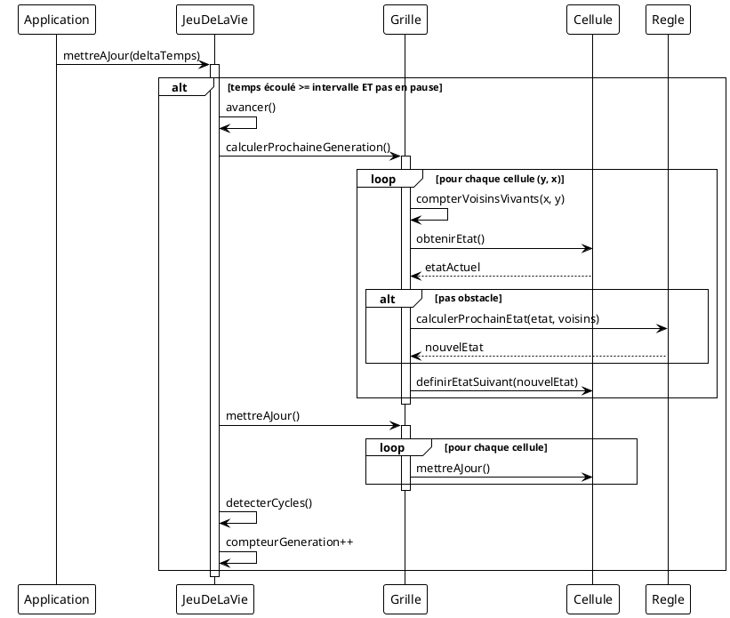
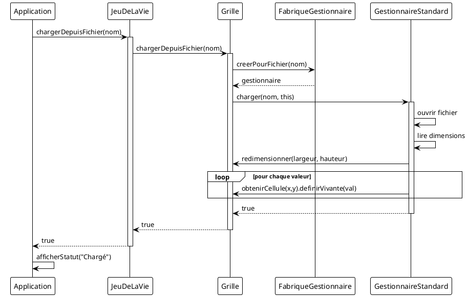

# 🔄 Diagrammes de Séquence - Jeu de la Vie

## Table des Matières
1. [Séquence 1 : Initialisation de l'Application](#séquence-1--initialisation-de-lapplication)
2. [Séquence 2 : Calcul d'une Génération](#séquence-2--calcul-dune-génération)
3. [Séquence 3 : Chargement d'un Fichier](#séquence-3--chargement-dun-fichier)
4. [Séquence 4 : Sauvegarde d'un Fichier](#séquence-4--sauvegarde-dun-fichier)
5. [Séquence 5 : Dessin d'une Cellule](#séquence-5--dessin-dune-cellule)
6. [Séquence 6 : Placement d'un Motif](#séquence-6--placement-dun-motif)
7. [Séquence 7 : Détection de Cycle](#séquence-7--détection-de-cycle)
8. [Séquence 8 : Changement de Règle](#séquence-8--changement-de-règle)
9. [Relations entre Séquences](#relations-entre-séquences)
10. [Code PlantUML](#code-plantuml)

---

## Séquence 1 : Initialisation de l'Application

### Description
Cette séquence montre le démarrage complet de l'application graphique.

### Acteurs et Objets
- **main()** : Point d'entrée du programme
- **Application** : Façade gérant l'interface
- **AfficheurSFML** : Afficheur graphique
- **JeuDeLaVie** : Contrôleur du jeu
- **Grille** : Modèle de données

### Diagramme

```
┌──────┐     ┌───────────┐     ┌─────────────┐     ┌───────────┐     ┌────────┐
│main()│     │Application│     │AfficheurSFML│     │JeuDeLaVie │     │ Grille │
└──┬───┘     └─────┬─────┘     └──────┬──────┘     └─────┬─────┘     └────┬───┘
   │               │                  │                  │                │
   │ new Application()                │                  │                │
   │──────────────>│                  │                  │                │
   │               │                  │                  │                │
   │               │ new AfficheurSFML()                 │                │
   │               │─────────────────>│                  │                │
   │               │                  │                  │                │
   │               │ new JeuDeLaVie(largeur, hauteur)    │                │
   │               │─────────────────────────────────────>│                │
   │               │                  │                  │                │
   │               │                  │                  │ new Grille(l, h)
   │               │                  │                  │───────────────>│
   │               │                  │                  │                │
   │               │                  │                  │ [Création des cellules]
   │               │                  │                  │<───────────────│
   │               │                  │                  │                │
   │               │                  │<─────────────────│                │
   │               │                  │  retour          │                │
   │               │                  │                  │                │
   │               │ initialiserModeGraphique()          │                │
   │               │─────────────────>│                  │                │
   │               │                  │                  │                │
   │               │                  │ créer RenderWindow(1200, 800)     │
   │               │                  │────────┐         │                │
   │               │                  │        │         │                │
   │               │                  │<───────┘         │                │
   │               │                  │                  │                │
   │               │                  │ charger police   │                │
   │               │                  │────────┐         │                │
   │               │                  │        │         │                │
   │               │                  │<───────┘         │                │
   │               │                  │                  │                │
   │               │     true         │                  │                │
   │               │<─────────────────│                  │                │
   │               │                  │                  │                │
   │ executerBoucleGraphique()        │                  │                │
   │──────────────>│                  │                  │                │
   │               │                  │                  │                │
   │               │ randomiser()     │                  │                │
   │               │─────────────────────────────────────>│                │
   │               │                  │                  │                │
   │               │                  │                  │ randomiser(0.3)
   │               │                  │                  │───────────────>│
   │               │                  │                  │                │
   │               │                  │                  │<───────────────│
   │               │                  │                  │                │
   │               │                  │<─────────────────│                │
   │               │                  │                  │                │
   │               │ [BOUCLE PRINCIPALE]                 │                │
   │               │────────────────────────────────────────────────────>│
   │               │                  │                  │                │
```

### Explication des Étapes

| Étape | Action | Objet Responsable |
|-------|--------|-------------------|
| 1 | Création de l'Application | main() |
| 2 | Création de l'afficheur SFML | Application |
| 3 | Création du jeu avec dimensions | Application |
| 4 | Création de la grille de cellules | JeuDeLaVie |
| 5 | Initialisation de la fenêtre SFML | AfficheurSFML |
| 6 | Chargement de la police | AfficheurSFML |
| 7 | Randomisation de la grille | Application → JeuDeLaVie → Grille |
| 8 | Démarrage de la boucle principale | Application |

---

## Séquence 2 : Calcul d'une Génération

### Description
Cette séquence détaille le calcul complet d'une nouvelle génération.

### Acteurs et Objets
- **Application** : Déclenche la mise à jour
- **JeuDeLaVie** : Contrôleur
- **Grille** : Contient les cellules
- **Cellule** : Unité de base
- **Regle** : Calcule le nouvel état

### Diagramme

```
┌───────────┐     ┌───────────┐     ┌────────┐     ┌────────┐     ┌───────┐
│Application│     │JeuDeLaVie │     │ Grille │     │Cellule │     │ Regle │
└─────┬─────┘     └─────┬─────┘     └───┬────┘     └───┬────┘     └───┬───┘
      │                 │               │              │              │
      │ mettreAJour(deltaTemps)         │              │              │
      │────────────────>│               │              │              │
      │                 │               │              │              │
      │                 │ [vérifier si temps >= intervalle]           │
      │                 │────────┐      │              │              │
      │                 │        │      │              │              │
      │                 │<───────┘      │              │              │
      │                 │               │              │              │
      │                 │ [si OUI et pas en pause]     │              │
      │                 │               │              │              │
      │                 │ avancer()     │              │              │
      │                 │────────┐      │              │              │
      │                 │        │      │              │              │
      │                 │        │ sauvegarder dans historique        │
      │                 │        │      │              │              │
      │                 │<───────┘      │              │              │
      │                 │               │              │              │
      │                 │ calculerProchaineGeneration()│              │
      │                 │──────────────>│              │              │
      │                 │               │              │              │
      │                 │               │ ╔═══════════════════════════╗
      │                 │               │ ║ POUR y = 0 à hauteur-1   ║
      │                 │               │ ║ POUR x = 0 à largeur-1   ║
      │                 │               │ ╚═══════════════════════════╝
      │                 │               │              │              │
      │                 │               │ compterVoisinsVivants(x, y) │
      │                 │               │────────┐     │              │
      │                 │               │        │     │              │
      │                 │               │ [examine les 8 voisins]     │
      │                 │               │        │     │              │
      │                 │               │<───────┘     │              │
      │                 │               │   voisins    │              │
      │                 │               │              │              │
      │                 │               │ obtenirEtat()│              │
      │                 │               │─────────────>│              │
      │                 │               │  etatActuel  │              │
      │                 │               │<─────────────│              │
      │                 │               │              │              │
      │                 │               │ [si pas obstacle]           │
      │                 │               │              │              │
      │                 │               │ calculerProchainEtat(etat, voisins)
      │                 │               │─────────────────────────────>│
      │                 │               │              │              │
      │                 │               │              │    ╔═════════════════╗
      │                 │               │              │    ║ Si vivante:     ║
      │                 │               │              │    ║   2-3 voisins   ║
      │                 │               │              │    ║   → reste vivante║
      │                 │               │              │    ║   sinon → meurt ║
      │                 │               │              │    ║                 ║
      │                 │               │              │    ║ Si morte:       ║
      │                 │               │              │    ║   3 voisins     ║
      │                 │               │              │    ║   → naît        ║
      │                 │               │              │    ║   sinon → morte ║
      │                 │               │              │    ╚═════════════════╝
      │                 │               │              │              │
      │                 │               │          nouvelEtat         │
      │                 │               │<─────────────────────────────│
      │                 │               │              │              │
      │                 │               │ definirEtatSuivant(nouvelEtat)
      │                 │               │─────────────>│              │
      │                 │               │              │              │
      │                 │               │              │ etatSuivant = nouvelEtat
      │                 │               │              │────────┐     │
      │                 │               │              │        │     │
      │                 │               │              │<───────┘     │
      │                 │               │              │              │
      │                 │               │ ╔═══════════════════════════╗
      │                 │               │ ║ FIN BOUCLES               ║
      │                 │               │ ╚═══════════════════════════╝
      │                 │               │              │              │
      │                 │<──────────────│              │              │
      │                 │               │              │              │
      │                 │ mettreAJour() │              │              │
      │                 │──────────────>│              │              │
      │                 │               │              │              │
      │                 │               │ ╔═══════════════════════════╗
      │                 │               │ ║ POUR chaque cellule       ║
      │                 │               │ ╚═══════════════════════════╝
      │                 │               │              │              │
      │                 │               │ mettreAJour()│              │
      │                 │               │─────────────>│              │
      │                 │               │              │              │
      │                 │               │              │ etat = etatSuivant
      │                 │               │              │────────┐     │
      │                 │               │              │        │     │
      │                 │               │              │<───────┘     │
      │                 │               │              │              │
      │                 │<──────────────│              │              │
      │                 │               │              │              │
      │                 │ compteurGeneration++         │              │
      │                 │────────┐      │              │              │
      │                 │        │      │              │              │
      │                 │<───────┘      │              │              │
      │                 │               │              │              │
      │<────────────────│               │              │              │
      │                 │               │              │              │
```

### Algorithme de Comptage des Voisins

```
╔═══════════════════════════════════════════════════════════════════════════╗
║                    COMPTAGE DES 8 VOISINS                                  ║
╠═══════════════════════════════════════════════════════════════════════════╣
║                                                                            ║
║     Position des voisins autour de (x, y):                                ║
║                                                                            ║
║         (x-1,y-1)  (x,y-1)  (x+1,y-1)                                     ║
║              ↖       ↑       ↗                                            ║
║         (x-1,y)  ← [x,y] →  (x+1,y)                                       ║
║              ↙       ↓       ↘                                            ║
║         (x-1,y+1)  (x,y+1)  (x+1,y+1)                                     ║
║                                                                            ║
║     Mode Normal:                                                           ║
║         Si voisin hors limites → ignoré                                   ║
║                                                                            ║
║     Mode Torique:                                                          ║
║         nouvX = (x + dx + largeur) % largeur                              ║
║         nouvY = (y + dy + hauteur) % hauteur                              ║
║         → Les bords sont connectés                                        ║
║                                                                            ║
╚═══════════════════════════════════════════════════════════════════════════╝
```

---

## Séquence 3 : Chargement d'un Fichier

### Description
Cette séquence montre le processus complet de chargement d'une grille depuis un fichier.

### Acteurs et Objets
- **Application** : Reçoit la demande
- **JeuDeLaVie** : Délègue à la grille
- **Grille** : Effectue le chargement
- **FabriqueGestionnaire** : Crée le bon gestionnaire
- **GestionnaireStandard** : Lit le fichier .txt

### Diagramme

```
┌───────────┐  ┌───────────┐  ┌────────┐  ┌─────────────┐  ┌────────────────┐
│Application│  │JeuDeLaVie │  │ Grille │  │  Fabrique   │  │Gestionnaire    │
│           │  │           │  │        │  │Gestionnaire │  │Standard        │
└─────┬─────┘  └─────┬─────┘  └───┬────┘  └──────┬──────┘  └───────┬────────┘
      │              │            │               │                 │
      │ [Clic sur "Charger" ou touche]            │                 │
      │              │            │               │                 │
      │ chargerDepuisFichier("exemple.txt")       │                 │
      │─────────────>│            │               │                 │
      │              │            │               │                 │
      │              │ chargerDepuisFichier("exemple.txt")          │
      │              │───────────>│               │                 │
      │              │            │               │                 │
      │              │            │ creerPourFichier("exemple.txt") │
      │              │            │──────────────>│                 │
      │              │            │               │                 │
      │              │            │               │ [analyse extension]
      │              │            │               │────────┐        │
      │              │            │               │        │        │
      │              │            │               │ .txt → Standard │
      │              │            │               │<───────┘        │
      │              │            │               │                 │
      │              │            │   gestionnaire│                 │
      │              │            │<──────────────│                 │
      │              │            │               │                 │
      │              │            │ charger("exemple.txt", this)    │
      │              │            │────────────────────────────────>│
      │              │            │               │                 │
      │              │            │               │    ╔════════════════════╗
      │              │            │               │    ║ 1. Ouvrir fichier  ║
      │              │            │               │    ║ 2. Lire hauteur    ║
      │              │            │               │    ║    et largeur      ║
      │              │            │               │    ╚════════════════════╝
      │              │            │               │                 │
      │              │            │ redimensionner(largeur, hauteur)│
      │              │            │<────────────────────────────────│
      │              │            │               │                 │
      │              │            │ [crée nouvelles cellules]       │
      │              │            │────────┐      │                 │
      │              │            │        │      │                 │
      │              │            │<───────┘      │                 │
      │              │            │               │                 │
      │              │            │               │    ╔════════════════════╗
      │              │            │               │    ║ POUR chaque valeur ║
      │              │            │               │    ║ dans le fichier:   ║
      │              │            │               │    ║                    ║
      │              │            │               │    ║ 0 → definirVivante ║
      │              │            │               │    ║     (false)        ║
      │              │            │               │    ║ 1 → definirVivante ║
      │              │            │               │    ║     (true)         ║
      │              │            │               │    ║ 2 → definirObstacle║
      │              │            │               │    ║     (false)        ║
      │              │            │               │    ║ 3 → definirObstacle║
      │              │            │               │    ║     (true)         ║
      │              │            │               │    ╚════════════════════╝
      │              │            │               │                 │
      │              │            │ obtenirCellule(x, y).definirVivante(val)
      │              │            │<────────────────────────────────│
      │              │            │               │                 │
      │              │            │               │    [fermer fichier]
      │              │            │               │                 │
      │              │            │        true   │                 │
      │              │            │<────────────────────────────────│
      │              │            │               │                 │
      │              │     true   │               │                 │
      │              │<───────────│               │                 │
      │              │            │               │                 │
      │       true   │            │               │                 │
      │<─────────────│            │               │                 │
      │              │            │               │                 │
      │ mettreAJourDecalageGrille()               │                 │
      │────────┐     │            │               │                 │
      │        │     │            │               │                 │
      │<───────┘     │            │               │                 │
      │              │            │               │                 │
      │ afficherStatut("Fichier chargé avec succès")               │
      │────────┐     │            │               │                 │
      │        │     │            │               │                 │
      │<───────┘     │            │               │                 │
      │              │            │               │                 │
```

### Format du Fichier Standard (.txt)

```
╔═══════════════════════════════════════════════════════════════════════════╗
║                        FORMAT FICHIER .txt                                 ║
╠═══════════════════════════════════════════════════════════════════════════╣
║                                                                            ║
║  Ligne 1: hauteur largeur                                                 ║
║  Lignes suivantes: valeurs des cellules (0, 1, 2, 3)                      ║
║                                                                            ║
║  Exemple (5 lignes, 10 colonnes):                                         ║
║  ─────────────────────────────────                                        ║
║  5 10                                                                      ║
║  0 0 1 0 0 0 0 0 0 0                                                      ║
║  0 0 0 1 0 0 0 0 0 0                                                      ║
║  0 1 1 1 0 0 0 0 0 0                                                      ║
║  0 0 0 0 0 2 2 0 0 0       ← 2 = obstacles morts                          ║
║  0 0 0 0 0 3 3 0 0 0       ← 3 = obstacles vivants                        ║
║                                                                            ║
║  Valeurs:                                                                  ║
║  ─────────                                                                 ║
║  0 = Cellule morte                                                        ║
║  1 = Cellule vivante                                                      ║
║  2 = Obstacle mort (ne change jamais, compte comme mort)                  ║
║  3 = Obstacle vivant (ne change jamais, compte comme vivant)              ║
║                                                                            ║
╚═══════════════════════════════════════════════════════════════════════════╝
```

---

## Séquence 4 : Sauvegarde d'un Fichier

### Description
Cette séquence montre le processus de sauvegarde de la grille dans un fichier.

```
┌───────────┐  ┌───────────┐  ┌────────┐  ┌────────────────┐
│Application│  │JeuDeLaVie │  │ Grille │  │Gestionnaire    │
│           │  │           │  │        │  │Standard        │
└─────┬─────┘  └─────┬─────┘  └───┬────┘  └───────┬────────┘
      │              │            │                │
      │ [Clic sur "Sauvegarder" ou touche W]       │
      │              │            │                │
      │ sauvegarderDansFichier("sauvegarde.txt")   │
      │─────────────>│            │                │
      │              │            │                │
      │              │ sauvegarderDansFichier(nom) │
      │              │───────────>│                │
      │              │            │                │
      │              │            │ [créer gestionnaire]
      │              │            │────────┐       │
      │              │            │        │       │
      │              │            │<───────┘       │
      │              │            │                │
      │              │            │ sauvegarder(nom, this)
      │              │            │───────────────>│
      │              │            │                │
      │              │            │                │ ╔══════════════════╗
      │              │            │                │ ║ 1. Ouvrir fichier║
      │              │            │                │ ║ 2. Écrire:       ║
      │              │            │                │ ║    hauteur largeur║
      │              │            │                │ ╚══════════════════╝
      │              │            │                │
      │              │            │                │ ╔══════════════════╗
      │              │            │                │ ║ POUR chaque      ║
      │              │            │                │ ║ cellule:         ║
      │              │            │                │ ║                  ║
      │              │            │ obtenirCellule(x,y)                 ║
      │              │            │<───────────────│ ║                  ║
      │              │            │    cellule     │ ║ Écrire:          ║
      │              │            │───────────────>│ ║ 0 si morte       ║
      │              │            │                │ ║ 1 si vivante     ║
      │              │            │                │ ║ 2 si obst. mort  ║
      │              │            │                │ ║ 3 si obst. vivant║
      │              │            │                │ ╚══════════════════╝
      │              │            │                │
      │              │            │      true      │
      │              │            │<───────────────│
      │              │            │                │
      │              │     true   │                │
      │              │<───────────│                │
      │              │            │                │
      │       true   │            │                │
      │<─────────────│            │                │
      │              │            │                │
      │ afficherStatut("Sauvegarde réussie")       │
      │────────┐     │            │                │
      │        │     │            │                │
      │<───────┘     │            │                │
      │              │            │                │
```

---

## Séquence 5 : Dessin d'une Cellule

### Description
Cette séquence montre ce qui se passe quand l'utilisateur clique sur la grille.

```
┌───────────┐  ┌─────────────┐  ┌───────────┐  ┌────────┐  ┌────────┐
│Application│  │AfficheurSFML│  │JeuDeLaVie │  │ Grille │  │Cellule │
└─────┬─────┘  └──────┬──────┘  └─────┬─────┘  └───┬────┘  └───┬────┘
      │               │               │            │           │
      │ [Événement: clic souris à (screenX, screenY)]          │
      │               │               │            │           │
      │ gererClicSouris(screenX, screenY, bouton)  │           │
      │────────┐      │               │            │           │
      │        │      │               │            │           │
      │        │ [Vérifier si dans sidebar]        │           │
      │        │ [Vérifier si dans panneau]        │           │
      │<───────┘      │               │            │           │
      │               │               │            │           │
      │ ecranVersGrille(screenX, screenY, grilleX, grilleY)    │
      │──────────────>│               │            │           │
      │               │               │            │           │
      │               │ [Calcul:]     │            │           │
      │               │ grilleX = (screenX - decalageX) / tailleCellule
      │               │ grilleY = (screenY - decalageY) / tailleCellule
      │               │────────┐      │            │           │
      │               │        │      │            │           │
      │               │<───────┘      │            │           │
      │               │               │            │           │
      │               │ [Vérifier limites]         │           │
      │               │ 0 <= grilleX < largeur     │           │
      │               │ 0 <= grilleY < hauteur     │           │
      │               │               │            │           │
      │  true + coords│               │            │           │
      │<──────────────│               │            │           │
      │               │               │            │           │
      │ [Si coordonnées valides]      │            │           │
      │               │               │            │           │
      │ obtenirGrille()               │            │           │
      │──────────────────────────────>│            │           │
      │              grille           │            │           │
      │<──────────────────────────────│            │           │
      │               │               │            │           │
      │               │               │ obtenirCellule(grilleX, grilleY)
      │               │               │───────────>│           │
      │               │               │   cellule  │           │
      │               │               │<───────────│           │
      │               │               │            │           │
      │ [Si modeObstacle == true]     │            │           │
      │               │               │            │           │
      │               │               │ definirObstacle(obstacleVivant)
      │               │               │────────────────────────>│
      │               │               │            │           │
      │               │               │            │    ╔══════════════════╗
      │               │               │            │    ║ Si obstacleVivant║
      │               │               │            │    ║ → EtatObstacle-  ║
      │               │               │            │    ║   Vivant         ║
      │               │               │            │    ║ Sinon            ║
      │               │               │            │    ║ → EtatObstacle-  ║
      │               │               │            │    ║   Mort           ║
      │               │               │            │    ╚══════════════════╝
      │               │               │            │           │
      │ [Sinon (mode normal)]         │            │           │
      │               │               │            │           │
      │               │               │ definirVivante(modeDessin)
      │               │               │────────────────────────>│
      │               │               │            │           │
      │               │               │            │    ╔══════════════════╗
      │               │               │            │    ║ Si modeDessin    ║
      │               │               │            │    ║ → EtatVivant     ║
      │               │               │            │    ║ Sinon            ║
      │               │               │            │    ║ → EtatMort       ║
      │               │               │            │    ╚══════════════════╝
      │               │               │            │           │
      │               │               │<────────────────────────│
      │               │               │            │           │
      │ reinitialiserMinuterieStagnation()         │           │
      │──────────────────────────────>│            │           │
      │               │               │            │           │
      │               │               │ tempsDepuisCycleDetecte = 0
      │               │               │ aArreteEvoluer = false  │
      │               │               │────────┐   │           │
      │               │               │        │   │           │
      │               │               │<───────┘   │           │
      │               │               │            │           │
      │<──────────────────────────────│            │           │
      │               │               │            │           │
```

### Modes de Dessin

```
╔═══════════════════════════════════════════════════════════════════════════╗
║                          MODES DE DESSIN                                   ║
╠═══════════════════════════════════════════════════════════════════════════╣
║                                                                            ║
║  1. MODE NORMAL (modeObstacle = false)                                    ║
║     ───────────────────────────────────                                   ║
║     • Clic gauche : modeDessin = true  → cellule VIVANTE                  ║
║     • Clic droit  : modeDessin = false → cellule MORTE                    ║
║     • Glisser     : continue avec le mode actuel                          ║
║                                                                            ║
║  2. MODE OBSTACLE (modeObstacle = true)                                   ║
║     ──────────────────────────────────                                    ║
║     • Clic gauche : place obstacle                                        ║
║       - Si obstacleVivant = true  → OBSTACLE VIVANT (compte comme vivant) ║
║       - Si obstacleVivant = false → OBSTACLE MORT (compte comme mort)     ║
║     • Clic droit  : supprime obstacle → cellule MORTE normale             ║
║                                                                            ║
║  3. MODE MOTIF (motifSelectionne != "")                                   ║
║     ─────────────────────────────────                                     ║
║     • Clic gauche : place le motif centré sur la position                 ║
║     • Le motif remplace les cellules existantes                           ║
║                                                                            ║
╚═══════════════════════════════════════════════════════════════════════════╝
```

---

## Séquence 6 : Placement d'un Motif

### Description
Cette séquence montre le placement d'un motif pré-programmé sur la grille.

```
┌───────────┐  ┌───────────┐  ┌────────┐  ┌────────┐
│Application│  │JeuDeLaVie │  │ Grille │  │Cellule │
└─────┬─────┘  └─────┬─────┘  └───┬────┘  └───┬────┘
      │              │            │           │
      │ [Utilisateur clique avec motif sélectionné]
      │              │            │           │
      │ placerMotif(motifSelectionne, grilleX, grilleY)
      │─────────────>│            │           │
      │              │            │           │
      │              │ placerMotif(motif, x, y)
      │              │───────────>│           │
      │              │            │           │
      │              │            │ [Récupérer définition du motif]
      │              │            │────────┐  │
      │              │            │        │  │
      │              │            │<───────┘  │
      │              │            │           │
      │              │            │ ╔══════════════════════════╗
      │              │            │ ║ Motifs disponibles:     ║
      │              │            │ ║ - Planeur               ║
      │              │            │ ║ - Oscillateur           ║
      │              │            │ ║ - Vaisseau              ║
      │              │            │ ║ - Canon                 ║
      │              │            │ ║ - Bloc                  ║
      │              │            │ ║ - Ruche                 ║
      │              │            │ ╚══════════════════════════╝
      │              │            │           │
      │              │            │ ╔══════════════════════════╗
      │              │            │ ║ POUR chaque cellule     ║
      │              │            │ ║ du motif (dx, dy):      ║
      │              │            │ ║                         ║
      │              │            │ ║ posX = x + dx           ║
      │              │            │ ║ posY = y + dy           ║
      │              │            │ ╚══════════════════════════╝
      │              │            │           │
      │              │            │ [Vérifier limites]
      │              │            │ [ou appliquer mode torique]
      │              │            │           │
      │              │            │ obtenirCellule(posX, posY)
      │              │            │───────────────────────────>│
      │              │            │         cellule            │
      │              │            │<───────────────────────────│
      │              │            │           │
      │              │            │ definirVivante(true)
      │              │            │───────────────────────────>│
      │              │            │           │
      │              │            │           │ etat = EtatVivant
      │              │            │           │────────┐
      │              │            │           │        │
      │              │            │           │<───────┘
      │              │            │           │
      │              │            │ [Fin boucle motif]
      │              │            │           │
      │              │<───────────│           │
      │              │            │           │
      │<─────────────│            │           │
      │              │            │           │
      │ motifSelectionne = ""     │           │
      │ [Désélectionner motif]    │           │
      │────────┐     │            │           │
      │        │     │            │           │
      │<───────┘     │            │           │
      │              │            │           │
      │ afficherStatut("Motif placé")         │
      │────────┐     │            │           │
      │        │     │            │           │
      │<───────┘     │            │           │
      │              │            │           │
```

### Définitions des Motifs

```
╔═══════════════════════════════════════════════════════════════════════════╗
║                         MOTIFS DISPONIBLES                                 ║
╠═══════════════════════════════════════════════════════════════════════════╣
║                                                                            ║
║  PLANEUR (Glider)           OSCILLATEUR (Blinker)     BLOC (Block)        ║
║  ─────────────────          ────────────────────      ─────────────        ║
║    . █ .                         . █ .                    █ █              ║
║    . . █                         . █ .                    █ █              ║
║    █ █ █                         . █ .                                     ║
║                                                                            ║
║  VAISSEAU (Spaceship)       RUCHE (Beehive)                               ║
║  ────────────────────       ─────────────────                              ║
║    █ . . █ .                    . █ █ .                                   ║
║    . . . . █                    █ . . █                                   ║
║    █ . . . █                    . █ █ .                                   ║
║    . █ █ █ █                                                              ║
║                                                                            ║
║  CANON À PLANEUR (Gosper Glider Gun) - Génère des planeurs                ║
║  ─────────────────────────────────────────────────────────                ║
║    Configuration 36x9 qui produit un planeur toutes les 30 générations    ║
║                                                                            ║
╚═══════════════════════════════════════════════════════════════════════════╝
```

---

## Séquence 7 : Détection de Cycle

### Description
Cette séquence montre l'algorithme de détection des cycles et patterns stables.

```
┌───────────┐  ┌────────┐  ┌────────┐
│JeuDeLaVie │  │ Grille │  │ Grille │
│           │  │(actuelle)│ │(historique)│
└─────┬─────┘  └───┬────┘  └───┬────┘
      │            │           │
      │ [Après chaque avancer()]
      │            │           │
      │ ╔═══════════════════════════════════════════╗
      │ ║ ÉTAPE 1: Comparer avec grille précédente ║
      │ ╚═══════════════════════════════════════════╝
      │            │           │
      │ estEgale(grillePrecedente)
      │───────────>│           │
      │            │           │
      │            │ ╔══════════════════════════════╗
      │            │ ║ POUR y = 0 à hauteur-1      ║
      │            │ ║ POUR x = 0 à largeur-1      ║
      │            │ ║                              ║
      │            │ ║ SI cellule[y][x].estVivante()║
      │            │ ║    != autre[y][x].estVivante()║
      │            │ ║ ALORS return false           ║
      │            │ ╚══════════════════════════════╝
      │            │           │
      │   résultat │           │
      │<───────────│           │
      │            │           │
      │ [SI résultat == true]  │
      │            │           │
      │ longueurCycleDetecte = 1  // Pattern STABLE
      │ raisonArret = "Pattern stable détecté"
      │────────┐   │           │
      │        │   │           │
      │<───────┘   │           │
      │            │           │
      │ [SINON]    │           │
      │            │           │
      │ ╔═══════════════════════════════════════════╗
      │ ║ ÉTAPE 2: Comparer avec historique        ║
      │ ╚═══════════════════════════════════════════╝
      │            │           │
      │ ╔══════════════════════════════════════════╗
      │ ║ POUR i = 0 à historique.taille() - 1    ║
      │ ╚══════════════════════════════════════════╝
      │            │           │
      │ estEgale(historique[i])│
      │─────────────────────────────────>│
      │            │           │
      │            │           │ [Même comparaison]
      │            │           │────────┐
      │            │           │        │
      │            │           │<───────┘
      │            │           │
      │       résultat         │
      │<─────────────────────────────────│
      │            │           │
      │ [SI résultat == true]  │
      │            │           │
      │ longueurCycleDetecte = i + 2  // Cycle de longueur i+2
      │ raisonArret = "Cycle de période X détecté"
      │────────┐   │           │
      │        │   │           │
      │<───────┘   │           │
      │ [BREAK]    │           │
      │            │           │
      │ ╔═══════════════════════════════════════════╗
      │ ║ ÉTAPE 3: Vérifier temps d'arrêt          ║
      │ ╚═══════════════════════════════════════════╝
      │            │           │
      │ [SI longueurCycleDetecte > 0]
      │ [ET tempsDepuisCycleDetecte >= 10.0 secondes]
      │            │           │
      │ aArreteEvoluer = true  │
      │ enPause = true         │
      │────────┐   │           │
      │        │   │           │
      │<───────┘   │           │
      │            │           │
      │ ╔═══════════════════════════════════════════╗
      │ ║ ÉTAPE 4: Mettre à jour historique        ║
      │ ╚═══════════════════════════════════════════╝
      │            │           │
      │ grillePrecedente = grille  // Copie
      │───────────>│           │
      │            │           │
      │ historique.push_back(grillePrecedente)
      │─────────────────────────────────>│
      │            │           │
      │ [SI historique.taille() > MAX_HISTORIQUE]
      │ historique.erase(historique.begin())
      │─────────────────────────────────>│
      │            │           │
```

### Types de Patterns Détectés

```
╔═══════════════════════════════════════════════════════════════════════════╗
║                        TYPES DE PATTERNS                                   ║
╠═══════════════════════════════════════════════════════════════════════════╣
║                                                                            ║
║  1. PATTERN STABLE (Still Life)                                           ║
║     ─────────────────────────                                             ║
║     • Longueur de cycle = 1                                               ║
║     • La grille ne change plus                                            ║
║     • Exemples: Bloc, Ruche, Pain                                         ║
║                                                                            ║
║         █ █         . █ █ .        . █ █ .                               ║
║         █ █         █ . . █        █ . . █                               ║
║         Bloc        . █ █ .        █ . . █                               ║
║                     Ruche          . █ █ .                                ║
║                                    Pain                                   ║
║                                                                            ║
║  2. OSCILLATEUR (Oscillator)                                              ║
║     ────────────────────────                                              ║
║     • Longueur de cycle = 2, 3, 4...                                      ║
║     • Revient à son état initial après N générations                      ║
║     • Exemples: Clignotant (2), Crapaud (2), Pulsar (3)                   ║
║                                                                            ║
║     Clignotant (période 2):                                               ║
║         . █ .     →     . . .                                             ║
║         . █ .     →     █ █ █                                             ║
║         . █ .     →     . . .                                             ║
║                                                                            ║
║  3. VAISSEAU (Spaceship)                                                  ║
║     ────────────────────                                                  ║
║     • Se déplace dans l'espace                                            ║
║     • Revient à son état initial mais décalé                              ║
║     • Non détecté comme cycle (position différente)                       ║
║                                                                            ║
║  4. EXTINCTION                                                            ║
║     ──────────                                                            ║
║     • Toutes les cellules meurent                                         ║
║     • Détecté comme pattern stable (grille vide)                          ║
║                                                                            ║
╚═══════════════════════════════════════════════════════════════════════════╝
```

---

## Séquence 8 : Changement de Règle

### Description
Cette séquence montre le changement dynamique des règles du jeu.

```
┌───────────┐  ┌───────────┐  ┌────────┐  ┌───────────┐
│Application│  │JeuDeLaVie │  │ Grille │  │NouvelleRegle│
└─────┬─────┘  └─────┬─────┘  └───┬────┘  └─────┬─────┘
      │              │            │              │
      │ [Touche 1-5 ou panneau Modes]            │
      │              │            │              │
      │ cyclerRegle()│            │              │
      │────────┐     │            │              │
      │        │     │            │              │
      │        │ [Déterminer prochaine règle]    │
      │        │ indiceRegle = (indiceRegle + 1) % 5
      │<───────┘     │            │              │
      │              │            │              │
      │ [Créer nouvelle règle selon indice]      │
      │              │            │              │
      │ new RegleHighLife()       │              │
      │────────────────────────────────────────>│
      │              │            │         instance
      │              │            │<────────────│
      │              │            │              │
      │ definirRegle(nouvelleRegle)│             │
      │─────────────>│            │              │
      │              │            │              │
      │              │ definirRegle(regle)       │
      │              │───────────>│              │
      │              │            │              │
      │              │            │ [Supprimer ancienne règle]
      │              │            │ regle.reset(nouvelleRegle)
      │              │            │────────┐     │
      │              │            │        │     │
      │              │            │<───────┘     │
      │              │            │              │
      │              │<───────────│              │
      │              │            │              │
      │<─────────────│            │              │
      │              │            │              │
      │ afficherStatut("Règle: HighLife")        │
      │────────┐     │            │              │
      │        │     │            │              │
      │<───────┘     │            │              │
      │              │            │              │
```

---

## 9. Relations entre Séquences

```
┌─────────────────────────────────────────────────────────────────────────────┐
│                      RELATIONS ENTRE SÉQUENCES                               │
└─────────────────────────────────────────────────────────────────────────────┘

                    ┌─────────────────────┐
                    │   Séquence 1        │
                    │   Initialisation    │
                    └──────────┬──────────┘
                               │
                               │ Lance
                               ▼
          ┌────────────────────────────────────────────┐
          │            BOUCLE PRINCIPALE               │
          │                                            │
          │  ┌──────────────────┐                     │
          │  │   Séquence 2     │◄────────────────────┤
          │  │ Calcul Génération│                     │
          │  └────────┬─────────┘                     │
          │           │                               │
          │           │ Déclenche                     │
          │           ▼                               │
          │  ┌──────────────────┐                     │
          │  │   Séquence 7     │                     │
          │  │ Détection Cycle  │                     │
          │  └──────────────────┘                     │
          │                                            │
          └────────────────────────────────────────────┘
                               │
                               │ Peut déclencher
                               ▼
          ┌────────────────────────────────────────────┐
          │           ACTIONS UTILISATEUR              │
          │                                            │
          │  ┌──────────────────┐  ┌──────────────────┐│
          │  │   Séquence 3     │  │   Séquence 4     ││
          │  │   Chargement     │  │   Sauvegarde     ││
          │  └──────────────────┘  └──────────────────┘│
          │                                            │
          │  ┌──────────────────┐  ┌──────────────────┐│
          │  │   Séquence 5     │  │   Séquence 6     ││
          │  │  Dessin Cellule  │  │ Placement Motif  ││
          │  └──────────────────┘  └──────────────────┘│
          │                                            │
          │  ┌──────────────────┐                     │
          │  │   Séquence 8     │                     │
          │  │ Changement Règle │                     │
          │  └──────────────────┘                     │
          │                                            │
          └────────────────────────────────────────────┘
```

---

## 10. Code PlantUML

### Séquence Calcul Génération



### Séquence Chargement Fichier




